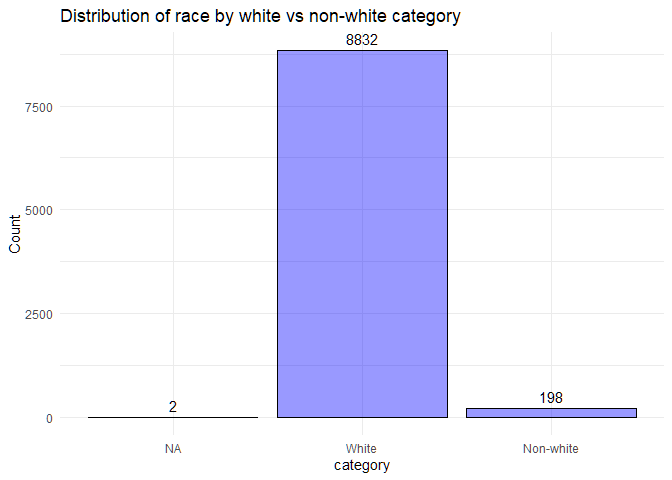
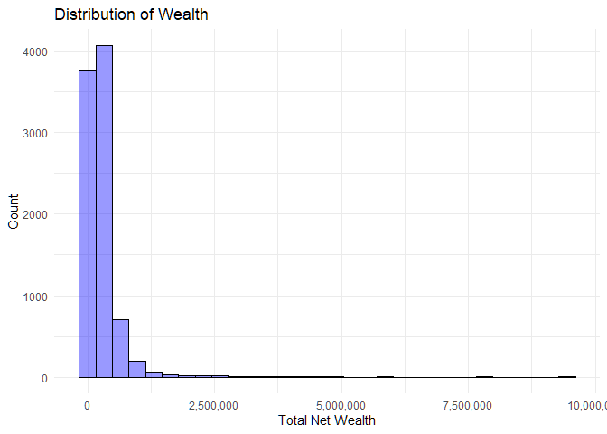
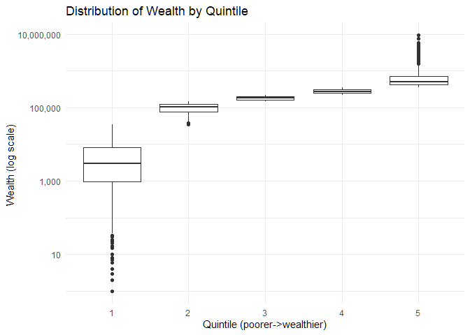
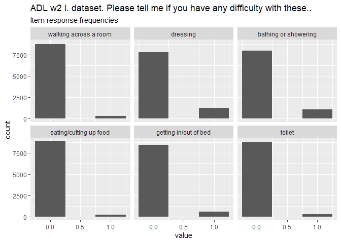
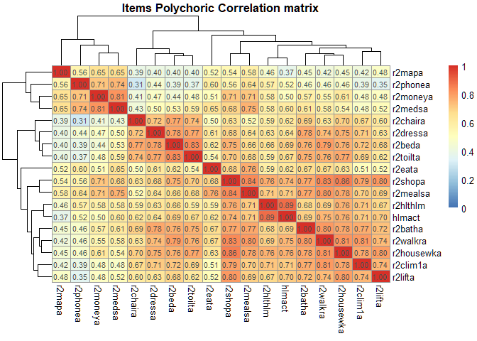
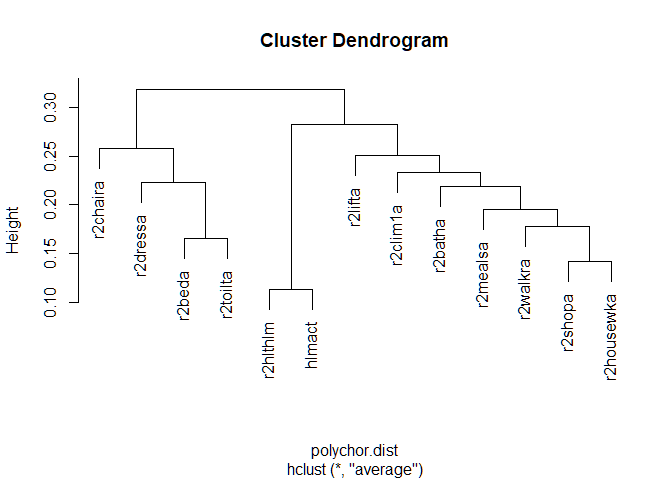

Measuring impact of pain in aging population using existing items in
ELSA
================
19 Jul 2024

- [INTRODUCTION](#introduction)
  - [AIM](#aim)
- [METHOD](#method)
  - [SAMPLE](#sample)
    - [Variable naming convention](#variable-naming-convention)
    - [Cohorts, Strata and Clusters](#cohorts-strata-and-clusters)
    - [Participants in W2](#participants-in-w2)
    - [Chronic pain indicator](#chronic-pain-indicator)
    - [Selecting 50yo+](#selecting-50yo)
  - [MEASURES](#measures)
    - [Participation to general
      activities](#participation-to-general-activities)
    - [Participation to Work
      Activities](#participation-to-work-activities)
    - [ADL+IADL items in ELSA](#adliadl-items-in-elsa)
    - [Defining list of Variables](#defining-list-of-variables)
    - [w2 Wave: Missing Data in sample](#w2-wave-missing-data-in-sample)
  - [ANALYSIS](#analysis)
    - [listwise deletion of missing
      data](#listwise-deletion-of-missing-data)
    - [Age and gender distribution](#age-and-gender-distribution)
    - [Ethnicity](#ethnicity)
    - [Net total Wealth](#net-total-wealth)
    - [Construct dimensionality](#construct-dimensionality)
    - [Parallel analysis](#parallel-analysis)
    - [Correlation matrix](#correlation-matrix)
    - [EFA](#efa)
    - [CFA](#cfa)
- [RESULTS](#results)
  - [Item responses: descriptive
    statistics](#item-responses-descriptive-statistics)
  - [Ordered proportion of responses](#ordered-proportion-of-responses)
  - [GOAL 1: Testing dimensionality of
    items](#goal-1-testing-dimensionality-of-items)
    - [Dimensionality](#dimensionality)
    - [Correlation matrix](#correlation-matrix-1)
    - [Hierarchical clustering](#hierarchical-clustering)
    - [All items solution](#all-items-solution)
  - [GOAL 2: Achieving a one factor
    solution](#goal-2-achieving-a-one-factor-solution)
    - [Removing items](#removing-items)
- [CONCLUSION](#conclusion)
- [References](#references)

# INTRODUCTION

## AIM

The overal aim of this analysis is to present a measurement model that
can capture  
the dimensions included in the NIH screenig tool for chronic pain
impact.

The goas of this analysis are:

0.  to explore the dimensionality of the items selected in the previus
    stages
1.  to assess construct validity of the measurement models proposed
2.  to achieve one or more sets of items to candidate for further
    analysis

# METHOD

## SAMPLE

``` r
## this is marked as "all" because includes both respondents and partners
H_elsa_all<-read.csv("c:/Users/d.vitali/Desktop/Github/CRIISP-WP5/data/clean/H_w1_9_ALL.tab")
```

This dataframe includes Harmonized ELSA data ([Banks et
al. 2024](#references)) from all waves of ELSA (harmonised g2 dataset).

For the purpose of this analysis I will focus on Wave 2 data because
this wave is the first implementing one of the key variables that are
being evaluated here

### Variable naming convention

Each individual is uniquely identified by the unique identifier:

    idauniq

Variable names in the Harmonized ELSA Data follow a consistent pattern
(e.g.):

    r2HLTHLM = (R)espondent, Wave(1), Health problem limiting work(HLTHLM)

1.  The first character indicates whether the variable refers to the
    reference person (“R”), spouse (“S”), the full household (“HH”), and
    a financial unit household (“H”).
2.  The second character indicates the wave to which the variable
    pertains: “1”, “2”, “3”, “4”, “5”, “6” , “7”, “8”, “9”, or “A”. The
    “A” indicates “all”, i.e. the variable is not specific to any single
    wave.
3.  The remaining characters describe the concept that the variable
    captures

| Code  | Reason for missing           |
|-------|:-----------------------------|
| NA    | did not respond to this wave |
| (-4)  | Don’t know                   |
| (-18) | Refused                      |
| (-13) | Other missing                |
| (-16) | Proxy                        |

**Table 2.** Coding of missing data in the H.Elsa dataset

### Cohorts, Strata and Clusters

In this wave one there are 3 identified cohorts:

1.  original HSE sample (HSE 1998-2001) (see [Mindell et
    al. 2012](#references))
2.  partner of an original sample respondent
3.  young partner of an original sample respondent

| case | desc                                | N     |
|------|:------------------------------------|-------|
| 1    | Original HSE sample                 | 11595 |
| 2    | Partner of an orig. sample resp.    | 138   |
| 3    | Young partner an orig. sample resp. | 664   |

**Table 3.** Cohorts and respective count of individuals for the current
wave

Therefore selecting only original HSE sample’s core respondents and
excluding their partners.

    ## cohort
    ##     1 
    ## 11595

### Participants in W2

    ## inwave2:
    ##     0     1 
    ## 10370  9432

Participants responding to wave 2 was: 9432

Down 2667 from wave 1.

### Chronic pain indicator

To identify respondents who erienced persistent pain symptoms, all
participants were required to report pain severities of moderate or
greater at both the analysed and previous ELSA data collection interval”

``` r
# load the chronic pain categorising function
source("c:/Users/d.vitali/Desktop/Github/Pain.Impact.Measures/ELSA Models/chronic_pain_var.R")

# Create chrpain variables for waves x to 9
waves <- 1:9
for (wave in waves) {
  H_elsa_w2_ <- create_chrpain_variable(H_elsa_w2_, wave)
}

#table(H_elsa_w2_$r2chrpain)
```

### Selecting 50yo+

Of this sample of the elsa current wave respondents  
I am excluding respondent aged \< 50 as ELSA is focused on english
population aged 50 and older.

## MEASURES

### Participation to general activities

loading the ELSA non harmonised dataset for wave 1. We need this to get
the variable “helim”. This correspond to the question:

    Q: helim. (Does this / Do these) illness(es) or disability(ies) limit your activities in any way?

**Cut-off criterion.** “limit your activity” is the cut-off criterion
proposed to respondents

**Anchor in pain.** NO i.e. lacking explicit causal link between the
limitation examined and pain. **Anchor in health.** YES i.e. proposing a
explicit causal between the limitation examined and health problem.

    ## .
    ##   -9   -8   -1    1    2 
    ##    1    2 4109 3341 1979

    ## Helim
    ##   -9   -8   -1    1    2 
    ##    1    2 3944 3276 1948

. “helim” = -1 : (not applicable, i.e. the do not report an illness,
disability or infirmity) . “helim” = 1 : No (does not limit the
activities) . “helim” = 2 : Yes (limits the activites)

we rename this variable as “hlmact”.

    ## .
    ##    0    1 
    ## 5892 3276

### Participation to Work Activities

    Do you have any health problem or disability that limits the kind or amount of paid work you 
    could do, should you want to?

**Cut-off criterion.** “limit” is the cut-off criterion proposed to
respondents.

**Anchor in pain.** NO i.e. lacking explicit causal link between the
limitation examined and pain. **Anchor in health.** YES i.e. proposing a
explicit causal between the limitation examined and health problem.

These Items are not anchored in pain (i.e. lacking “because of pain”
pain or in “because of health problem or disability”

| VarName | Description                                                      |
|:--------|:-----------------------------------------------------------------|
| rXhlthl | impairment or health problem limits paid work for the respondent |

    ## 
    ##  -18  -16  -13   -4    0    1 
    ##    1  116    7   10 6047 2990

. “r2hlthlm” = -16 : interview given via proxy (these will be filtered
out) . “r2hlthlm” = -13 : missing . “r2hlthlm” = -4 : Don’t know .
“r2hlthlm” = 1 : NO (Does not limit work) . “r2hlthlm” = 2 : Yes (limits
work)

### ADL+IADL items in ELSA

The ADL ([Katz 1963](#references))refers to activities that are
fundamental to living in a social world as they describe ways in which
an individual enables oneself’s basic survival and well-being, such as
bathing, toileting, dressing and eating.

The IADL ([Lawton and Brody 1969](#references)) refers to activities to
support daily life at home and outside in the community. These activity
require more complex skills and more complex interactions than those
described in the ADLs.

In H.ELSA the ADL and AIDL items and three additional mobility-focused
items. All items are of type “dichotomous” and they are scored as 1 if
the respondent indicates a difficulty with a particular activity, or as
0 if they do not indicate a difficulty.

    Here are a few more everyday activities. Please tell me if you have any 
    difficulty with these because of a physical, mental, emotional or memory 
    problem. Again exclude any difficulties you ect to last less than 
    three months.

**Cut-off criterion.** “difficulty” is the cut-off criterion proposed to
respondents.

**Anchor in pain.** NO i.e. lacking explicit causal link between the
limitation examined and pain. **Anchor in health.** YES i.e. proposing a
explicit causal between the limitation examined and health problem.

| VarName    | scale | Waves | Description:                                            |
|:-----------|:------|:-----:|:--------------------------------------------------------|
| rxdressa   | ADL   |  1-9  | dressing including putting on shoes and socks           |
| rxwalkra   | ADL   |  1-9  | walking across a room                                   |
| rxbatha    | ADL   |  1-9  | bathing or showering                                    |
| rxeata     | ADL   |  1-9  | eating such as cutting up food                          |
| rxbeda     | ADL   |  1-9  | getting in and out of bed                               |
| rxtoilta   | ADL   |  1-9  | using the toilet including getting up or down           |
| rxmapa     | IADL  |  1-9  | using map to figure out how to get around strange place |
| rxmealsa   | IADL  |  1-9  | preparing a hot meal                                    |
| rxshopa    | IADL  |  1-9  | shopping for groceries                                  |
| rxphonea   | IADL  |  1-9  | making telephone calls                                  |
| rxmedsa    | IADL  |  1-9  | taking medications                                      |
| rxhousewka | IADL  |  1-9  | doing work around house and garden                      |
| r2chaira   | Mobil |  1-9  | Diff-Get up fr chair                                    |
| r2clim1a   | Mobil |  1-9  | Diff-Clmb 1 flt str                                     |
| r2lifta    | Mobil |  1-9  | Diff-Lift/carry 10lbs                                   |

**Table 5.** Variable names, description, scale origin, and ELSA waves
in which each item has been implemented.

### Defining list of Variables

List of the proposed variables

``` r
varlist<-c("idauniq",
           "r2dressa", "r2walkra", "r2batha"   , "r2eata"  , "r2beda"  , "r2toilta",
           "r2shopa" , "r2mealsa", "r2housewka", "r2mapa"  , "r2phonea", "r2moneya", "r2medsa" , 
           "r2hlthlm", "hlmact",
           "r2chaira", "r2clim1a","r2lifta"
           )
```

### w2 Wave: Missing Data in sample

Missing data for any considered indicator was treated with listwise
deletion and reported in the table below.

    ##       VarName N. Missing Total
    ## 1     idauniq          0  9171
    ## 2    r2dressa          3  9171
    ## 3    r2walkra          3  9171
    ## 4     r2batha          3  9171
    ## 5      r2eata          3  9171
    ## 6      r2beda          3  9171
    ## 7    r2toilta          3  9171
    ## 8     r2shopa          3  9171
    ## 9    r2mealsa          3  9171
    ## 10 r2housewka          3  9171
    ## 11     r2mapa          3  9171
    ## 12   r2phonea          3  9171
    ## 13   r2moneya          3  9171
    ## 14    r2medsa          3  9171
    ## 15   r2hlthlm        134  9171
    ## 16     hlmact          3  9171
    ## 17   r2chaira          3  9171
    ## 18   r2clim1a          3  9171
    ## 19    r2lifta          3  9171

<!-- -->

## ANALYSIS

Combining:

- ADL
- IADL items
- functional ability items
- r2hlthl (health impairment prevents from doing my work)
- helim (health inmpairment prevents engaging activities)

1.  PA + EFA to evaluate construct validity and dimensionality
2.  CFA to evaluate the measurement model

### listwise deletion of missing data

Selecting complete cases

``` r
#Creating a ADL&IADL specific dataframe so that

# -   columns: item name
# -   rows: item response


LV_items<-H_elsa_w2_[,varlist] 


# selecting complete cases listwise 
LV_items<- LV_items %>% filter(if_all(.fns = ~. >= 0))
```

total sample available for analysis 9032.

### Age and gender distribution

``` r
plotdata<-H_elsa_w2_ %>% filter(idauniq %in% LV_items$idauniq)

plotdata$ragender <-factor(plotdata$ragender, levels = c(1,2), labels = c("Male", "Female"))


# Create a summary data frame with counts
counts <- plotdata %>%
  group_by(ragender) %>%
  summarise(count = n())

# Plot with bar and frequency count labels
ggplot(plotdata, aes(x = ragender)) +
  geom_bar(fill = "blue", color = "black", alpha = .4) +
  geom_text(data = counts, aes(x = ragender, y = count, label = count), 
            vjust = -0.5, color = "black") +
  labs(title = "Distribution of Sex at birth",
       x = "category",
       y = "Count") +
  theme_minimal()
```

<!-- -->

``` r
# proportions
(table(plotdata$ragender, useNA = "ifany")%>% prop.table())*100 %>% round(2)
```

    ## 
    ##     Male   Female 
    ## 44.41984 55.58016

<!-- -->

    ##        
    ##             M     W
    ##   0-29   0.00  0.00
    ##   30-39  0.00  0.00
    ##   40-49  0.00  0.00
    ##   50-59 14.12 17.95
    ##   60-69 14.78 17.21
    ##   70-79 10.95 13.04
    ##   80-89  4.21  6.70
    ##   90+    0.37  0.69
    ##   Sum   44.42 55.58

    ##     50-59     60-69     70-79     80-89 
    ## 0.5597376 0.5379024 0.5436087 0.6142132

    ## 
    ##  4-sample test for equality of proportions without continuity correction
    ## 
    ## data:  tr_tab0[2, ] out of addmargins(tr_tab0, 1)[3, ]
    ## X-squared = 18.801, df = 3, p-value = 0.0003005
    ## alternative hypothesis: two.sided
    ## sample estimates:
    ##    prop 1    prop 2    prop 3    prop 4 
    ## 0.5597376 0.5379024 0.5436087 0.6142132

The age distribution in this sample of subject reporting pain show a
majority of women in all age groups with the 80-89 range presenting the
highest prevalence of females:

|     | 50-59 | 60-69 | 70-79 | 80-89 | **Tot** |
|----:|:-----:|:-----:|:-----:|:-----:|:-------:|
|   M | 1275  | 1335  |  989  |  380  |  4012   |
|   F | 1621  | 1554  | 1178  |  605  |  5020   |
| Tot | 2896  | 2889  | 2167  |  985  |  9032   |

**Table 4.** Count and proportion of individuals by age and gender
(current wave)

### Ethnicity

``` r
plotdata$raracem <-factor(plotdata$raracem, levels = c(-13,1,4), labels = c("NA","White", "Non-white"))

table(plotdata$raracem, useNA = "ifany")
```

    ## 
    ##        NA     White Non-white 
    ##         2      8832       198

``` r
# Create a summary data frame with counts
counts <- plotdata %>%
  group_by(raracem) %>%
  summarise(count = n())

# Plot with bar and frequency count labels
ggplot(plotdata, aes(x = raracem)) +
  geom_bar(fill = "blue", color = "black", alpha = .4) +
  geom_text(data = counts, aes(x = raracem, y = count, label = count), 
            vjust = -0.5, color = "black") +
  labs(title = "Distribution of race by white vs non-white category",
       x = "category",
       y = "Count") +
  theme_minimal()
```

<!-- -->

### Net total Wealth

Net total wealth (benefit unit level). The sum of savings, investments,
physical wealth and housing wealth after financial debt and mortgage
debt has been subtracted.

The distrubution of wealth is severely skewed

    ## `stat_bin()` using `bins = 30`. Pick better value with `binwidth`.

<!-- -->

and a log transformation of the wealth magnitude axis allows for better
visual examination of the distribution

    ## Warning in transformation$transform(x): NaNs produced

    ## Warning in scale_x_continuous(trans = "log10", labels = scales::comma): log-10
    ## transformation introduced infinite values.

    ## `stat_bin()` using `bins = 30`. Pick better value with `binwidth`.

    ## Warning: Removed 468 rows containing non-finite outside the scale range
    ## (`stat_bin()`).

<!-- -->

the representation by quintile allows for a more general perspective on
this same information

    ## Warning in transformation$transform(x): NaNs produced

    ## Warning in scale_y_continuous(trans = "log10", labels = scales::comma): log-10
    ## transformation introduced infinite values.

    ## Warning: Removed 448 rows containing non-finite outside the scale range
    ## (`stat_boxplot()`).

<!-- -->

    ## 
    ##    1    2    3    4    5 <NA>  Sum 
    ## 1550 1700 1721 1754 1829  478 9032

### Construct dimensionality

Construct dimensionality will be assess via Parallel Analysis (PA) and
EFA. The factor structure emerging from these explorative analysis will
then be submitted for CFA for further empirical validation of the
solutions proposed.

The sample available to these analysis is n = 9432 therefore it was
further partitioned in two randomly selected datasets :

1.  ~ 1/2 from of total sample to used for PA and EFA (LV_items_ex)
2.  the remaining data (LV_items_conf) to be used for CFA

#### Sample split

Split sample for confirmatory factor analysis. 50% for EFA and then 50
for CFA.

### Parallel analysis

Parallel analysis will be used to compare the scree of factors of the
observed data with that of a random data matrix (re-sampled from the
original) of the same size. It should be noted that as the sample size
increases to infinite, the approximation of the eigenvalue of the random
data tends to 1.

### Correlation matrix

[Spector and Fleishman (1998)](#references) have pointed out that using
pearson correlation coefficients have been shown to suffer greatly in
the presence of skew data ([Muthen 1988](#references)). This is not
uncommon in the literature and one example of PCA using a person
correlation matrix is found in [Kempen et al (1995)](#references). In
the current analysis, I used tetrachoric correlations ([Spector &
Fleishman, 1998](#references)). Tetrachoric correlations assume that
observed dichotomous variables represent unobserved (latent) continuous
variables with a bivariate normal distribution; the tetrachoric
correlation estimates the relationship between these latent continuous
variables.

### EFA

#### Sample

n = 4533 (~1/2) randomly selected from the N= 9032 first wave
respondents studied in this paper. The remaining 1/2 of the N= 9032 will
be used for CFA.

#### Estimator

With regards to the estimator, some (although dated) suggestions point
to generalized least squares estimation procedure [Spector & Fleishman,
1998; Muthen, 1978, 1988](#references). The choice for the GLS estimator
comes from [Fleishman (1998)](#references) and [Muthen (1978,
1988)](#references). Arguably ML estimation is a more appropriate and
accurate method for factor analysis with binary data than other methods,
such as PCA or PAF, because it makes fewer assumptions about the
distribution of the data. More recent methodological papers suggest WLSM
(mean adj weighted least square - see e.g. mplus) which do not assume a
particular distribution.

#### Tetra- vs Polychoric correlations

Tetrachoric correlation assumes that the binary data have a continuous
underlying distribution, and estimates the correlation between the
underlying continuous variables. Tetrachoric correlation is appropriate
when the binary variables are thought to be generated from an underlying
normal distribution. The distribution of the binary data may not be
accurately approximated by a continuous distribution, and this can lead
to biased estimates of the tetrachoric correlation matrix. This bias can
be particularly problematic when the binary data are highly skewed and
therefore should be avoided in this case

Polychoric correlation, on the other hand, is appropriate when the
binary variables are thought to be generated from an underlying ordinal
variable, with multiple categories. It assumes that the binary variables
have an underlying, unobserved continuous variable that generates the
observed categories, and estimates the correlation between the
underlying continuous variables. Polychoric correlation is more robust
to departures from normality and can provide more accurate estimates of
the correlation matrix when the binary variables have few categories
and/or are highly skewed.

#### Rotations

Rotations considered:

- promax
- varimax

The two factors are expected to be correlated. The correlation
assumption is explored via the application of two rotation methods:
oblique and orthogonal.

1.  Correlated factors assumption (oblique rotation)
    - Promax rotation is a popular approach with large datasets - could
      overestimate the correlation between factors
    - Oblimin rotation is discouraged with large datasets but can help
      produce simpler factor structures.
2.  Orthogonal factors assumption

Promax and oblimin rotations are expected to yield a clearer factor
solution here than Varimax which assumes orthogonality between the
latent factors.

[Thurstone’s (1947)](#references) five criteria for the “simple”
solution were used to select the rotation method

1.  Each variable should produce at least one zero loading
    (-.1\<$\lambda$\<.1) on some factor.
2.  Each factor should have at least as many zero loadings as there are
    factors.
3.  Each pair of factors should have variables with significant loadings
    on one ($\lambda$ \> .3) and zero loadings on the other.
4.  Each pair of factors should have a large proportion of zero loadings
    on both factors (if there are say four or more factors total).
5.  Each pair of factors should have only a few complex variables (
    $\lambda$ \> .3).

We can think of the goal of rotation and of choosing a particular type
of rotation as seeking something called simple structure. That is, the
rotation is adequate if the result achieves a simple structure.

### CFA

#### Sample

The remaining 1/2 of the N= 9032, randomly selected.

#### Estimator

WLSM (mean adj weighted least square - see e.g. mplus) which do not
assume a particular distribution [Newsom 2023](#references). This method
imply the Diagonalised weighted least square estimator, have robust
standard errors and a mean adjusted $\chi^2$ statistic.

#### Items selection

Round 1: all items with EFA suggested structure Round 2: final item
selection

CFA will inform the removal of items that do not support a single
dimension solution of the proposed scale of disability. Fit of models
will be compared via scaled Chi-Squared Difference Test
($\Delta\chi^2$).

# RESULTS

## Item responses: descriptive statistics

<!-- --><!-- --><!-- --><!-- -->

## Ordered proportion of responses

List of item by how often are scored as “1”, i.e. experiencing the
difficulty.

``` r
propsummary<-data.frame(Item = colnames(summarytab),
                       Proportion = round(colMeans(summarytab) * 100,2)) 
rownames(propsummary)<-NULL


# Proportion of current wave respondent having difficulties with
# each of the nine IADL ADL Tasks
propsummary[order(propsummary$Proportion, decreasing = TRUE), ] %>% print
```

    ##                                   Item Proportion
    ## 15     Health/disability limits actity      35.31
    ## 14                   Health limit work      33.07
    ## 16           Some Diff-Get up fr chair      26.82
    ## 18 Some Diff-lifting/carrying 10pounds      25.52
    ## 9                    work house/garden      16.76
    ## 17            Some Diff-Clmb 1 flt str      15.10
    ## 2                             dressing      13.50
    ## 3                 bathing or showering      11.75
    ## 7               shopping for groceries       9.51
    ## 5                getting in/out of bed       6.21
    ## 10       using a map in unknown places       5.61
    ## 8                       prep. hot meal       4.65
    ## 1                walking across a room       3.27
    ## 6                               toilet       3.11
    ## 12                      managing money       2.85
    ## 4               eating/cutting up food       2.08
    ## 11                     telephone calls       1.98
    ## 13                  taking medications       1.77

## GOAL 1: Testing dimensionality of items

### Dimensionality

When ADL and IADL are used as separate scales they seem to present
clearer dimensionality and hierarchical structure but they may also
carry significant DIF bias and intrinsic limitations with regards to
what they measure. As an example of intrinsic limitations, ADL items
cannot discriminate below higher levels of functional disability thereby
making it difficult to use the ADL items alone in populations where the
prevalence of severe levels of disability tends to be low ([Kovar and
Lawton 1994](#references)).

On the other hand, when considering ADL+IADL as a single scale, it is
important to observe that the simple aggregation of these indicators in
a deterministic model (e.g. Guttman’s model) implies the untenable
assumption of the equivalence of each item’s importance ([Thomas et al
1998, Fieo 2011](#references)). Some researchers have suggested that
rather than using a deterministic model it is perhaps better to assume a
probabilistic relationship between the item responses and the concept
these aim to represent ([Kempen et al 1995](#references)). Recent work
by [Caballero et al. (2017)](#references) have showed that it is
possible to create a compound health metric in ELSA that can be used to
quantify and study the health status of individuals overtime using a
probabilistic model. In addition, and most relevantly for the larger
study in which the present is nested, [Caballero et
al. (2017)](#references) showed that Machine Learning methods can be
applied to identify relationships between socio-demographics and the
health score created.

### Correlation matrix

The following plot shows the (polychoric) correlation matrix in
conjunction with the hierarchical clustering of these variables done by
pheatmap() using hclust().

``` r
cor0<-polychoric(LV_items_ex[,-1], smooth = F, correct = F)


cor0$rho %>% pheatmap(display_numbers = T, 
                      cluster_rows = T,
                      cluster_cols = T,
                      breaks = seq(0, 1, length.out = 101),
                      main = "Items Polychoric Correlation matrix")
```

<!-- -->

The visual examination of the tetrachoric correlation matrix seems two
suggest a two factor solution with “warmer colors” (higher correlation)
with “map,phone,money,med”, and a larger group with the rest of the
items.

### Hierarchical clustering

The dendrogram visually represents the hierarchical structure of the
data, allowing you to interpret the relationships between clusters or
data points based on their distances or dissimilarities.

The methods “average” linkage is used as it is less sensitive to the
distribution of the variables (these are all dichotomous items)

The vertical axis represents the distances or dissimilarities between
clusters or individual data points. Therefore, the height at which two
clusters or data points are merged corresponds to the distance or
dissimilarity between them. The longer the vertical line, the greater
the dissimilarity between the clusters being merged.

``` r
# treats correlation scores as point in a high dimensional space and calculates the distance between two points
polychor.dist<-as.dist(1 - cor0$rho)

#hclust(polychor.dist, method="complete") %>% plot

# Complete linkage or maximum linkage:

# . Calculates the maximum dissimilarity between pairs of clusters.
# . Tends to produce clusters that are compact and well-separated.
# . Can be sensitive to outliers.

hclust(polychor.dist, method="average") %>% plot
```

<!-- -->

``` r
# Average linkage

# . Calculates the average dissimilarity between pairs of clusters.
# . Less sensitive to outliers compared to complete linkage.
```

Items within the closest distance seems to include, in order:

“meal, shop” “housework,walk across the room” “getting out of bed”,
“gettin on/off toilet” “getting dressed”, “using the bath/washing
oneselves” “climbing one flight of stairs”, “lifting a weight” “health
limits work”, “health limits my activity”

### All items solution

#### Parallel analysis

This code is performing a parallel analysis to determine the number of
factors that should be retained in a factor analysis of the LV_items_ex
dataset. The number of factors to retain will be determined by comparing
the actual eigenvalues to the mean and standard deviation of the
eigenvalues generated from the bootstrap resampled datasets.

\[ from the documentation of fa.parallel() in the R package “psych”\]

*Parallel analysis for factors is actually harder than it seems, for the
question is what are the appropriate communalities to use. If
communalities are estimated by the Squared Multiple Correlation (SMC)
smc, then the eigen values of the original data will reflect major as
well as minor factors (see sim.minor to simulate such data). Random data
will not, of course, have any structure and thus the number of factors
will tend to be biased upwards by the presence of the minor factors.*

Here we will use parallel with the option “fa” which estimates the
communalities based upon a one factor minres solution. Although this
will underestimate the communalities, it is suggested that leads to
better solutions on simulated or real data sets.

``` r
pa<-psych::fa.parallel(LV_items_ex[,-1],
                   main = "Parallel analysis round 1",
                   fa ="fa", 
                   fm = "gls", 
                   sim = "F", 
                   error.bars = T, 
                   cor = "poly", 
                   correct = T)
```

<!-- -->

    ## Parallel analysis suggests that the number of factors =  2  and the number of components =  NA

Parallel analysis confirms the suggestion of a two factor solution as
well as the expected eigenvalue for the second factor close to 1 as
observed in previous studies.

##### Alternatives to Parallel analysis

Another method to evaluate the number of factors to extract in
exploratory factor analysis is to use the “Very simple structure
criterion” (VSS). In factor analysis we tend to interpret the results of
our factor analysis by focusing on the largest loadings that each
variable extress and we tend to consider less important or even ignore
the loadings of smaller magnitude. VSS takes this “simplifying” approach
and operationalizes it by comparing the original correlation matrix to
that reproduced by a simplified version of the original factor matrix.
The VSS criterion compares the fit of the simplified model to the
original correlation [Revelle & Rocklin 1979](#references).

VSS() is a function in the psych package stands for Very Simple
Structure and applies this method. This function takes as input a
correlation matrix (in this case we need to specify the sample size). or
a dataset (in this case we need to specify which correlations ought to
be used). We then specify the extraction method “fm” as “mle” Maximum
Likelihood FA. Other factoring methods available are “pa” Principal Axis
Factor Analysis, “minres” stands for minimum residual (OLS) factoring,
“pc” Principal Components”. By including the diagonal (setting diagonal
= T), the model will focus on the total variance in the dataset (the
assumption is that total variance = common variance). In this case we
chose to exclude the diagonal to model only shared variance
(communality) and ignoring the unique variance. This method aligns with
the goal of EFA, which is to identify latent constructs that explain the
correlations among observed variables.

``` r
cor_vss<-polychoric(LV_items_ex[,-1], smooth = F, correct = F)


VSS(cor_vss$rho, 
    fm="mle", 
    rotate = "oblimin",
    n=4,
    n.obs = nrow(LV_items_ex[,-1]), 
    diagonal = F)
```

<!-- -->

    ## 
    ## Very Simple Structure
    ## Call: vss(x = x, n = n, rotate = rotate, diagonal = diagonal, fm = fm, 
    ##     n.obs = n.obs, plot = plot, title = title, use = use, cor = cor)
    ## VSS complexity 1 achieves a maximimum of 0.97  with  1  factors
    ## VSS complexity 2 achieves a maximimum of 0.81  with  2  factors
    ## 
    ## The Velicer MAP achieves a minimum of 0.03  with  2  factors 
    ## BIC achieves a minimum of  7741.63  with  4  factors
    ## Sample Size adjusted BIC achieves a minimum of  8018.08  with  4  factors
    ## 
    ## Statistics by number of factors 
    ##   vss1 vss2   map dof chisq prob sqresid  fit RMSEA   BIC SABIC complex eChisq
    ## 1 0.97 0.00 0.055 135 25442    0     5.1 0.97  0.20 24306 24735     1.0  10390
    ## 2 0.73 0.81 0.034 118 15818    0    27.3 0.81  0.17 14825 15200     1.2   2271
    ## 3 0.53 0.72 0.037 102 12153    0    41.5 0.72  0.16 11294 11618     1.2   1525
    ## 4 0.35 0.44 0.042  87  8474    0    56.8 0.61  0.15  7742  8018     1.6    926
    ##    SRMR eCRMS eBIC
    ## 1 0.087 0.092 9253
    ## 2 0.040 0.046 1277
    ## 3 0.033 0.041  666
    ## 4 0.026 0.034  193

#### EFA

To confirm this, an EFA was conducted for the two-factor solution
suggested by Parallel analysis. Generalised Least Square (GLS) estimator
was suggested by [Spector & Fleishman (1998)](#references) and [Muthen
(1978, 1988)](#references) but more recent methodological papers suggest
WLSM (mean adj weighted least square - see e.g. mplus) which do not
assume a particular distribution.

- Using WLSM as a factoring method

- rotation evaluated: Varimax, Promax.

This code performs an loratory factor analysis (EFA) with tetrachoric
correlations using the “fa()” function from the “psych” package. The
analysis is rotated using both the varimax and promax methods, and the
resulting loadings are compared using a heatmap.

The “fa()” function is called twice within a loop, with each iteration
rotating the factor solution using a different method. The loadings from
each iteration are then combined into a single matrix using the
“cbind()” function.

Finally, the resulting loadings matrix is rounded to two decimal places
using the “round()” function and visualized using the “pheatmap()”
function from the “pheatmap” package. The heatmap displays the loadings
for each factor and rotation method, with the colors representing the
strength and direction of the loadings.

The Bartlett correction (correct = “T” in the fa() function) is commonly
used in factor analysis when the assumption of sphericity is violated,
which means that the variables are not uncorrelated and the correlation
matrix is not an identity matrix. In such cases, the eigenvalues of the
correlation matrix tend to overestimate the true number of factors.

The Bartlett correction adjusts for the lack of sphericity by using a
correction factor based on the determinant of the correlation matrix.
The corrected eigenvalues provide a better estimate of the true number
of factors.

This correction is generally appropriate when conducting factor analysis
on correlated variables which is the assumption here.

<!-- -->

*Note that in oblique rotations like promax, loadings are regression
coefficients and can exceed the \[-1,1\] interval.*

**Rotation decision.** Promax rotation was selected as satisfying all 5
Thurstone’s criteria for simplicity. The other oblique rotation
(oblimin) was also satisfactory but inferior by the same criteria. This
represent a suggestion that this selection of items comprises two
defined and correlated factors.

#### EFA summary

#### CFA: one vs two-factor fit

For simplicity of interpretation, all CFA models will be identified by
fixing the variance of the latent to 1 and therefore all indicators are
free parameters.

Diagonally weighted least squares (WLSMV) is specifically designed for
ordinal data.

[Kline (2016)](#referecens) suggests to inspect residuals (type =
“correlation”) to identify residuals \> \|.10\| (chapter 4). Such
residuals indicate a likely specification error and could inform a
decision to respecify a model\*.

##### One factor solution

Like the previous, both models are confirmatory factor analysis (CFA)
models that aim to identify the factor structure of the ADL+IADL data.
The second model, ALL.one.factor.model, proposes a single factor that
loads on all ALL items

``` r
######################################################
##### CONFIRMATORY FACTOR ANALYSIS: one.factor.model
#######################################################

ALL.one.factor.model<-'

  Lv1   =~ r2dressa + r2walkra + r2batha + r2eata + r2beda + r2toilta + r2shopa + r2mealsa + r2housewka + r2chaira  + r2clim1a + r2lifta + r2mapa + r2phonea + r2moneya + r2medsa + r2hlthlm + hlmact'
ALL.one.factor.Fit<- cfa(model = ALL.one.factor.model, 
                     data = LV_items_conf,
                     ordered = TRUE, # polychoric correlations for the ordinal variables
                     std.lv = TRUE,
                     auto.fix.first = FALSE,
                     estimator = "WLSM" #  WLSM or alternatively WLSMV
                     )
                                 


r<-residuals(ALL.one.factor.Fit, type = "cor")$cov %>% as.table %>% round(2)
r[abs(r) < 0.1] <- "-"

#r

## Diagnostic tool to explore residual correlations or other potential sources of bias in the model
#m<-modificationindices(ALL.one.factor.Fit)

summary(ALL.one.factor.Fit, fit.measures = T, rsquare=T)
```

    ## lavaan 0.6.17 ended normally after 21 iterations
    ## 
    ##   Estimator                                       DWLS
    ##   Optimization method                           NLMINB
    ##   Number of model parameters                        36
    ## 
    ##   Number of observations                          4499
    ## 
    ## Model Test User Model:
    ##                                               Standard      Scaled
    ##   Test Statistic                              1213.197    1947.883
    ##   Degrees of freedom                               135         135
    ##   P-value (Chi-square)                           0.000       0.000
    ##   Scaling correction factor                                  0.623
    ##     Satorra-Bentler correction                                    
    ## 
    ## Model Test Baseline Model:
    ## 
    ##   Test statistic                            114917.924  114917.924
    ##   Degrees of freedom                               153         153
    ##   P-value                                        0.000       0.000
    ##   Scaling correction factor                                  1.000
    ## 
    ## User Model versus Baseline Model:
    ## 
    ##   Comparative Fit Index (CFI)                    0.991       0.984
    ##   Tucker-Lewis Index (TLI)                       0.989       0.982
    ##                                                                   
    ##   Robust Comparative Fit Index (CFI)                         0.793
    ##   Robust Tucker-Lewis Index (TLI)                            0.766
    ## 
    ## Root Mean Square Error of Approximation:
    ## 
    ##   RMSEA                                          0.042       0.055
    ##   90 Percent confidence interval - lower         0.040       0.052
    ##   90 Percent confidence interval - upper         0.044       0.057
    ##   P-value H_0: RMSEA <= 0.050                    1.000       0.002
    ##   P-value H_0: RMSEA >= 0.080                    0.000       0.000
    ##                                                                   
    ##   Robust RMSEA                                               0.176
    ##   90 Percent confidence interval - lower                     0.164
    ##   90 Percent confidence interval - upper                     0.189
    ##   P-value H_0: Robust RMSEA <= 0.050                         0.000
    ##   P-value H_0: Robust RMSEA >= 0.080                         1.000
    ## 
    ## Standardized Root Mean Square Residual:
    ## 
    ##   SRMR                                           0.086       0.086
    ## 
    ## Parameter Estimates:
    ## 
    ##   Parameterization                               Delta
    ##   Standard errors                           Robust.sem
    ##   Information                                 Expected
    ##   Information saturated (h1) model        Unstructured
    ## 
    ## Latent Variables:
    ##                    Estimate  Std.Err  z-value  P(>|z|)
    ##   Lv1 =~                                              
    ##     r2dressa          0.810    0.012   66.009    0.000
    ##     r2walkra          0.894    0.016   56.082    0.000
    ##     r2batha           0.855    0.011   78.417    0.000
    ##     r2eata            0.763    0.027   27.795    0.000
    ##     r2beda            0.833    0.015   55.123    0.000
    ##     r2toilta          0.811    0.021   38.161    0.000
    ##     r2shopa           0.901    0.009   97.377    0.000
    ##     r2mealsa          0.905    0.012   75.339    0.000
    ##     r2housewka        0.899    0.008  111.034    0.000
    ##     r2chaira          0.727    0.014   52.977    0.000
    ##     r2clim1a          0.844    0.011   78.476    0.000
    ##     r2lifta           0.821    0.011   77.175    0.000
    ##     r2mapa            0.593    0.026   22.990    0.000
    ##     r2phonea          0.600    0.033   18.048    0.000
    ##     r2moneya          0.693    0.027   25.729    0.000
    ##     r2medsa           0.669    0.034   19.427    0.000
    ##     r2hlthlm          0.879    0.009  103.236    0.000
    ##     hlmact            0.904    0.008  118.158    0.000
    ## 
    ## Thresholds:
    ##                    Estimate  Std.Err  z-value  P(>|z|)
    ##     r2dressa|t1       1.074    0.023   46.330    0.000
    ##     r2walkra|t1       1.843    0.036   50.764    0.000
    ##     r2batha|t1        1.161    0.024   48.227    0.000
    ##     r2eata|t1         2.045    0.043   47.802    0.000
    ##     r2beda|t1         1.534    0.029   52.275    0.000
    ##     r2toilta|t1       1.828    0.036   50.928    0.000
    ##     r2shopa|t1        1.293    0.026   50.436    0.000
    ##     r2mealsa|t1       1.667    0.032   52.125    0.000
    ##     r2housewka|t1     0.952    0.022   43.054    0.000
    ##     r2chaira|t1       0.605    0.020   30.284    0.000
    ##     r2clim1a|t1       1.031    0.023   45.237    0.000
    ##     r2lifta|t1        0.636    0.020   31.612    0.000
    ##     r2mapa|t1         1.587    0.030   52.310    0.000
    ##     r2phonea|t1       1.989    0.041   48.747    0.000
    ##     r2moneya|t1       1.911    0.038   49.918    0.000
    ##     r2medsa|t1        2.092    0.045   46.925    0.000
    ##     r2hlthlm|t1       0.426    0.019   22.036    0.000
    ##     hlmact|t1         0.371    0.019   19.348    0.000
    ## 
    ## Variances:
    ##                    Estimate  Std.Err  z-value  P(>|z|)
    ##    .r2dressa          0.343                           
    ##    .r2walkra          0.202                           
    ##    .r2batha           0.269                           
    ##    .r2eata            0.417                           
    ##    .r2beda            0.306                           
    ##    .r2toilta          0.342                           
    ##    .r2shopa           0.189                           
    ##    .r2mealsa          0.180                           
    ##    .r2housewka        0.191                           
    ##    .r2chaira          0.472                           
    ##    .r2clim1a          0.287                           
    ##    .r2lifta           0.326                           
    ##    .r2mapa            0.648                           
    ##    .r2phonea          0.640                           
    ##    .r2moneya          0.519                           
    ##    .r2medsa           0.553                           
    ##    .r2hlthlm          0.227                           
    ##    .hlmact            0.184                           
    ##     Lv1               1.000                           
    ## 
    ## R-Square:
    ##                    Estimate
    ##     r2dressa          0.657
    ##     r2walkra          0.798
    ##     r2batha           0.731
    ##     r2eata            0.583
    ##     r2beda            0.694
    ##     r2toilta          0.658
    ##     r2shopa           0.811
    ##     r2mealsa          0.820
    ##     r2housewka        0.809
    ##     r2chaira          0.528
    ##     r2clim1a          0.713
    ##     r2lifta           0.674
    ##     r2mapa            0.352
    ##     r2phonea          0.360
    ##     r2moneya          0.481
    ##     r2medsa           0.447
    ##     r2hlthlm          0.773
    ##     hlmact            0.816

``` r
#######################################################
##### END CONFIRMATORY FACTOR ANALYSIS
#######################################################
```

##### Two factor solution

The model below includes two latent variables, “Lv1” and “Lv2”, which
are measured by a set of observed variables (indicators).

. The first latent variable “Lv1” is measured by 13 binary items:
r2eata, r2dressa, r2walkra, r2batha, r2beda, r2toilta, r2shopa,
r2mealsa, r2housewka, r2chaira , r2clim1a, r2lifta, r2hlthlm, and
hlmact;

. The second latent variable “Lv2” is measured by five binary items:
r2mapa, r2phonea, r2moneya, r2medsa, and r2eata;

The symbol “=~” is used to specify the measurement model, indicating
that the latent variables are being measured by the observed variables.
The symbol “\~~” specifies a correlation between the two latent
variables.

The lavaan package is used to estimate the model using weighted least
squares mean and variance adjusted (WLSMV) estimation. The “ordered =
TRUE” argument indicates that polychoric correlations should be used for
the binary variables. The “auto.fix.first = FALSE” argument specifies
that the first loading for each latent variable should not be fixed to 1
for identification purposes. Finally, the “std.lv = TRUE” argument
specifies that the latent variables should be standardized to have a
variance of 1.

The resulting object “ALL.two.factor.Fit” contains information about the
fit of the CFA model to the data, such as standardized parameter
estimates, fit indices, and residuals.

The first model, ALL.two.factor.model, proposes two factors: a first
factor that loads on the nine items suggested by EFA, and a second
factor that loads on the other four items.

``` r
######################################################
##### CONFIRMATORY FACTOR ANALYSIS: Two.factor.model
#######################################################

ALL.two.factor.model<-'

  Lv1   =~ r2dressa + r2walkra + r2batha +  r2beda + r2toilta + r2shopa + r2mealsa + r2housewka + r2chaira  + r2clim1a + r2lifta + r2hlthlm + hlmact
  Lv2   =~ r2mapa + r2phonea + r2moneya + r2medsa + r2eata
  
  Lv1 ~~ Lv2
'
ALL.two.factor.Fit<- cfa(model = ALL.two.factor.model, 
                     data = LV_items_conf,
                     ordered = TRUE, # polychoric correlations for the ordinal variables
                     auto.fix.first = FALSE,
                     std.lv = TRUE,
                     estimator = "WLSM" #  WLSM or alternatively WLSMV
                     )
                                 
#residuals(ALL.two.factor.Fit, type = "cor")

## Diagnostic tool to explore residual correlations or other potential sources of bias in the model
#m<-modificationindices(ALL.two.factor.Fit)
r<-residuals(ALL.two.factor.Fit, type = "cor")$cov %>% as.table %>% round(2)
r[abs(r) < 0.1] <- "-"

#r  # residuals
summary(ALL.two.factor.Fit, fit.measures = T, rsquare=T, standardize = T)
```

    ## lavaan 0.6.17 ended normally after 25 iterations
    ## 
    ##   Estimator                                       DWLS
    ##   Optimization method                           NLMINB
    ##   Number of model parameters                        37
    ## 
    ##   Number of observations                          4499
    ## 
    ## Model Test User Model:
    ##                                               Standard      Scaled
    ##   Test Statistic                               904.928    1460.134
    ##   Degrees of freedom                               134         134
    ##   P-value (Chi-square)                           0.000       0.000
    ##   Scaling correction factor                                  0.620
    ##     Satorra-Bentler correction                                    
    ## 
    ## Model Test Baseline Model:
    ## 
    ##   Test statistic                            114917.924  114917.924
    ##   Degrees of freedom                               153         153
    ##   P-value                                        0.000       0.000
    ##   Scaling correction factor                                  1.000
    ## 
    ## User Model versus Baseline Model:
    ## 
    ##   Comparative Fit Index (CFI)                    0.993       0.988
    ##   Tucker-Lewis Index (TLI)                       0.992       0.987
    ##                                                                   
    ##   Robust Comparative Fit Index (CFI)                         0.833
    ##   Robust Tucker-Lewis Index (TLI)                            0.809
    ## 
    ## Root Mean Square Error of Approximation:
    ## 
    ##   RMSEA                                          0.036       0.047
    ##   90 Percent confidence interval - lower         0.034       0.044
    ##   90 Percent confidence interval - upper         0.038       0.050
    ##   P-value H_0: RMSEA <= 0.050                    1.000       0.966
    ##   P-value H_0: RMSEA >= 0.080                    0.000       0.000
    ##                                                                   
    ##   Robust RMSEA                                               0.159
    ##   90 Percent confidence interval - lower                     0.145
    ##   90 Percent confidence interval - upper                     0.174
    ##   P-value H_0: Robust RMSEA <= 0.050                         0.000
    ##   P-value H_0: Robust RMSEA >= 0.080                         1.000
    ## 
    ## Standardized Root Mean Square Residual:
    ## 
    ##   SRMR                                           0.064       0.064
    ## 
    ## Parameter Estimates:
    ## 
    ##   Parameterization                               Delta
    ##   Standard errors                           Robust.sem
    ##   Information                                 Expected
    ##   Information saturated (h1) model        Unstructured
    ## 
    ## Latent Variables:
    ##                    Estimate  Std.Err  z-value  P(>|z|)   Std.lv  Std.all
    ##   Lv1 =~                                                                
    ##     r2dressa          0.813    0.012   66.227    0.000    0.813    0.813
    ##     r2walkra          0.896    0.016   56.272    0.000    0.896    0.896
    ##     r2batha           0.857    0.011   78.591    0.000    0.857    0.857
    ##     r2beda            0.836    0.015   55.284    0.000    0.836    0.836
    ##     r2toilta          0.815    0.021   38.216    0.000    0.815    0.815
    ##     r2shopa           0.903    0.009   97.337    0.000    0.903    0.903
    ##     r2mealsa          0.909    0.012   75.010    0.000    0.909    0.909
    ##     r2housewka        0.901    0.008  111.309    0.000    0.901    0.901
    ##     r2chaira          0.729    0.014   53.147    0.000    0.729    0.729
    ##     r2clim1a          0.846    0.011   78.724    0.000    0.846    0.846
    ##     r2lifta           0.822    0.011   77.470    0.000    0.822    0.822
    ##     r2hlthlm          0.881    0.009  103.458    0.000    0.881    0.881
    ##     hlmact            0.905    0.008  118.470    0.000    0.905    0.905
    ##   Lv2 =~                                                                
    ##     r2mapa            0.735    0.028   26.469    0.000    0.735    0.735
    ##     r2phonea          0.728    0.036   20.260    0.000    0.728    0.728
    ##     r2moneya          0.844    0.028   30.374    0.000    0.844    0.844
    ##     r2medsa           0.807    0.037   22.089    0.000    0.807    0.807
    ##     r2eata            0.944    0.032   29.416    0.000    0.944    0.944
    ## 
    ## Covariances:
    ##                    Estimate  Std.Err  z-value  P(>|z|)   Std.lv  Std.all
    ##   Lv1 ~~                                                                
    ##     Lv2               0.750    0.020   38.297    0.000    0.750    0.750
    ## 
    ## Thresholds:
    ##                    Estimate  Std.Err  z-value  P(>|z|)   Std.lv  Std.all
    ##     r2dressa|t1       1.074    0.023   46.330    0.000    1.074    1.074
    ##     r2walkra|t1       1.843    0.036   50.764    0.000    1.843    1.843
    ##     r2batha|t1        1.161    0.024   48.227    0.000    1.161    1.161
    ##     r2beda|t1         1.534    0.029   52.275    0.000    1.534    1.534
    ##     r2toilta|t1       1.828    0.036   50.928    0.000    1.828    1.828
    ##     r2shopa|t1        1.293    0.026   50.436    0.000    1.293    1.293
    ##     r2mealsa|t1       1.667    0.032   52.125    0.000    1.667    1.667
    ##     r2housewka|t1     0.952    0.022   43.054    0.000    0.952    0.952
    ##     r2chaira|t1       0.605    0.020   30.284    0.000    0.605    0.605
    ##     r2clim1a|t1       1.031    0.023   45.237    0.000    1.031    1.031
    ##     r2lifta|t1        0.636    0.020   31.612    0.000    0.636    0.636
    ##     r2hlthlm|t1       0.426    0.019   22.036    0.000    0.426    0.426
    ##     hlmact|t1         0.371    0.019   19.348    0.000    0.371    0.371
    ##     r2mapa|t1         1.587    0.030   52.310    0.000    1.587    1.587
    ##     r2phonea|t1       1.989    0.041   48.747    0.000    1.989    1.989
    ##     r2moneya|t1       1.911    0.038   49.918    0.000    1.911    1.911
    ##     r2medsa|t1        2.092    0.045   46.925    0.000    2.092    2.092
    ##     r2eata|t1         2.045    0.043   47.802    0.000    2.045    2.045
    ## 
    ## Variances:
    ##                    Estimate  Std.Err  z-value  P(>|z|)   Std.lv  Std.all
    ##    .r2dressa          0.340                               0.340    0.340
    ##    .r2walkra          0.196                               0.196    0.196
    ##    .r2batha           0.266                               0.266    0.266
    ##    .r2beda            0.301                               0.301    0.301
    ##    .r2toilta          0.336                               0.336    0.336
    ##    .r2shopa           0.185                               0.185    0.185
    ##    .r2mealsa          0.174                               0.174    0.174
    ##    .r2housewka        0.189                               0.189    0.189
    ##    .r2chaira          0.469                               0.469    0.469
    ##    .r2clim1a          0.284                               0.284    0.284
    ##    .r2lifta           0.324                               0.324    0.324
    ##    .r2hlthlm          0.225                               0.225    0.225
    ##    .hlmact            0.182                               0.182    0.182
    ##    .r2mapa            0.459                               0.459    0.459
    ##    .r2phonea          0.470                               0.470    0.470
    ##    .r2moneya          0.287                               0.287    0.287
    ##    .r2medsa           0.348                               0.348    0.348
    ##    .r2eata            0.110                               0.110    0.110
    ##     Lv1               1.000                               1.000    1.000
    ##     Lv2               1.000                               1.000    1.000
    ## 
    ## R-Square:
    ##                    Estimate
    ##     r2dressa          0.660
    ##     r2walkra          0.804
    ##     r2batha           0.734
    ##     r2beda            0.699
    ##     r2toilta          0.664
    ##     r2shopa           0.815
    ##     r2mealsa          0.826
    ##     r2housewka        0.811
    ##     r2chaira          0.531
    ##     r2clim1a          0.716
    ##     r2lifta           0.676
    ##     r2hlthlm          0.775
    ##     hlmact            0.818
    ##     r2mapa            0.541
    ##     r2phonea          0.530
    ##     r2moneya          0.713
    ##     r2medsa           0.652
    ##     r2eata            0.890

``` r
#######################################################
##### END CONFIRMATORY FACTOR ANALYSIS
#######################################################
```

##### One vs two factor fit comparison

lavTestLRT() performs a likelihood ratio test (LRT) comparing two
models, in this case ALL.two.factor.Fit and ALL.one.factor.Fit. The null
hypothesis is that the more complex model (i.e., ALL.two.factor.Fit)
does not fit significantly better than the simpler model (i.e.,
ALL.one.factor.Fit). The alternative hypothesis is that the more complex
model fits significantly better than the simpler model.

``` r
a1<-lavTestLRT(ALL.one.factor.Fit,ALL.two.factor.Fit,type="chisq")

a1
```

    ## 
    ## Scaled Chi-Squared Difference Test (method = "satorra.bentler.2001")
    ## 
    ## lavaan NOTE:
    ##     The "Chisq" column contains standard test statistics, not the
    ##     robust test that should be reported per model. A robust difference
    ##     test is a function of two standard (not robust) statistics.
    ##  
    ##                     Df AIC BIC   Chisq Chisq diff Df diff Pr(>Chisq)    
    ## ALL.two.factor.Fit 134          904.93                                  
    ## ALL.one.factor.Fit 135         1213.20     298.01       1  < 2.2e-16 ***
    ## ---
    ## Signif. codes:  0 '***' 0.001 '**' 0.01 '*' 0.05 '.' 0.1 ' ' 1

##### Conclusion: not unidimensional

The output of the lavTestLRT function indicates that the scaled
chi-squared difference test was used with the satorra.bentler.2001
method to compare the fit of the two models.

The Chisq diff indicates a significant difference in fit between the two
models. The p-value in the Pr(\>Chisq) column \< .001, which provides
strong evidence to reject the null hypothesis that the two models fit
the data equally well.

Therefore, we can conclude that the ALL.two.factor model provides a
better fit to the data than the ALL.one.factor model.

This confirms the results of EFA and thus that these items underlie two
separate dimensions.

## GOAL 2: Achieving a one factor solution

### Removing items

Considering that our overall aim is to achieve a unidimensional solution
that can capture the impact of chronic pain on everyday activities we
can eliminate the cognitive focused tasks, and “eating and chopping out
food” as it seems an item that could potentially be sometimes related to
cognitive impairment rather than being a typical impairment due to pain.

``` r
varlist2<-c("idauniq", 
            "r2dressa", "r2walkra", "r2batha", "r2beda", "r2toilta",
            "r2shopa", "r2mealsa", "r2housewka", "r2hlthlm","hlmact",
            "r2chaira","r2clim1a","r2lifta")


LV_items_ex2<-LV_items_ex[,varlist2]
```

#### Clustering

``` r
cor0<-polychoric(LV_items_ex2[,-1], smooth = F, correct = F)

# treats correlation scores as point in a high dimensional space and calculates the distance between two points
polychor.dist<-as.dist(1 - cor0$rho)

# Complete linkage:

# . Calculates the maximum dissimilarity between pairs of clusters.
# . Tends to produce clusters that are compact and well-separated.
# . Can be sensitive to outliers.

hclust(polychor.dist, method="average") %>% plot
```

<!-- -->

Notably item “r2chaira” appears to show the greates euclidian distance
with the other items.

#### Parallel analysis (Selected items)

This code is performing another parallel analysis to determine the
number of factors that should be retained in a factor analysis of the
LV_items_ex2 dataset (Selected items). The number of factors to retain
will be determined by comparing the actual eigenvalues to the mean and
standard deviation of the simulated eigenvalues generated from the
bootstrap resampled datasets.

``` r
pa<-psych::fa.parallel(LV_items_ex2[,-1],
                   main = "Parallel analysis for EFA round 2",
                   fa ="fa", 
                   fm = "gls", 
                   sim = "F", 
                   error.bars = T, 
                   cor = "poly", 
                   correct = T)
```

<!-- -->

    ## Parallel analysis suggests that the number of factors =  2  and the number of components =  NA

Removing the cognitive items and r2eata, parallel analysis that a one
factor solution is acceptable

``` r
cor_vss2<-polychoric(LV_items_ex2[,-1], smooth = T, correct = T)


VSS(cor_vss2$rho, 
    fm="mle", 
    rotate = "oblimin",
    n=4,
    n.obs = nrow(LV_items_ex2[,-1]), 
    diagonal = F)
```

<!-- -->

    ## 
    ## Very Simple Structure
    ## Call: vss(x = x, n = n, rotate = rotate, diagonal = diagonal, fm = fm, 
    ##     n.obs = n.obs, plot = plot, title = title, use = use, cor = cor)
    ## VSS complexity 1 achieves a maximimum of 0.98  with  1  factors
    ## VSS complexity 2 achieves a maximimum of 0.7  with  2  factors
    ## 
    ## The Velicer MAP achieves a minimum of 0.04  with  2  factors 
    ## BIC achieves a minimum of  1687.49  with  4  factors
    ## Sample Size adjusted BIC achieves a minimum of  1789.17  with  4  factors
    ## 
    ## Statistics by number of factors 
    ##   vss1 vss2   map dof chisq prob sqresid  fit RMSEA  BIC SABIC complex eChisq
    ## 1 0.98 0.00 0.042  65  9758    0     1.4 0.98  0.18 9211  9417     1.0   1794
    ## 2 0.58 0.70 0.039  53  5862    0    28.5 0.70  0.16 5416  5584     1.1    653
    ## 3 0.42 0.56 0.042  42  2940    0    37.7 0.61  0.12 2586  2720     1.2    253
    ## 4 0.31 0.45 0.054  32  1957    0    44.0 0.54  0.12 1687  1789     1.4    134
    ##    SRMR eCRMS eBIC
    ## 1 0.050 0.055 1247
    ## 2 0.030 0.037  207
    ## 3 0.019 0.026 -101
    ## 4 0.014 0.021 -135

#### EFA summary (Selected items)

This code conduct a factor analysis using the fa() function:

``` r
res.efa2<-psych::fa(LV_items_ex2[,-1], 
                   nfactors = 1, 
                  # rotate = "promax", 
                   fm = "gls", 
                   cor = "poly",
                   correct = "T")
res.efa2 %>% loadings()
```

    ## 
    ## Loadings:
    ##            GLS1 
    ## r2dressa   0.836
    ## r2walkra   0.903
    ## r2batha    0.884
    ## r2beda     0.872
    ## r2toilta   0.844
    ## r2shopa    0.902
    ## r2mealsa   0.838
    ## r2housewka 0.915
    ## r2hlthlm   0.815
    ## hlmact     0.839
    ## r2chaira   0.776
    ## r2clim1a   0.868
    ## r2lifta    0.831
    ## 
    ##                 GLS1
    ## SS loadings    9.537
    ## Proportion Var 0.734

##### Balancing the measure

Looking at the dendogram of the hierarchical realtionship and
considering the loadings from the EFA using promax rotation, we will
attempt to simplify a selection of items that would strike a measure of
impact that could be more balanced and not too focused on pure physical
disability.

we would exclude

- “r2chaira”
- “r2batha”,“r2toilta”,“r2dressa”

to have nine items:

r2shopa + r2housewka r2clim1a + r2lifta + r2walkra r2mealsa + r2beda
r2hlthlm + hlmact

#### CFA: Selected items

The model assumes that all the observed variables are indicators of a
single underlying construct, which is represented by the latent variable
Lv1.

``` r
######################################################
##### CONFIRMATORY FACTOR ANALYSIS: One.factor.model
#######################################################

One.factor.model<-'

  Lv1   =~  r2shopa + r2housewka + r2walkra + r2mealsa +
            r2clim1a + r2lifta +
            r2beda +
            r2hlthlm #+ hlmact 

'
One.factor.Fit<- cfa(model = One.factor.model, 
                     data = LV_items_conf,
                     ordered = TRUE, # polychoric correlations for the ordinal variables
                     std.lv = TRUE,
                     auto.fix.first = FALSE,
                     estimator = "WLSM" #  WLSM or alternatively WLSMV
                     )
                                 

## Diagnostic tool to explore residual correlations or other potential sources of bias in the model
#m<-modificationindices(One.factor.Fit)

summary(One.factor.Fit, fit.measures = T)
```

    ## lavaan 0.6.17 ended normally after 15 iterations
    ## 
    ##   Estimator                                       DWLS
    ##   Optimization method                           NLMINB
    ##   Number of model parameters                        16
    ## 
    ##   Number of observations                          4499
    ## 
    ## Model Test User Model:
    ##                                               Standard      Scaled
    ##   Test Statistic                                48.512      82.289
    ##   Degrees of freedom                                20          20
    ##   P-value (Chi-square)                           0.000       0.000
    ##   Scaling correction factor                                  0.590
    ##     Satorra-Bentler correction                                    
    ## 
    ## Model Test Baseline Model:
    ## 
    ##   Test statistic                             39514.622   39514.622
    ##   Degrees of freedom                                28          28
    ##   P-value                                        0.000       0.000
    ##   Scaling correction factor                                  1.000
    ## 
    ## User Model versus Baseline Model:
    ## 
    ##   Comparative Fit Index (CFI)                    0.999       0.998
    ##   Tucker-Lewis Index (TLI)                       0.999       0.998
    ##                                                                   
    ##   Robust Comparative Fit Index (CFI)                         0.958
    ##   Robust Tucker-Lewis Index (TLI)                            0.942
    ## 
    ## Root Mean Square Error of Approximation:
    ## 
    ##   RMSEA                                          0.018       0.026
    ##   90 Percent confidence interval - lower         0.011       0.019
    ##   90 Percent confidence interval - upper         0.024       0.034
    ##   P-value H_0: RMSEA <= 0.050                    1.000       1.000
    ##   P-value H_0: RMSEA >= 0.080                    0.000       0.000
    ##                                                                   
    ##   Robust RMSEA                                               0.134
    ##   90 Percent confidence interval - lower                     0.105
    ##   90 Percent confidence interval - upper                     0.165
    ##   P-value H_0: Robust RMSEA <= 0.050                         0.000
    ##   P-value H_0: Robust RMSEA >= 0.080                         0.998
    ## 
    ## Standardized Root Mean Square Residual:
    ## 
    ##   SRMR                                           0.027       0.027
    ## 
    ## Parameter Estimates:
    ## 
    ##   Parameterization                               Delta
    ##   Standard errors                           Robust.sem
    ##   Information                                 Expected
    ##   Information saturated (h1) model        Unstructured
    ## 
    ## Latent Variables:
    ##                    Estimate  Std.Err  z-value  P(>|z|)
    ##   Lv1 =~                                              
    ##     r2shopa           0.919    0.009   97.483    0.000
    ##     r2housewka        0.920    0.008  108.550    0.000
    ##     r2walkra          0.903    0.017   54.447    0.000
    ##     r2mealsa          0.905    0.013   70.635    0.000
    ##     r2clim1a          0.862    0.011   77.271    0.000
    ##     r2lifta           0.844    0.011   74.173    0.000
    ##     r2beda            0.798    0.018   44.957    0.000
    ##     r2hlthlm          0.791    0.014   58.319    0.000
    ## 
    ## Thresholds:
    ##                    Estimate  Std.Err  z-value  P(>|z|)
    ##     r2shopa|t1        1.293    0.026   50.436    0.000
    ##     r2housewka|t1     0.952    0.022   43.054    0.000
    ##     r2walkra|t1       1.843    0.036   50.764    0.000
    ##     r2mealsa|t1       1.667    0.032   52.125    0.000
    ##     r2clim1a|t1       1.031    0.023   45.237    0.000
    ##     r2lifta|t1        0.636    0.020   31.612    0.000
    ##     r2beda|t1         1.534    0.029   52.275    0.000
    ##     r2hlthlm|t1       0.426    0.019   22.036    0.000
    ## 
    ## Variances:
    ##                    Estimate  Std.Err  z-value  P(>|z|)
    ##    .r2shopa           0.156                           
    ##    .r2housewka        0.153                           
    ##    .r2walkra          0.185                           
    ##    .r2mealsa          0.181                           
    ##    .r2clim1a          0.257                           
    ##    .r2lifta           0.288                           
    ##    .r2beda            0.363                           
    ##    .r2hlthlm          0.374                           
    ##     Lv1               1.000

``` r
#coef(One.factor.Fit) %>% as.matrix %>% round(3)
#######################################################
##### END CONFIRMATORY FACTOR ANALYSIS
#######################################################
```

In the followin table we see the factor loadings and thresholds obtained
from the one-factor confirmatory factor analysis model fitted to the
LV_items_conf dataset. The factor loadings represent the strength of the
relationship between each item and the latent factor (ability level)
being measured, while the thresholds represent the point at which each
item transitions from one response category to the next in the ordered
categorical measurement scale used in the model.

``` r
thresholds <- lavInspect(One.factor.Fit, "thresholds") %>% as.matrix()
thresholds[order(thresholds,decreasing = T),] %>% as.matrix()
```

    ##                    [,1]
    ## r2walkra|t1   1.8428709
    ## r2mealsa|t1   1.6666863
    ## r2beda|t1     1.5344595
    ## r2shopa|t1    1.2929060
    ## r2clim1a|t1   1.0305883
    ## r2housewka|t1 0.9522609
    ## r2lifta|t1    0.6363305
    ## r2hlthlm|t1   0.4256386

Residuals correlations

``` r
r<-residuals(One.factor.Fit, type = "cor")$cov %>% as.table %>% round(2)
r[abs(r) < 0.1] <- "-"

r
```

    ##            r2shopa r2housewka r2walkra r2mealsa r2clim1a r2lifta r2beda
    ## r2shopa    -       -          -        -        -        -       -     
    ## r2housewka -       -          -        -        -        -       -     
    ## r2walkra   -       -          -        -        -        -       -     
    ## r2mealsa   -       -          -        -        -        -       -     
    ## r2clim1a   -       -          -        -        -        -       -     
    ## r2lifta    -       -          -        -        -        -       -     
    ## r2beda     -       -          -        -        -        -       -     
    ## r2hlthlm   -       -          -        -        -        -       -     
    ##            r2hlthlm
    ## r2shopa    -       
    ## r2housewka -       
    ## r2walkra   -       
    ## r2mealsa   -       
    ## r2clim1a   -       
    ## r2lifta    -       
    ## r2beda     -       
    ## r2hlthlm   -

Residual correlation below .1 are omitted (-).

# CONCLUSION

This is the suggested set of items to be studied with IRT

``` r
list<-c(varlist,"inw2","inw3","r2painfr","r2painlv","r2agey","ragender","r2chrpain")


LV_items.irt<-H_elsa_w2_[list]


write.csv(LV_items.irt,"C:/Users/d.vitali/Desktop/Github/CRIISP-WP5/data/clean/cfa_w2_all")
```

# References

- Banks, J., Marmot, M., Blundell, R., Lessof, C., & Nazroo, J. (2003).
  Health, wealth and lifestyles of the older population in England: the
  2002 English Longitudinal Study of Ageing. In. Institute for Fiscal
  Studies.
- Caballero, F. F., Soulis, G., Engchuan, W., Sánchez-Niubó, A., Arndt,
  H., Ayuso-Mateos, J. L., … & Panagiotakos, D. B. (2017). Advanced
  analytical methodologies for measuring healthy ageing and its
  determinants, using factor analysis and machine learning techniques:
  the ATHLOS project. Scientific reports, 7(1), 43955.
- Fieo, R. A., Austin, E. J., Starr, J. M., & Deary, I. J. (2011).
  Calibrating ADL-IADL scales to improve measurement accuracy and to
  extend the disability construct into the preclinical range: a
  systematic review. BMC geriatrics, 11, 1-15.
- Katz, S. (1963). The index of ADL: a standardized measure of
  biological and psychosocial function. J Am Med Assoc, 185, 914-919.
- Kempen, G. I. J. M., Myers, A. M., & Powell, L. E. (1995).
  Hierarchical structure in ADL and IADL: analytical assumptions and
  applications for clinicians and researchers. Journal of clinical
  epidemiology, 48(11), 1299-1305.
- Kline, R. B. (2023). Principles and practice of structural equation
  modeling. Guilford publications.
- Kovar, M. G., & Powell Lawton, M. (1994). Functional disability:
  activities and instrumental activities of daily living. Annual review
  of gerontology and geriatrics, 14, 57-57.
- Lawton MP, Brody EM. Assessment of older people: Self-maintaining and
  instrumental activities of daily living. Gerontologist.
  1969;9(3):179–86.
- Mindell, J., Biddulph, J. P., Hirani, V., Stamatakis, E., Craig, R.,
  Nunn, S., & Shelton, N. (2012). Cohort profile: the health survey for
  England. International journal of epidemiology, 41(6), 1585-1593.
- Muthén, B. (1978). Contributions to factor analysis of dichotomous
  variables. Psychometrika, 43(4), 551-560.
- Muthén, B., & Hofacker, C. (1988). Testing the assumptions underlying
  tetrachoric correlations. Psychometrika, 53, 563-577.
- Newsom, J. (2023) Structural equation modelling
- Revelle, W., & Rocklin, T. (1979). Very simple structure: An
  alternative procedure for estimating the optimal number of
  interpretable factors. Multivariate behavioral research, 14(4),
  403-414.
- Spector, W. D. and Fleishman, J. A. (1998). Combining activities of
  daily living with instrumental activities of daily living to measure
  functional disability. J. Gerontology: Social Sciences
- Thomas, V. S., Rockwood, K., & McDowell, I. (1998).
  Multidimensionality in instrumental and basic activities of daily
  living. Journal of clinical epidemiology, 51(4), 315-321.
- Thurstone, L. L. (1947). Multiple-factor analysis; A development and
  expansion of The vectors of the mind. Chicago, IL: University of
  Chicago Press.
