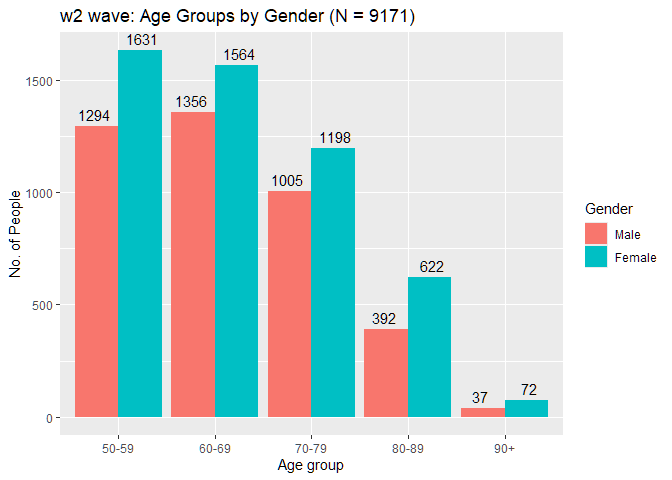
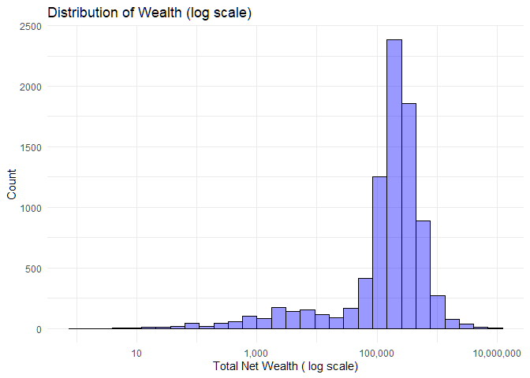
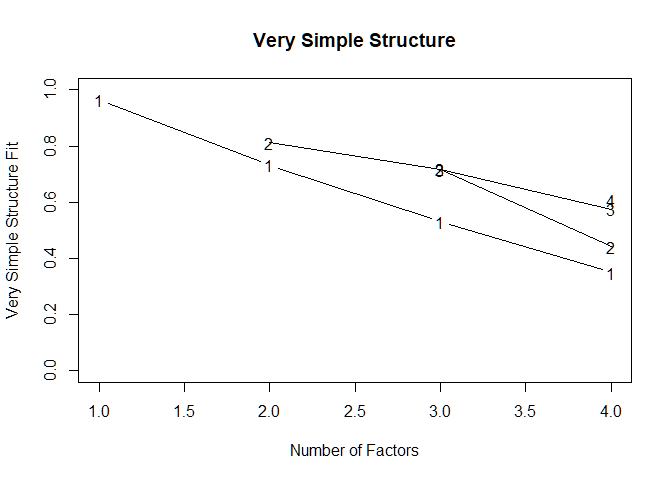

Measuring impact of pain in aging population using existing items in
ELSA
================
28 May 2024

- [INTRODUCTION](#introduction)
  - [AIM](#aim)
- [METHOD](#method)
  - [SAMPLE](#sample)
    - [Variable naming convention](#variable-naming-convention)
    - [Cohorts, Strata and Clusters](#cohorts-strata-and-clusters)
    - [Participants in W2](#participants-in-w2)
    - [Chronic pain indicator](#chronic-pain-indicator)
    - [Age and Gender distributions](#age-and-gender-distributions)
  - [MEASURES](#measures)
    - [Participation to general
      activities](#participation-to-general-activities)
    - [Participation to Work
      Activities](#participation-to-work-activities)
    - [ADL+IADL items in ELSA](#adliadl-items-in-elsa)
    - [Defining list of Variables](#defining-list-of-variables)
    - [w3 Wave: Missing Data in sample](#w3-wave-missing-data-in-sample)
  - [ANALYSIS](#analysis)
    - [Construct dimensionality](#construct-dimensionality)
    - [listwise deletion of missing
      data](#listwise-deletion-of-missing-data)
- [Sample split](#sample-split)
  - [EFA](#efa)
  - [CFA](#cfa)
- [RESULTS](#results)
  - [Item responses: descriptive
    statistics](#item-responses-descriptive-statistics)
  - [Ordered proportion of responses](#ordered-proportion-of-responses)
  - [GOAL 1: Testing dimensionality of
    items](#goal-1-testing-dimensionality-of-items)
    - [Dimensionality](#dimensionality)
    - [Correlation matrix](#correlation-matrix-1)
    - [Hierarchical clustering](#hierarchical-clustering)
    - [All items solution](#all-items-solution)
  - [GOAL 2: Achieving a one factor
    solution](#goal-2-achieving-a-one-factor-solution)
    - [Removing items](#removing-items)
- [CONCLUSION](#conclusion)

# INTRODUCTION

## AIM

The overal aim of this analysis is to present a measurement model that
can capture  
the dimensions included in the NIH screenig tool for chronic pain
impact.

The goas of this analysis are:

0.  to explore the dimensionality of the items selected in the previus
    stages
1.  to assess construct validity of the measurement models proposed
2.  to achieve one or more sets of items to candidate for further
    analysis

# METHOD

## SAMPLE

``` r
## this is marked as "all" because includes both respondents and partners
H_elsa_all<-read.csv("c:/Users/d.vitali/Desktop/Github/CRIISP-WP5/data/clean/H_w1_9_ALL.tab")
```

This dataframe includes Harmonized ELSA data from all waves of ELSA
(harmonised g2 dataset).

For the purpose of this analysis I will focus on Wave 2 data because
this wave is the first implementing one of the key variables that are
being evaluated here

### Variable naming convention

Each individual is uniquely identified by the unique identifier:

    idauniq

Variable names in the Harmonized ELSA Data follow a consistent pattern
(e.g.):

    r2HLTHLM = (R)espondent, Wave(1), Health problem limiting work(HLTHLM)

1.  The first character indicates whether the variable refers to the
    reference person (“R”), spouse (“S”), the full household (“HH”), and
    a financial unit household (“H”).
2.  The second character indicates the wave to which the variable
    pertains: “1”, “2”, “3”, “4”, “5”, “6” , “7”, “8”, “9”, or “A”. The
    “A” indicates “all”, i.e. the variable is not specific to any single
    wave.
3.  The remaining characters describe the concept that the variable
    captures

| Code  | Reason for missing           |
|-------|:-----------------------------|
| NA    | did not respond to this wave |
| (-4)  | Don’t know                   |
| (-18) | Refused                      |
| (-13) | Other missing                |
| (-16) | Proxy                        |

**Table 2.** Coding of missing data in the H.Elsa dataset

### Cohorts, Strata and Clusters

In this wave one there are 3 identified cohorts:

1.  original HSE sample (HSE 1998-2001)
2.  partner of an original sample respondent
3.  young partner of an original sample respondent

| case | desc                                | N     |
|------|:------------------------------------|-------|
| 1    | Original HSE sample                 | 11595 |
| 2    | Partner of an orig. sample resp.    | 138   |
| 3    | Young partner an orig. sample resp. | 664   |

**Table 3.** Cohorts and respective count of individuals for the current
wave

Therefore selecting only original HSE sample’s core respondents and
excluding their partners.

    ## cohort
    ##     1 
    ## 11595

### Participants in W2

    ## inwave2:
    ##     0     1 
    ## 10370  9432

Participants responding to wave 2 was: 9432

Down 2667 from wave 1.

### Chronic pain indicator

To identify respondents who erienced persistent pain symptoms, all
participants were required to report pain severities of moderate or
greater at both the analysed and previous ELSA data collection interval”

``` r
# load the chronic pain categorising function
source("c:/Users/d.vitali/Desktop/Github/CRIISP-WP5/Sources/chronic_pain_var.R")

# Create chrpain variables for waves x to 9
waves <- 1:9
for (wave in waves) {
  H_elsa_w2_ <- create_chrpain_variable(H_elsa_w2_, wave)
}

#table(H_elsa_w2_$r2chrpain)
```

### Age and Gender distributions

    ## [1] "90+ count: 109"

    ## [1] "<50 count: 261"

Of this sample of the elsa current wave respondents  
I am excluding the 90+ because elsa do not track age beyond this level
and simply classifies age 90+.

respondent aged \< 50 or above 89yo

<!-- -->

    ##        
    ##             M     W
    ##   0-29   0.00  0.00
    ##   30-39  0.00  0.00
    ##   40-49  0.00  0.00
    ##   50-59 14.28 18.00
    ##   60-69 14.96 17.26
    ##   70-79 11.09 13.22
    ##   80-89  4.33  6.86
    ##   90+    0.00  0.00
    ##   Sum   44.66 55.34

    ##     50-59     60-69     70-79     80-89 
    ## 0.5576068 0.5356164 0.5438039 0.6134122

    ## 
    ##  4-sample test for equality of proportions without continuity correction
    ## 
    ## data:  tr_tab0[2, ] out of addmargins(tr_tab0, 1)[3, ]
    ## X-squared = 19.543, df = 3, p-value = 0.0002111
    ## alternative hypothesis: two.sided
    ## sample estimates:
    ##    prop 1    prop 2    prop 3    prop 4 
    ## 0.5576068 0.5356164 0.5438039 0.6134122

The age distribution in this sample of subject reporting pain show a
majority of women in all age groups with the 80-89 range presenting the
highest prevalence of females:

|     | 50-59 | 60-69 | 70-79 | 80-89 | **Tot** |
|----:|:-----:|:-----:|:-----:|:-----:|:-------:|
|   M | 1294  | 1356  | 1005  |  392  |  4047   |
|   F | 1631  | 1564  | 1198  |  622  |  5015   |
| Tot | 2925  | 2920  | 2203  | 1014  |  9062   |

**Table 4.** Count and proportion of individuals by age and gender
(current wave)

## MEASURES

### Participation to general activities

loading the ELSA non harmonised dataset for wave 1. We need this to get
the variable “helim”. This correspond to the question:

    Q: helim. (Does this / Do these) illness(es) or disability(ies) limit your activities in any way?

**Cut-off criterion.** “limit your activity” is the cut-off criterion
proposed to respondents

**Anchor in pain.** NO i.e. lacking explicit causal link between the
limitation examined and pain. **Anchor in health.** YES i.e. proposing a
explicit causal between the limitation examined and health problem.

    ## .
    ##   -1    1    2 
    ## 5343 4202 2554

    ## helim
    ##   -1    1    2 
    ## 4038 2922 2012

. “helim” = -1 : (not applicable, i.e. the do not report an illness,
disability or infirmity) . “helim” = 1 : No (does not limit the
activities) . “helim” = 2 : Yes (limits the activites)

we rename this variable as “hlmact”.

    ## .
    ##    0    1 
    ## 6050 2922

### Participation to Work Activities

    Do you have any health problem or disability that limits the kind or amount of paid work you 
    could do, should you want to?

**Cut-off criterion.** “limit” is the cut-off criterion proposed to
respondents.

**Anchor in pain.** NO i.e. lacking explicit causal link between the
limitation examined and pain. **Anchor in health.** YES i.e. proposing a
explicit causal between the limitation examined and health problem.

These Items are not anchored in pain (i.e. lacking “because of pain”
pain or in “because of health problem or disability”

| VarName | Description                                                      |
|:--------|:-----------------------------------------------------------------|
| rXhlthl | impairment or health problem limits paid work for the respondent |

    ## 
    ##  -18  -16  -13   -4    0    1 
    ##    1  102    7   10 5999 2943

. “r2hlthlm” = -16 : interview given via proxy (these will be filtered
out) . “r2hlthlm” = -13 : missing . “r2hlthlm” = -4 : Don’t know .
“r2hlthlm” = 1 : NO (Does not limit work) . “r2hlthlm” = 2 : Yes (limits
work)

### ADL+IADL items in ELSA

In H.ELSA the ADL and AIDL items and three additional mobility-focused
items. All items are of type “dichotomous” and they are scored as 1 if
the respondent indicates a difficulty with a particular activity, or as
0 if they do not indicate a difficulty.

    Here are a few more everyday activities. Please tell me if you have any 
    difficulty with these because of a physical, mental, emotional or memory 
    problem. Again exclude any difficulties you ect to last less than 
    three months.

**Cut-off criterion.** “difficulty” is the cut-off criterion proposed to
respondents.

**Anchor in pain.** NO i.e. lacking explicit causal link between the
limitation examined and pain. **Anchor in health.** YES i.e. proposing a
explicit causal between the limitation examined and health problem.

| VarName    | scale | Waves | Description:                                            |
|:-----------|:------|:-----:|:--------------------------------------------------------|
| rxdressa   | ADL   |  1-9  | dressing including putting on shoes and socks           |
| rxwalkra   | ADL   |  1-9  | walking across a room                                   |
| rxbatha    | ADL   |  1-9  | bathing or showering                                    |
| rxeata     | ADL   |  1-9  | eating such as cutting up food                          |
| rxbeda     | ADL   |  1-9  | getting in and out of bed                               |
| rxtoilta   | ADL   |  1-9  | using the toilet including getting up or down           |
| rxmapa     | IADL  |  1-9  | using map to figure out how to get around strange place |
| rxmealsa   | IADL  |  1-9  | preparing a hot meal                                    |
| rxshopa    | IADL  |  1-9  | shopping for groceries                                  |
| rxphonea   | IADL  |  1-9  | making telephone calls                                  |
| rxmedsa    | IADL  |  1-9  | taking medications                                      |
| rxhousewka | IADL  |  1-9  | doing work around house and garden                      |
| r2chaira   | Mobil |  1-9  | Diff-Get up fr chair                                    |
| r2clim1a   | Mobil |  1-9  | Diff-Clmb 1 flt str                                     |
| r2lifta    | Mobil |  1-9  | Diff-Lift/carry 10lbs                                   |

**Table 5.** Variable names, description, scale origin, and ELSA waves
in which each item has been implemented.

### Defining list of Variables

List of the proposed variables

``` r
varlist<-c("idauniq",
           "r2dressa", "r2walkra", "r2batha"   , "r2eata"  , "r2beda"  , "r2toilta",
           "r2shopa" , "r2mealsa", "r2housewka", "r2mapa"  , "r2phonea", "r2moneya", "r2medsa" , 
           "r2hlthlm", "hlmact",
           "r2chaira", "r2clim1a","r2lifta"
           )
```

### w3 Wave: Missing Data in sample

Missing data for any considered indicator was treated with listwise
deletion and reported in the table below.

    ##       VarName N. Missing Total
    ## 1     idauniq          0  9062
    ## 2    r2dressa          3  9062
    ## 3    r2walkra          3  9062
    ## 4     r2batha          3  9062
    ## 5      r2eata          3  9062
    ## 6      r2beda          3  9062
    ## 7    r2toilta          3  9062
    ## 8     r2shopa          3  9062
    ## 9    r2mealsa          3  9062
    ## 10 r2housewka          3  9062
    ## 11     r2mapa          3  9062
    ## 12   r2phonea          3  9062
    ## 13   r2moneya          3  9062
    ## 14    r2medsa          3  9062
    ## 15   r2hlthlm        120  9062
    ## 16     hlmact         90  9062
    ## 17   r2chaira          3  9062
    ## 18   r2clim1a          3  9062
    ## 19    r2lifta          3  9062

<!-- -->

## ANALYSIS

Combining:

- ADL
- IADL items
- functional ability items
- r2hlthl (health impairment prevents from doing my work)
- helim (health inmpairment prevents engaging activities)

1.  PA + EFA to evaluate construct validity and dimensionality
2.  CFA to evaluate the measurement model

### Construct dimensionality

Construct dimensionality will be assess via Parallel Analysis (PA) and
EFA. The factor structure emerging from these lorative analysis will
then be submitted for CFA for further empirical validation of the
solutions proposed.

The sample available to these analysis is n = 9062 therefore it was
further partitioned in two randomly selected datasets :

1.  ~ 1/2 from of total sample to used for PA and EFA (LV_items_ex)
2.  the remaining data (LV_items_conf) to be used for CFA

### listwise deletion of missing data

Selecting complete cases

# Sample split

Split sample for confirmatory factor analysis. 50% for EFA and then 50
for CFA.

#### Parallel analysis

Parallel analysis will be used to compare the scree of factors of the
observed data with that of a random data matrix (re-sampled from the
original) of the same size. It should be noted that as the sample size
increases to infinite, the approximation of the eigenvalue of the random
data tends to 1.

#### Correlation matrix

Spector and Fleishman (1998) have pointed out that using pearson
correlation coefficients have been shown to suffer greatly in the
presence of skew data (Muthen 1988). This is not uncommon in the
literature and one example of PCA using a person correlation matrix is
found in Kempen et al (1995). In the current analysis, I used
tetrachoric correlations (Spector & Fleishman, 1998). Tetrachoric
correlations assume that observed dichotomous variables represent
unobserved (latent) continuous variables with a bivariate normal
distribution; the tetrachoric correlation estimates the relationship
between these latent continuous variables.

### EFA

#### Sample

n = 4454 (~1/2) randomly selected from the N= 8878 first wave
respondents studied in this paper. The remaining 1/2 of the N= 8878 will
be used for CFA.

#### Estimator

With regards to the estimator, some (although dated) suggestions point
to generalized least squares estimation procedure (Spector & Fleishman,
1998; Muthen, 1978, 1988). The choice for the GLS estimator comes from
Fleishman (1998) and Muthen (1978, 1988). Arguably ML estimation is a
more appropriate and accurate method for factor analysis with binary
data than other methods, such as PCA or PAF, because it makes fewer
assumptions about the distribution of the data. More recent
methodological papers suggest WLSM (mean adj weighted least square - see
e.g. mplus) which do not assume a particular distribution.

#### Tetra- vs Polychoric correlations

Tetrachoric correlation assumes that the binary data have a continuous
underlying distribution, and estimates the correlation between the
underlying continuous variables. Tetrachoric correlation is appropriate
when the binary variables are thought to be generated from an underlying
normal distribution. The distribution of the binary data may not be
accurately approximated by a continuous distribution, and this can lead
to biased estimates of the tetrachoric correlation matrix. This bias can
be particularly problematic when the binary data are highly skewed and
therefore should be avoided in this case

Polychoric correlation, on the other hand, is appropriate when the
binary variables are thought to be generated from an underlying ordinal
variable, with multiple categories. It assumes that the binary variables
have an underlying, unobserved continuous variable that generates the
observed categories, and estimates the correlation between the
underlying continuous variables. Polychoric correlation is more robust
to departures from normality and can provide more accurate estimates of
the correlation matrix when the binary variables have few categories
and/or are highly skewed.

    SPECTOR, W. D. and FLEISHMAN, J. A. (1998). Combining activities of daily living with instrumental activities of daily living to measure functional disability. J. Gerontology: Social Sciences 
    Muthén, B. (1978). Contributions to factor analysis of dichotomous variables. Psychometrika, 43(4), 551-560.
    Muthén, B., & Hofacker, C. (1988). Testing the assumptions underlying tetrachoric correlations. Psychometrika, 53, 563-577.

#### Rotations

Rotations considered:

- promax
- varimax

The two factors are ected to be correlated. The correlation assumption
is lored via the application of two rotation methods: oblique and
orthogonal.

1.  Correlated factors assumption (oblique rotation)
    - Promax rotation is a popular approach with large datasets - could
      overestimate the correlation between factors
    - Oblimin rotation is discouraged with large datasets but can help
      produce simpler factor structures.
2.  Orthogonal factors assumption

Promax and oblimin rotations are expected to yield a clearer factor
solution here than Varimax which assumes orthogonality between the
latent factors.

Thurstone’s (1947) five criteria for the “simple” solution were used to
select the rotation method

1.  Each variable should produce at least one zero loading
    (-.1\<$\lambda$\<.1) on some factor.
2.  Each factor should have at least as many zero loadings as there are
    factors.
3.  Each pair of factors should have variables with significant loadings
    on one ($\lambda$ \> .3) and zero loadings on the other.
4.  Each pair of factors should have a large proportion of zero loadings
    on both factors (if there are say four or more factors total).
5.  Each pair of factors should have only a few complex variables (
    $\lambda$ \> .3).

We can think of the goal of rotation and of choosing a particular type
of rotation as seeking something called simple structure. That is, the
rotation is adequate if the result achieves a simple structure.

    Thurstone, L. L. (1947). Multiple-factor analysis; A development and expansion of The vectors of the mind. Chicago, IL: University of Chicago Press.

### CFA

#### Sample

The remaining 1/2 of the N= 8878, randomly selected.

#### Estimator

WLSM (mean adj weighted least square - see e.g. mplus) which do not
assume a particular distribution. This method imply the Diagonalised
weighted least square estimator, have robust standard errors and a mean
adjusted $\chi^2$ statistic.

#### Items selection

Round 1: all items with EFA suggested structure Round 2: final item
selection

CFA will inform the removal of items that do not support a single
dimension solution of the proposed scale of disability. Fit of models
will be compared via scaled Chi-Squared Difference Test
($\Delta\chi^2$).

# RESULTS

## Item responses: descriptive statistics

<!-- --><!-- --><!-- --><!-- -->

## Ordered proportion of responses

List of item by how often are scored as “1”, i.e. experiencing the
difficulty.

``` r
propsummary<-data.frame(Item = colnames(summarytab),
                       Proportion = round(colMeans(summarytab) * 100,2)) 
rownames(propsummary)<-NULL


# Proportion of current wave respondent having difficulties with
# each of the nine IADL ADL Tasks
propsummary[order(propsummary$Proportion, decreasing = TRUE), ] %>% print
```

    ##                                   Item Proportion
    ## 14                   Health limit work      32.97
    ## 15     Health/disability limits actity      32.35
    ## 16           Some Diff-Get up fr chair      26.71
    ## 18 Some Diff-lifting/carrying 10pounds      25.19
    ## 9                    work house/garden      16.40
    ## 17            Some Diff-Clmb 1 flt str      14.87
    ## 2                             dressing      13.40
    ## 3                 bathing or showering      11.48
    ## 7               shopping for groceries       9.16
    ## 5                getting in/out of bed       6.18
    ## 10       using a map in unknown places       5.42
    ## 8                       prep. hot meal       4.47
    ## 1                walking across a room       3.22
    ## 6                               toilet       3.08
    ## 12                      managing money       2.69
    ## 4               eating/cutting up food       2.03
    ## 11                     telephone calls       1.91
    ## 13                  taking medications       1.73

## GOAL 1: Testing dimensionality of items

### Dimensionality

When ADL and IADL are used as separate scales they seem to present
clearer dimensionality and hierarchical structure but they may also
carry significant DIF bias and intrinsic limitations with regards to
what they measure. As an example of intrinsic limitations, ADL items
cannot discriminate below higher levels of functional disability thereby
making it difficult to use the ADL items alone in populations where the
prevalence of severe levels of disability tends to be low (Kovar and
Lawton 1994).

On the other hand, when considering ADL+IADL as a single scale, it is
important to observe that the simple aggregation of these indicators in
a deterministic model (e.g. Guttman’s model) implies the untenable
assumption of the equivalence of each item’s importance (Thomas et al
1998, Fieo 2011). Some researchers have suggested that rather than using
a deterministic model it is perhaps better to assume a probabilistic
relationship between the item responses and the concept these aim to
represent (Kempen et al 1995). Recent work by Caballero et al. (2017)
have showed that it is possible to create a compound health metric in
ELSA that can be used to quantify and study the health status of
individuals overtime using a probabilistic model. In addition, and most
relevantly for the larger study in which the present is nested,
Caballero et al have showed that Machine Learning methods can be applied
to identify relationships between socio-demographics and the health
score created.

    Caballero, F. F., Soulis, G., Engchuan, W., Sánchez-Niubó, A., Arndt, H., Ayuso-Mateos, J. L., ... & Panagiotakos, D. B. (2017). Advanced analytical methodologies for measuring healthy ageing and its determinants, using factor analysis and machine learning techniques: the ATHLOS project. Scientific reports, 7(1), 43955.
    Fieo, R. A., Austin, E. J., Starr, J. M., & Deary, I. J. (2011). Calibrating ADL-IADL scales to improve measurement accuracy and to extend the disability construct into the preclinical range: a systematic review. BMC geriatrics, 11, 1-15.
    Kempen, G. I. J. M., Myers, A. M., & Powell, L. E. (1995). Hierarchical structure in ADL and IADL: analytical assumptions and applications for clinicians and researchers. Journal of clinical epidemiology, 48(11), 1299-1305.
    Thomas, V. S., Rockwood, K., & McDowell, I. (1998). Multidimensionality in instrumental and basic activities of daily living. Journal of clinical epidemiology, 51(4), 315-321.

### Correlation matrix

The following plot shows the (polychoric) correlation matrix in
conjunction with the hierarchical clustering of these variables done by
pheatmap() using hclust().

``` r
cor0<-polychoric(LV_items_ex[,-1], smooth = F, correct = F)


cor0$rho %>% pheatmap(display_numbers = T, 
                      cluster_rows = T,
                      cluster_cols = T,
                      breaks = seq(0, 1, length.out = 101),
                      main = "Items Polychoric Correlation matrix")
```

<!-- -->

The visual examination of the tetrachoric correlation matrix seems two
suggest a two factor solution with “warmer colors” (higher correlation)
with “map,phone,money,med”, and a larger group with the rest of the
items.

### Hierarchical clustering

The dendrogram visually represents the hierarchical structure of the
data, allowing you to interpret the relationships between clusters or
data points based on their distances or dissimilarities.

The methods “average” linkage is used as it is less sensitive to the
distribution of the variables (these are all dichotomous items)

The vertical axis represents the distances or dissimilarities between
clusters or individual data points. Therefore, the height at which two
clusters or data points are merged corresponds to the distance or
dissimilarity between them. The longer the vertical line, the greater
the dissimilarity between the clusters being merged.

``` r
# treats correlation scores as point in a high dimensional space and calculates the distance between two points
polychor.dist<-as.dist(1 - cor0$rho)

#hclust(polychor.dist, method="complete") %>% plot

# Complete linkage or maximum linkage:

# . Calculates the maximum dissimilarity between pairs of clusters.
# . Tends to produce clusters that are compact and well-separated.
# . Can be sensitive to outliers.

hclust(polychor.dist, method="average") %>% plot
```

<!-- -->

``` r
# Average linkage

# . Calculates the average dissimilarity between pairs of clusters.
# . Less sensitive to outliers compared to complete linkage.
```

Items within the closest distance seems to include, in order:

“meal, shop” “housework,walk across the room” “getting out of bed”,
“gettin on/off toilet” “getting dressed”, “using the bath/washing
oneselves” “climbing one flight of stairs”, “lifting a weight” “health
limits work”, “health limits my activity”

### All items solution

#### Parallel analysis

This code is performing a parallel analysis to determine the number of
factors that should be retained in a factor analysis of the LV_items_ex
dataset. The number of factors to retain will be determined by comparing
the actual eigenvalues to the mean and standard deviation of the
eigenvalues generated from the bootstrap resampled datasets.

``` r
psych::fa.parallel(LV_items_ex[,-1],
                   main = "Parallel analysis round 1",
                   fa ="fa", 
                   fm = "gls", 
                   sim = "F", 
                   error.bars = T, 
                   cor = "poly", 
                   correct = T)
```

<!-- -->

    ## Parallel analysis suggests that the number of factors =  2  and the number of components =  NA

Parallel analysis confirms the suggestion of a two factor solution as
well as the ected eigenvalue for the second factor close to 1 as
observed in previous studies.

To confirm this, an EFA was conducted for the two-factor solution
suggested by Parallel analysis. Generalised Least Square (GLS) estimator
was suggested by Fleishman (1998) and Muthen (1978, 1988) but more
recent methodological papers suggest WLSM (mean adj weighted least
square - see e.g. mplus) which do not assume a particular distribution.

- Using WLSM as a factoring method

- rotation evaluated: Varimax, Promax.

This code performs an loratory factor analysis (EFA) with tetrachoric
correlations using the “fa()” function from the “psych” package. The
analysis is rotated using both the varimax and promax methods, and the
resulting loadings are compared using a heatmap.

The “fa()” function is called twice within a loop, with each iteration
rotating the factor solution using a different method. The loadings from
each iteration are then combined into a single matrix using the
“cbind()” function.

Finally, the resulting loadings matrix is rounded to two decimal places
using the “round()” function and visualized using the “pheatmap()”
function from the “pheatmap” package. The heatmap displays the loadings
for each factor and rotation method, with the colors representing the
strength and direction of the loadings.

The Bartlett correction (correct = “T” in the fa() function) is commonly
used in factor analysis when the assumption of sphericity is violated,
which means that the variables are not uncorrelated and the correlation
matrix is not an identity matrix. In such cases, the eigenvalues of the
correlation matrix tend to overestimate the true number of factors.

The Bartlett correction adjusts for the lack of sphericity by using a
correction factor based on the determinant of the correlation matrix.
The corrected eigenvalues provide a better estimate of the true number
of factors.

This correction is generally appropriate when conducting factor analysis
on correlated variables which is the assumption here.

    SPECTOR, W. D. and FLEISHMAN, J. A. (1998). Combining activities of daily living with instrumental activities of daily living to measure functional disability. J. Gerontology: Social Sciences 
    Muthén, B. (1978). Contributions to factor analysis of dichotomous variables. Psychometrika, 43(4), 551-560.
    Muthén, B., & Hofacker, C. (1988). Testing the assumptions underlying tetrachoric correlations. Psychometrika, 53, 563-577.

<!-- -->

*Note that in oblique rotations like promax, loadings are regression
coefficients and can exceed the \[-1,1\] interval.*

**Rotation decision.** Promax rotation was selected as satisfying all 5
Thurstone’s criteria for simplicity. The other oblique rotation
(oblimin) was also satisfactory but inferior by the same criteria. This
represent a suggestion that this selection of items comprises two
defined and correlated factors.

#### EFA summary

#### CFA: one vs two-factor fit

For simplicity of interpretation, all CFA models will be identified by
fixing the variance of the latent to 1 and therefore all indicators are
free parameters.

Diagonally weighted least squares (WLSMV) is specifically designed for
ordinal data.

Kline (2016) suggests to inspect residuals (type = “correlation”) to
identify residuals \> \|.10\|. Such residuals indicate a likely
specification error and could inform a decision to respecify a model\*.

    See chapter 11 in Kline, R. B. (2016). Principles and practice of structural equation modeling (4th ed.). Guilford Press.

##### One factor solution

Like the previous, both models are confirmatory factor analysis (CFA)
models that aim to identify the factor structure of the ADL+IADL data.
The second model, ALL.one.factor.model, proposes a single factor that
loads on all ALL items

``` r
######################################################
##### CONFIRMATORY FACTOR ANALYSIS: one.factor.model
#######################################################

ALL.one.factor.model<-'

  Lv1   =~ r2dressa + r2walkra + r2batha + r2eata + r2beda + r2toilta + r2shopa + r2mealsa + r2housewka + r2chaira  + r2clim1a + r2lifta + r2mapa + r2phonea + r2moneya + r2medsa + r2hlthlm + hlmact'
ALL.one.factor.Fit<- cfa(model = ALL.one.factor.model, 
                     data = LV_items_conf,
                     ordered = TRUE, # polychoric correlations for the ordinal variables
                     std.lv = TRUE,
                     auto.fix.first = FALSE,
                     estimator = "WLSM" #  WLSM or alternatively WLSMV
                     )
                                 


r<-residuals(ALL.one.factor.Fit, type = "cor")$cov %>% as.table %>% round(2)
r[abs(r) < 0.1] <- "-"

#r

## Diagnostic tool to explore residual correlations or other potential sources of bias in the model
#m<-modificationindices(ALL.one.factor.Fit)

summary(ALL.one.factor.Fit, fit.measures = T, rsquare=T)
```

    ## lavaan 0.6.17 ended normally after 23 iterations
    ## 
    ##   Estimator                                       DWLS
    ##   Optimization method                           NLMINB
    ##   Number of model parameters                        36
    ## 
    ##   Number of observations                          4424
    ## 
    ## Model Test User Model:
    ##                                               Standard      Scaled
    ##   Test Statistic                               782.717    1280.303
    ##   Degrees of freedom                               135         135
    ##   P-value (Chi-square)                           0.000       0.000
    ##   Scaling correction factor                                  0.611
    ##     Satorra-Bentler correction                                    
    ## 
    ## Model Test Baseline Model:
    ## 
    ##   Test statistic                             96664.482   96664.482
    ##   Degrees of freedom                               153         153
    ##   P-value                                        0.000       0.000
    ##   Scaling correction factor                                  1.000
    ## 
    ## User Model versus Baseline Model:
    ## 
    ##   Comparative Fit Index (CFI)                    0.993       0.988
    ##   Tucker-Lewis Index (TLI)                       0.992       0.987
    ##                                                                   
    ##   Robust Comparative Fit Index (CFI)                         0.810
    ##   Robust Tucker-Lewis Index (TLI)                            0.785
    ## 
    ## Root Mean Square Error of Approximation:
    ## 
    ##   RMSEA                                          0.033       0.044
    ##   90 Percent confidence interval - lower         0.031       0.041
    ##   90 Percent confidence interval - upper         0.035       0.047
    ##   P-value H_0: RMSEA <= 0.050                    1.000       1.000
    ##   P-value H_0: RMSEA >= 0.080                    0.000       0.000
    ##                                                                   
    ##   Robust RMSEA                                               0.167
    ##   90 Percent confidence interval - lower                     0.155
    ##   90 Percent confidence interval - upper                     0.180
    ##   P-value H_0: Robust RMSEA <= 0.050                         0.000
    ##   P-value H_0: Robust RMSEA >= 0.080                         1.000
    ## 
    ## Standardized Root Mean Square Residual:
    ## 
    ##   SRMR                                           0.083       0.083
    ## 
    ## Parameter Estimates:
    ## 
    ##   Parameterization                               Delta
    ##   Standard errors                           Robust.sem
    ##   Information                                 Expected
    ##   Information saturated (h1) model        Unstructured
    ## 
    ## Latent Variables:
    ##                    Estimate  Std.Err  z-value  P(>|z|)
    ##   Lv1 =~                                              
    ##     r2dressa          0.830    0.012   66.828    0.000
    ##     r2walkra          0.893    0.015   59.968    0.000
    ##     r2batha           0.862    0.012   74.817    0.000
    ##     r2eata            0.732    0.031   23.617    0.000
    ##     r2beda            0.860    0.015   58.974    0.000
    ##     r2toilta          0.806    0.023   34.840    0.000
    ##     r2shopa           0.907    0.010   95.325    0.000
    ##     r2mealsa          0.886    0.014   64.096    0.000
    ##     r2housewka        0.900    0.009  101.208    0.000
    ##     r2chaira          0.742    0.014   53.169    0.000
    ##     r2clim1a          0.860    0.011   78.845    0.000
    ##     r2lifta           0.830    0.011   76.038    0.000
    ##     r2mapa            0.591    0.027   21.678    0.000
    ##     r2phonea          0.614    0.037   16.410    0.000
    ##     r2moneya          0.737    0.026   28.067    0.000
    ##     r2medsa           0.700    0.033   21.443    0.000
    ##     r2hlthlm          0.832    0.011   76.869    0.000
    ##     hlmact            0.761    0.013   58.599    0.000
    ## 
    ## Thresholds:
    ##                    Estimate  Std.Err  z-value  P(>|z|)
    ##     r2dressa|t1       1.127    0.024   47.124    0.000
    ##     r2walkra|t1       1.826    0.036   50.519    0.000
    ##     r2batha|t1        1.198    0.025   48.525    0.000
    ##     r2eata|t1         2.051    0.043   47.281    0.000
    ##     r2beda|t1         1.548    0.030   51.859    0.000
    ##     r2toilta|t1       1.880    0.038   49.903    0.000
    ##     r2shopa|t1        1.312    0.026   50.264    0.000
    ##     r2mealsa|t1       1.688    0.033   51.590    0.000
    ##     r2housewka|t1     0.985    0.023   43.634    0.000
    ##     r2chaira|t1       0.648    0.020   31.821    0.000
    ##     r2clim1a|t1       1.031    0.023   44.874    0.000
    ##     r2lifta|t1        0.671    0.020   32.775    0.000
    ##     r2mapa|t1         1.607    0.031   51.852    0.000
    ##     r2phonea|t1       2.121    0.046   45.962    0.000
    ##     r2moneya|t1       1.943    0.040   49.045    0.000
    ##     r2medsa|t1        2.105    0.045   46.272    0.000
    ##     r2hlthlm|t1       0.450    0.020   23.035    0.000
    ##     hlmact|t1         0.466    0.020   23.747    0.000
    ## 
    ## Variances:
    ##                    Estimate  Std.Err  z-value  P(>|z|)
    ##    .r2dressa          0.311                           
    ##    .r2walkra          0.202                           
    ##    .r2batha           0.258                           
    ##    .r2eata            0.464                           
    ##    .r2beda            0.261                           
    ##    .r2toilta          0.350                           
    ##    .r2shopa           0.177                           
    ##    .r2mealsa          0.214                           
    ##    .r2housewka        0.189                           
    ##    .r2chaira          0.450                           
    ##    .r2clim1a          0.260                           
    ##    .r2lifta           0.311                           
    ##    .r2mapa            0.651                           
    ##    .r2phonea          0.623                           
    ##    .r2moneya          0.457                           
    ##    .r2medsa           0.510                           
    ##    .r2hlthlm          0.308                           
    ##    .hlmact            0.420                           
    ##     Lv1               1.000                           
    ## 
    ## R-Square:
    ##                    Estimate
    ##     r2dressa          0.689
    ##     r2walkra          0.798
    ##     r2batha           0.742
    ##     r2eata            0.536
    ##     r2beda            0.739
    ##     r2toilta          0.650
    ##     r2shopa           0.823
    ##     r2mealsa          0.786
    ##     r2housewka        0.811
    ##     r2chaira          0.550
    ##     r2clim1a          0.740
    ##     r2lifta           0.689
    ##     r2mapa            0.349
    ##     r2phonea          0.377
    ##     r2moneya          0.543
    ##     r2medsa           0.490
    ##     r2hlthlm          0.692
    ##     hlmact            0.580

``` r
#######################################################
##### END CONFIRMATORY FACTOR ANALYSIS
#######################################################
```

##### Two factor solution

The model below includes two latent variables, “Lv1” and “Lv2”, which
are measured by a set of observed variables (indicators).

. The first latent variable “Lv1” is measured by 13 binary items:
r2eata, r2dressa, r2walkra, r2batha, r2beda, r2toilta, r2shopa,
r2mealsa, r2housewka, r2chaira , r2clim1a, r2lifta, r2hlthlm, and
hlmact;

. The second latent variable “Lv2” is measured by five binary items:
r2mapa, r2phonea, r2moneya, r2medsa, and r2eata;

The symbol “=~” is used to specify the measurement model, indicating
that the latent variables are being measured by the observed variables.
The symbol “\~~” specifies a correlation between the two latent
variables.

The lavaan package is used to estimate the model using weighted least
squares mean and variance adjusted (WLSMV) estimation. The “ordered =
TRUE” argument indicates that polychoric correlations should be used for
the binary variables. The “auto.fix.first = FALSE” argument specifies
that the first loading for each latent variable should not be fixed to 1
for identification purposes. Finally, the “std.lv = TRUE” argument
specifies that the latent variables should be standardized to have a
variance of 1.

The resulting object “ALL.two.factor.Fit” contains information about the
fit of the CFA model to the data, such as standardized parameter
estimates, fit indices, and residuals.

The first model, ALL.two.factor.model, proposes two factors: a first
factor that loads on the nine items suggested by EFA, and a second
factor that loads on the other four items.

``` r
######################################################
##### CONFIRMATORY FACTOR ANALYSIS: Two.factor.model
#######################################################

ALL.two.factor.model<-'

  Lv1   =~ r2dressa + r2walkra + r2batha +  r2beda + r2toilta + r2shopa + r2mealsa + r2housewka + r2chaira  + r2clim1a + r2lifta + r2hlthlm + hlmact
  Lv2   =~ r2mapa + r2phonea + r2moneya + r2medsa + r2eata
  
  Lv1 ~~ Lv2
'
ALL.two.factor.Fit<- cfa(model = ALL.two.factor.model, 
                     data = LV_items_conf,
                     ordered = TRUE, # polychoric correlations for the ordinal variables
                     auto.fix.first = FALSE,
                     std.lv = TRUE,
                     estimator = "WLSM" #  WLSM or alternatively WLSMV
                     )
                                 
#residuals(ALL.two.factor.Fit, type = "cor")

## Diagnostic tool to explore residual correlations or other potential sources of bias in the model
#m<-modificationindices(ALL.two.factor.Fit)
r<-residuals(ALL.two.factor.Fit, type = "cor")$cov %>% as.table %>% round(2)
r[abs(r) < 0.1] <- "-"

#r  # residuals
summary(ALL.two.factor.Fit, fit.measures = T, rsquare=T, standardize = T)
```

    ## lavaan 0.6.17 ended normally after 25 iterations
    ## 
    ##   Estimator                                       DWLS
    ##   Optimization method                           NLMINB
    ##   Number of model parameters                        37
    ## 
    ##   Number of observations                          4424
    ## 
    ## Model Test User Model:
    ##                                               Standard      Scaled
    ##   Test Statistic                               480.095     789.218
    ##   Degrees of freedom                               134         134
    ##   P-value (Chi-square)                           0.000       0.000
    ##   Scaling correction factor                                  0.608
    ##     Satorra-Bentler correction                                    
    ## 
    ## Model Test Baseline Model:
    ## 
    ##   Test statistic                             96664.482   96664.482
    ##   Degrees of freedom                               153         153
    ##   P-value                                        0.000       0.000
    ##   Scaling correction factor                                  1.000
    ## 
    ## User Model versus Baseline Model:
    ## 
    ##   Comparative Fit Index (CFI)                    0.996       0.993
    ##   Tucker-Lewis Index (TLI)                       0.996       0.992
    ##                                                                   
    ##   Robust Comparative Fit Index (CFI)                         0.866
    ##   Robust Tucker-Lewis Index (TLI)                            0.847
    ## 
    ## Root Mean Square Error of Approximation:
    ## 
    ##   RMSEA                                          0.024       0.033
    ##   90 Percent confidence interval - lower         0.022       0.030
    ##   90 Percent confidence interval - upper         0.027       0.036
    ##   P-value H_0: RMSEA <= 0.050                    1.000       1.000
    ##   P-value H_0: RMSEA >= 0.080                    0.000       0.000
    ##                                                                   
    ##   Robust RMSEA                                               0.141
    ##   90 Percent confidence interval - lower                     0.127
    ##   90 Percent confidence interval - upper                     0.156
    ##   P-value H_0: Robust RMSEA <= 0.050                         0.000
    ##   P-value H_0: Robust RMSEA >= 0.080                         1.000
    ## 
    ## Standardized Root Mean Square Residual:
    ## 
    ##   SRMR                                           0.059       0.059
    ## 
    ## Parameter Estimates:
    ## 
    ##   Parameterization                               Delta
    ##   Standard errors                           Robust.sem
    ##   Information                                 Expected
    ##   Information saturated (h1) model        Unstructured
    ## 
    ## Latent Variables:
    ##                    Estimate  Std.Err  z-value  P(>|z|)   Std.lv  Std.all
    ##   Lv1 =~                                                                
    ##     r2dressa          0.832    0.012   67.010    0.000    0.832    0.832
    ##     r2walkra          0.896    0.015   60.209    0.000    0.896    0.896
    ##     r2batha           0.864    0.012   74.949    0.000    0.864    0.864
    ##     r2beda            0.862    0.015   59.109    0.000    0.862    0.862
    ##     r2toilta          0.810    0.023   34.931    0.000    0.810    0.810
    ##     r2shopa           0.910    0.010   95.241    0.000    0.910    0.910
    ##     r2mealsa          0.891    0.014   63.776    0.000    0.891    0.891
    ##     r2housewka        0.902    0.009  101.399    0.000    0.902    0.902
    ##     r2chaira          0.744    0.014   53.330    0.000    0.744    0.744
    ##     r2clim1a          0.862    0.011   79.123    0.000    0.862    0.862
    ##     r2lifta           0.832    0.011   76.328    0.000    0.832    0.832
    ##     r2hlthlm          0.834    0.011   76.953    0.000    0.834    0.834
    ##     hlmact            0.764    0.013   58.718    0.000    0.764    0.764
    ##   Lv2 =~                                                                
    ##     r2mapa            0.728    0.029   24.771    0.000    0.728    0.728
    ##     r2phonea          0.736    0.040   18.278    0.000    0.736    0.736
    ##     r2moneya          0.890    0.025   35.546    0.000    0.890    0.890
    ##     r2medsa           0.834    0.033   25.195    0.000    0.834    0.834
    ##     r2eata            0.902    0.035   25.479    0.000    0.902    0.902
    ## 
    ## Covariances:
    ##                    Estimate  Std.Err  z-value  P(>|z|)   Std.lv  Std.all
    ##   Lv1 ~~                                                                
    ##     Lv2               0.751    0.020   37.190    0.000    0.751    0.751
    ## 
    ## Thresholds:
    ##                    Estimate  Std.Err  z-value  P(>|z|)   Std.lv  Std.all
    ##     r2dressa|t1       1.127    0.024   47.124    0.000    1.127    1.127
    ##     r2walkra|t1       1.826    0.036   50.519    0.000    1.826    1.826
    ##     r2batha|t1        1.198    0.025   48.525    0.000    1.198    1.198
    ##     r2beda|t1         1.548    0.030   51.859    0.000    1.548    1.548
    ##     r2toilta|t1       1.880    0.038   49.903    0.000    1.880    1.880
    ##     r2shopa|t1        1.312    0.026   50.264    0.000    1.312    1.312
    ##     r2mealsa|t1       1.688    0.033   51.590    0.000    1.688    1.688
    ##     r2housewka|t1     0.985    0.023   43.634    0.000    0.985    0.985
    ##     r2chaira|t1       0.648    0.020   31.821    0.000    0.648    0.648
    ##     r2clim1a|t1       1.031    0.023   44.874    0.000    1.031    1.031
    ##     r2lifta|t1        0.671    0.020   32.775    0.000    0.671    0.671
    ##     r2hlthlm|t1       0.450    0.020   23.035    0.000    0.450    0.450
    ##     hlmact|t1         0.466    0.020   23.747    0.000    0.466    0.466
    ##     r2mapa|t1         1.607    0.031   51.852    0.000    1.607    1.607
    ##     r2phonea|t1       2.121    0.046   45.962    0.000    2.121    2.121
    ##     r2moneya|t1       1.943    0.040   49.045    0.000    1.943    1.943
    ##     r2medsa|t1        2.105    0.045   46.272    0.000    2.105    2.105
    ##     r2eata|t1         2.051    0.043   47.281    0.000    2.051    2.051
    ## 
    ## Variances:
    ##                    Estimate  Std.Err  z-value  P(>|z|)   Std.lv  Std.all
    ##    .r2dressa          0.307                               0.307    0.307
    ##    .r2walkra          0.197                               0.197    0.197
    ##    .r2batha           0.254                               0.254    0.254
    ##    .r2beda            0.256                               0.256    0.256
    ##    .r2toilta          0.344                               0.344    0.344
    ##    .r2shopa           0.172                               0.172    0.172
    ##    .r2mealsa          0.207                               0.207    0.207
    ##    .r2housewka        0.186                               0.186    0.186
    ##    .r2chaira          0.446                               0.446    0.446
    ##    .r2clim1a          0.257                               0.257    0.257
    ##    .r2lifta           0.308                               0.308    0.308
    ##    .r2hlthlm          0.305                               0.305    0.305
    ##    .hlmact            0.417                               0.417    0.417
    ##    .r2mapa            0.469                               0.469    0.469
    ##    .r2phonea          0.458                               0.458    0.458
    ##    .r2moneya          0.207                               0.207    0.207
    ##    .r2medsa           0.305                               0.305    0.305
    ##    .r2eata            0.186                               0.186    0.186
    ##     Lv1               1.000                               1.000    1.000
    ##     Lv2               1.000                               1.000    1.000
    ## 
    ## R-Square:
    ##                    Estimate
    ##     r2dressa          0.693
    ##     r2walkra          0.803
    ##     r2batha           0.746
    ##     r2beda            0.744
    ##     r2toilta          0.656
    ##     r2shopa           0.828
    ##     r2mealsa          0.793
    ##     r2housewka        0.814
    ##     r2chaira          0.554
    ##     r2clim1a          0.743
    ##     r2lifta           0.692
    ##     r2hlthlm          0.695
    ##     hlmact            0.583
    ##     r2mapa            0.531
    ##     r2phonea          0.542
    ##     r2moneya          0.793
    ##     r2medsa           0.695
    ##     r2eata            0.814

``` r
#######################################################
##### END CONFIRMATORY FACTOR ANALYSIS
#######################################################
```

##### One vs two factor fit comparison

lavTestLRT() performs a likelihood ratio test (LRT) comparing two
models, in this case ALL.two.factor.Fit and ALL.one.factor.Fit. The null
hypothesis is that the more complex model (i.e., ALL.two.factor.Fit)
does not fit significantly better than the simpler model (i.e.,
ALL.one.factor.Fit). The alternative hypothesis is that the more complex
model fits significantly better than the simpler model.

``` r
a1<-lavTestLRT(ALL.one.factor.Fit,ALL.two.factor.Fit,type="chisq")

a1
```

    ## 
    ## Scaled Chi-Squared Difference Test (method = "satorra.bentler.2001")
    ## 
    ## lavaan NOTE:
    ##     The "Chisq" column contains standard test statistics, not the
    ##     robust test that should be reported per model. A robust difference
    ##     test is a function of two standard (not robust) statistics.
    ##  
    ##                     Df AIC BIC  Chisq Chisq diff Df diff Pr(>Chisq)    
    ## ALL.two.factor.Fit 134         480.10                                  
    ## ALL.one.factor.Fit 135         782.72     297.22       1  < 2.2e-16 ***
    ## ---
    ## Signif. codes:  0 '***' 0.001 '**' 0.01 '*' 0.05 '.' 0.1 ' ' 1

##### Conclusion: not unidimensional

The output of the lavTestLRT function indicates that the scaled
chi-squared difference test was used with the satorra.bentler.2001
method to compare the fit of the two models.

The Chisq diff indicates a significant difference in fit between the two
models. The p-value in the Pr(\>Chisq) column \< .001, which provides
strong evidence to reject the null hypothesis that the two models fit
the data equally well.

Therefore, we can conclude that the ALL.two.factor model provides a
better fit to the data than the ALL.one.factor model.

This confirms the results of EFA and thus that these items underlie two
separate dimensions.

## GOAL 2: Achieving a one factor solution

### Removing items

Considering that our overall aim is to achieve a unidimensional solution
that can capture the impact of chronic pain on everyday activities we
can eliminate the cognitive focused tasks, and “eating and chopping out
food” as it seems an item that could potentially be sometimes related to
cognitive impairment rather than being a typical impairment due to pain.

``` r
varlist2<-c("idauniq", 
            "r2dressa", "r2walkra", "r2batha", "r2beda", "r2toilta",
            "r2shopa", "r2mealsa", "r2housewka", "r2hlthlm","hlmact",
            "r2chaira","r2clim1a","r2lifta")


LV_items_ex2<-LV_items_ex[,varlist2]
```

#### Clustering

``` r
cor0<-polychoric(LV_items_ex2[,-1], smooth = F, correct = F)

# treats correlation scores as point in a high dimensional space and calculates the distance between two points
polychor.dist<-as.dist(1 - cor0$rho)

# Complete linkage:

# . Calculates the maximum dissimilarity between pairs of clusters.
# . Tends to produce clusters that are compact and well-separated.
# . Can be sensitive to outliers.

hclust(polychor.dist, method="average") %>% plot
```

<!-- -->

Notably item “r2chaira” appears to show the greates euclidian distance
with the other items.

#### Parallel analysis (Selected items)

This code is performing another parallel analysis to determine the
number of factors that should be retained in a factor analysis of the
LV_items_ex2 dataset (Selected items). The number of factors to retain
will be determined by comparing the actual eigenvalues to the mean and
standard deviation of the simulated eigenvalues generated from the
bootstrap resampled datasets.

``` r
psych::fa.parallel(LV_items_ex2[,-1],
                   main = "Parallel analysis for EFA round 2",
                   fa ="fa", 
                   fm = "gls", 
                   sim = "F", 
                   error.bars = T, 
                   cor = "poly", 
                   correct = T)
```

<!-- -->

    ## Parallel analysis suggests that the number of factors =  2  and the number of components =  NA

Removing the cognitive items and r2eata, parallel analysis that a one
factor solution is acceptable

#### EFA summary (Selected items)

This code conduct a factor analysis using the fa() function:

``` r
res.efa2<-psych::fa(LV_items_ex2[,-1], 
                   nfactors = 1, 
                  # rotate = "promax", 
                   fm = "gls", 
                   cor = "poly",
                   correct = "T")
res.efa2 %>% loadings()
```

    ## 
    ## Loadings:
    ##            GLS1 
    ## r2dressa   0.824
    ## r2walkra   0.915
    ## r2batha    0.882
    ## r2beda     0.855
    ## r2toilta   0.843
    ## r2shopa    0.894
    ## r2mealsa   0.851
    ## r2housewka 0.916
    ## r2hlthlm   0.791
    ## hlmact     0.738
    ## r2chaira   0.763
    ## r2clim1a   0.859
    ## r2lifta    0.823
    ## 
    ##                 GLS1
    ## SS loadings    9.265
    ## Proportion Var 0.713

##### Balancing the measure

Looking at the dendogram of the hierarchical realtionship and
considering the loadings from the EFA using promax rotation, we will
attempt to simplify a selection of items that would strike a measure of
impact that could be more balanced and not too focused on pure physical
disability.

we would exclude

- “r2chaira”
- “r2batha”,“r2toilta”,“r2dressa”

to have nine items:

r2shopa + r2housewka r2clim1a + r2lifta + r2walkra r2mealsa + r2beda
r2hlthlm + hlmact

#### CFA: Selected items

The model assumes that all the observed variables are indicators of a
single underlying construct, which is represented by the latent variable
Lv1.

``` r
######################################################
##### CONFIRMATORY FACTOR ANALYSIS: One.factor.model
#######################################################

One.factor.model<-'

  Lv1   =~  r2shopa + r2housewka + r2walkra + r2mealsa +
            r2clim1a + r2lifta +
            r2beda +
            r2hlthlm #+ hlmact 

'
One.factor.Fit<- cfa(model = One.factor.model, 
                     data = LV_items_conf,
                     ordered = TRUE, # polychoric correlations for the ordinal variables
                     std.lv = TRUE,
                     auto.fix.first = FALSE,
                     estimator = "WLSM" #  WLSM or alternatively WLSMV
                     )
                                 

## Diagnostic tool to explore residual correlations or other potential sources of bias in the model
#m<-modificationindices(One.factor.Fit)

summary(One.factor.Fit, fit.measures = T)
```

    ## lavaan 0.6.17 ended normally after 15 iterations
    ## 
    ##   Estimator                                       DWLS
    ##   Optimization method                           NLMINB
    ##   Number of model parameters                        16
    ## 
    ##   Number of observations                          4424
    ## 
    ## Model Test User Model:
    ##                                               Standard      Scaled
    ##   Test Statistic                                30.994      52.104
    ##   Degrees of freedom                                20          20
    ##   P-value (Chi-square)                           0.055       0.000
    ##   Scaling correction factor                                  0.595
    ##     Satorra-Bentler correction                                    
    ## 
    ## Model Test Baseline Model:
    ## 
    ##   Test statistic                             38383.911   38383.911
    ##   Degrees of freedom                                28          28
    ##   P-value                                        0.000       0.000
    ##   Scaling correction factor                                  1.000
    ## 
    ## User Model versus Baseline Model:
    ## 
    ##   Comparative Fit Index (CFI)                    1.000       0.999
    ##   Tucker-Lewis Index (TLI)                       1.000       0.999
    ##                                                                   
    ##   Robust Comparative Fit Index (CFI)                         0.976
    ##   Robust Tucker-Lewis Index (TLI)                            0.966
    ## 
    ## Root Mean Square Error of Approximation:
    ## 
    ##   RMSEA                                          0.011       0.019
    ##   90 Percent confidence interval - lower         0.000       0.011
    ##   90 Percent confidence interval - upper         0.018       0.027
    ##   P-value H_0: RMSEA <= 0.050                    1.000       1.000
    ##   P-value H_0: RMSEA >= 0.080                    0.000       0.000
    ##                                                                   
    ##   Robust RMSEA                                               0.102
    ##   90 Percent confidence interval - lower                     0.071
    ##   90 Percent confidence interval - upper                     0.134
    ##   P-value H_0: Robust RMSEA <= 0.050                         0.005
    ##   P-value H_0: Robust RMSEA >= 0.080                         0.882
    ## 
    ## Standardized Root Mean Square Residual:
    ## 
    ##   SRMR                                           0.022       0.022
    ## 
    ## Parameter Estimates:
    ## 
    ##   Parameterization                               Delta
    ##   Standard errors                           Robust.sem
    ##   Information                                 Expected
    ##   Information saturated (h1) model        Unstructured
    ## 
    ## Latent Variables:
    ##                    Estimate  Std.Err  z-value  P(>|z|)
    ##   Lv1 =~                                              
    ##     r2shopa           0.921    0.010   93.261    0.000
    ##     r2housewka        0.911    0.010   94.626    0.000
    ##     r2walkra          0.903    0.015   59.774    0.000
    ##     r2mealsa          0.882    0.015   60.730    0.000
    ##     r2clim1a          0.862    0.012   74.693    0.000
    ##     r2lifta           0.846    0.011   74.489    0.000
    ##     r2beda            0.822    0.017   47.631    0.000
    ##     r2hlthlm          0.820    0.012   66.093    0.000
    ## 
    ## Thresholds:
    ##                    Estimate  Std.Err  z-value  P(>|z|)
    ##     r2shopa|t1        1.312    0.026   50.264    0.000
    ##     r2housewka|t1     0.985    0.023   43.634    0.000
    ##     r2walkra|t1       1.826    0.036   50.519    0.000
    ##     r2mealsa|t1       1.688    0.033   51.590    0.000
    ##     r2clim1a|t1       1.031    0.023   44.874    0.000
    ##     r2lifta|t1        0.671    0.020   32.775    0.000
    ##     r2beda|t1         1.548    0.030   51.859    0.000
    ##     r2hlthlm|t1       0.450    0.020   23.035    0.000
    ## 
    ## Variances:
    ##                    Estimate  Std.Err  z-value  P(>|z|)
    ##    .r2shopa           0.153                           
    ##    .r2housewka        0.171                           
    ##    .r2walkra          0.185                           
    ##    .r2mealsa          0.221                           
    ##    .r2clim1a          0.257                           
    ##    .r2lifta           0.285                           
    ##    .r2beda            0.324                           
    ##    .r2hlthlm          0.327                           
    ##     Lv1               1.000

``` r
#coef(One.factor.Fit) %>% as.matrix %>% round(3)
#######################################################
##### END CONFIRMATORY FACTOR ANALYSIS
#######################################################
```

In the followin table we see the factor loadings and thresholds obtained
from the one-factor confirmatory factor analysis model fitted to the
LV_items_conf dataset. The factor loadings represent the strength of the
relationship between each item and the latent factor (ability level)
being measured, while the thresholds represent the point at which each
item transitions from one response category to the next in the ordered
categorical measurement scale used in the model.

``` r
thresholds <- lavInspect(One.factor.Fit, "thresholds") %>% as.matrix()
thresholds[order(thresholds,decreasing = T),] %>% as.matrix()
```

    ##                    [,1]
    ## r2walkra|t1   1.8262545
    ## r2mealsa|t1   1.6884751
    ## r2beda|t1     1.5480536
    ## r2shopa|t1    1.3122929
    ## r2clim1a|t1   1.0312124
    ## r2housewka|t1 0.9850630
    ## r2lifta|t1    0.6709374
    ## r2hlthlm|t1   0.4504988

Residuals correlations

``` r
r<-residuals(One.factor.Fit, type = "cor")$cov %>% as.table %>% round(2)
r[abs(r) < 0.1] <- "-"

r
```

    ##            r2shopa r2housewka r2walkra r2mealsa r2clim1a r2lifta r2beda
    ## r2shopa    -       -          -        -        -        -       -     
    ## r2housewka -       -          -        -        -        -       -     
    ## r2walkra   -       -          -        -        -        -       -     
    ## r2mealsa   -       -          -        -        -        -       -     
    ## r2clim1a   -       -          -        -        -        -       -     
    ## r2lifta    -       -          -        -        -        -       -     
    ## r2beda     -       -          -        -        -        -       -     
    ## r2hlthlm   -       -          -        -        -        -       -     
    ##            r2hlthlm
    ## r2shopa    -       
    ## r2housewka -       
    ## r2walkra   -       
    ## r2mealsa   -       
    ## r2clim1a   -       
    ## r2lifta    -       
    ## r2beda     -       
    ## r2hlthlm   -

Residual correlation below .1 are omitted (-).

# CONCLUSION

This is the suggested set of items to be studied with IRT

``` r
list<-c(varlist,"inw2","inw3","r2painfr","r2painlv","r2agey","ragender","r2chrpain")


LV_items.irt<-H_elsa_w2_[list]


write.csv(LV_items.irt,"C:/Users/d.vitali/Desktop/Github/CRIISP-WP5/data/clean/cfa_w2_all")
```
