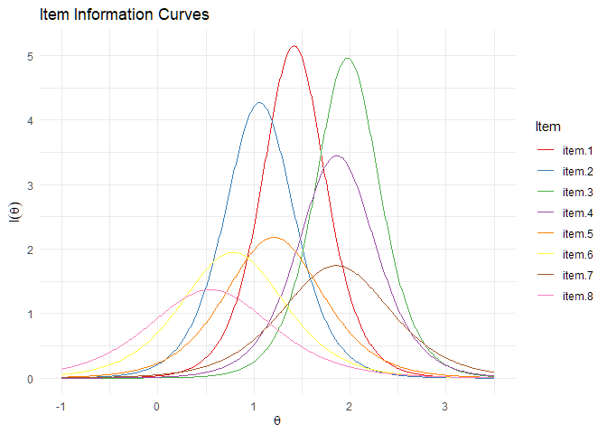
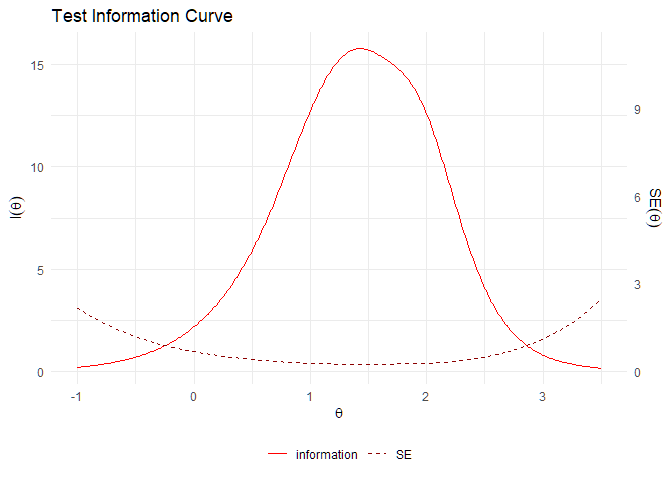
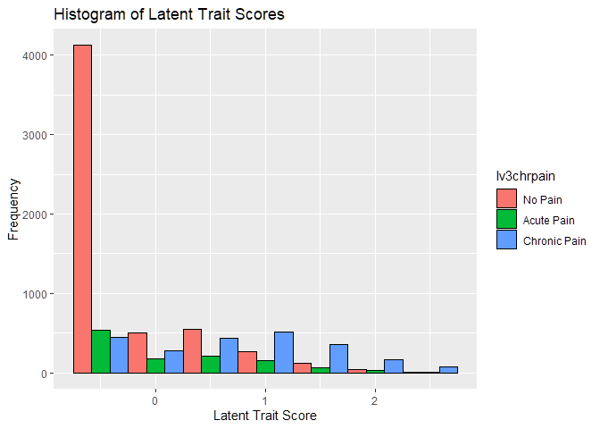
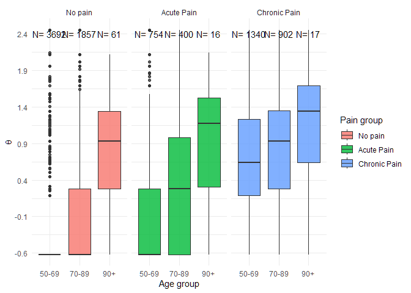

IRT 2PL model of pain impact in ELSA
================
12 July, 2024

- [Introduction](#introduction)
  - [F-scores estimators](#f-scores-estimators)
- [Number of Items and Sample size](#number-of-items-and-sample-size)
- [Assumption Checks](#assumption-checks)
- [Item list](#item-list)
- [chronic pain variable](#chronic-pain-variable)
- [Missing data](#missing-data)
  - [Impute missing values](#impute-missing-values)
- [2PL Model estimation](#2pl-model-estimation)
  - [Coefficients](#coefficients)
  - [F-score or “Person latent trait
    Measure”](#f-score-or-person-latent-trait-measure)
- [ICC,TCC, and information plots](#icctcc-and-information-plots)
  - [ICC: Item Characteristics Curves](#icc-item-characteristics-curves)
    - [IIT: Item Information Curves](#iit-item-information-curves)
  - [TCC: Test Characteristic Curve](#tcc-test-characteristic-curve)
  - [SCC: Scale Characteristic Curves](#scc-scale-characteristic-curves)
- [Model fit](#model-fit)
  - [Item fit](#item-fit)
  - [Person fit](#person-fit)
    - [Zh values](#zh-values)
    - [Person fit summary](#person-fit-summary)
- [Assumption 1: Unidimesionality](#assumption-1-unidimesionality)
- [Assumption 2: Local independence](#assumption-2-local-independence)
- [Assumption 3: monotonicity](#assumption-3-monotonicity)
- [Fscore distributions](#fscore-distributions)
  - [Range of theta (F-score)](#range-of-theta-f-score)
  - [extracting Fscores](#extracting-fscores)
  - [Pain subgroups](#pain-subgroups)
    - [Fscore Boostrap Mean and 95CI](#fscore-boostrap-mean-and-95ci)
  - [Age subgroups](#age-subgroups)
- [References](#references)

``` r
library(tidyverse) # For data wrangling and basic visualizations
library(psych) # For descriptive stats and assumption checks
library(mirt) # IRT modeling
# devtools::install_github("masurp/ggmirt")
library(ggmirt) # Extension for 'mirt' 
library(cowplot) # for the personfitplot
library(difR) # for difMH Performs DIF detection using Mantel-Haenszel method.
library(gridExtra)

par(ask = FALSE) # don't ask before updating plot
```

# Introduction

The 1PL model, also known as the One-Parameter Logistic Model or the
Rasch model ([Rasch 1993](#references)), is a widely used item response
theory (IRT) model. It assumes that the probability of a correct
response ($X_{is} = 1$) to an item $i$ depends on a single parameter:
the item difficulty ($\beta_i$).

$$P(X_{is} = 1|\theta_s, \beta_i) = \frac{e^{(\theta_s-\beta_i)}}{1+ e^{(\theta_s-\beta_i)}}$$
*Item Difficulty* ($\beta_i$) represents the location on the latent
trait continuum where the probability of a correct response to item $i$
is 0.50 (Difficulty is usually expressed on a logit scale). $\theta_s$
represents the latent trait level of a given subject $s$, $X_{is} = 1$
referst to the observed endorsement of an item.

The 2PL (Two-Parameter Logistic) model, like the Rasch model, is a
commonly used IRT model for analyzing item responses in psychometric
measurement ([Paek and Cole 2019](#references)). In the 2PL model we
relax the restriction on the $\alpha_i$ parameter which was fixed to 1
in the Rasch model.

$$P(X_{is} = 1|\theta_s, \beta_i, \alpha_i) = \frac{e^{(\alpha_i(\theta_s-\beta_i))}}{1+ e^{(\alpha_i((\theta_s-\beta_i))}}$$

The *discrimination parameter* $\alpha_i$ dictates how the item $i$ can
differentiate between individuals with different levels of the latent
trait. An item’s discrimination value indicates the relevance of the
item to the trait being measured by the test. This parameter is similar
to item–total correlation from Classic Test Theory. In fact if an item
shows a positive discrimination value we can think of it as showing
consistency with the underlying trait being measured, consistency that
is proportional to how large the discrimination appears. In this
analysis we will use a 2PL IRT model.

### F-scores estimators

In this pipeline we calculate fscores using the EAP (Expected a
posteriori with item-pattern scoring) as an excellent alternative (in
some case superior) to Maximum Likelyhood estimation (ML). In this
particular case ML imposes significant limitations because it cannot
provide estimates for respondents with an “all-zero” or with an
“all-one” score pattern, which is often the case for the chosen
variables.

Alternative estimators to ML are Weighted maximum likelyhood (WLE), and
two Bayesian estimator EAP (default in mirt) and MAP ([Embretson &
Reise, 2000](#references)). Both EAP and MAP consider that the posterior
distribution of the latent trait $\theta$ is defined as the product of
the likelihood function and the prior $\theta$ distribution (in this
case there is no observed prior, therefore the prior is assumed as
following normal distribution). The mean of the of a certain number of
plausible values (specified by the user) drawn from the posterior
distribution represented the latent trait value $\theta$ when we use
“EAP” ([Luo & Dimitrov 2019](#references)), whereas $\theta$ the mode of
the posterior distribution when the estimator is “MAP” ([Kim, Moses, Yoo
2015](#references)). However, some studies showed that EAP can inflate
the estimate patterns at the extreme ends of the patterns (e.g. when all
items are endorsed or when none are endorsed), and this bias can be more
prominent when the number of items is relatively small e.g. less than 20
([Lee & Ban 2009](#references)). The bias of the EAP estimator is
approximately the same as that of regressed estimates for the same
reliabilities and at the same ability levels ([Bock & Mislevy
1982](#references)).

In summary, both ML and EAP should not be used when the respondents that
we expect to assess are likely to endorse all items at once, or exactly
none of them. In these cases the value of $\theta$ is going to be
severely biased. [Warm (1989)](#references) proposed a weighted maximum
likelihood (WML) estimator for use in tests of dichotomous items that
was found to be marginally less biased than theand EAP estimators ([Kim
& Nicewander, 1993; Warm, 1989](#references)). In the present use case
we are not interested in measuring with precision at the extreme ends of
the response patterns and therefore it maybe carefully accepted a
solution with estimates attained via EAP or MAP. In this case we must be
aware that the discrimation of differences in severity is particularly
poor at both the top and low end of the latent trait measurement. WML
could be used here as alternative to ML and as a comparitive estiamtor
to EAP/MAP.

# Number of Items and Sample size

In dichotomous IRT models, both sample size and test lenght (i.e. n. of
items selected) can influence the accuracy of item-paramenter
estimation, and they do so differently in 1PL, 2PL and 3PL models ([Baur
& Lukes 2009](#references)). In general, the estimation of item
parameters tends to be proportionally more biased in smaller samples (N
\<500) ([Finch & French 2019](#references)). In addition, shorter tests
require a much larger sample to reduce the bias in the estimation of
item paramenters - e.g. [Baur & Lukes (2009)](#references) suggest a
minimum of 500 individuals to estimate a 2PL model with 15 items.

However, sample size cannot compensate for the sparcity of information
determined by a short test. [Baur & Lukes (2009)](#references) showed
that given a sample of N=5000, the correlation between the IRT model
estimate of $\theta$ and the “true” ability was above r=.85 with a 15
item test, it was close to r=.85 with 10 items, and r=.74 with 5 items.
Other, helpful tables on this topic can be consulted on this paper by
[Sahin & Anil (2017)](#references).

# Assumption Checks

IRT models have three basic assumptions (Paek & Cole 2019):

1.  unidimensionality
2.  local independence
3.  monotonicity

The most common way to evaluate dimensionality is through factor
analysis. We have done so in the previous step of the analysis.

The second assumption is local independence, which means that we assume
that there is no additional relationship between items that is not
already accounted for by the IRT model - this is evaluated by looking at
the linear relationship that may exist between the residual variance of
each possible couple of items.

The third assumption states that the highest response rates to the set
of items should correspond to higher latent trait level. A failure to
meet this assumption would be in the case in which endorsing all items
of would correspond to a lower level of the latent trait than the case
in which a respondent endorses (e.g.) only half the same items. A
monotonic item is typically not endorsed until the latent trait reaches
a certain level $\theta$ at which this item becomes more likely to be
endoresed. Beyond this level of $theta$ the probability of this item
being endorsed asymptotically approach 1. If this item is not monotonic,
we will find a further level of $\theta$ at which probability of this
item being endorsed will begin to decrese.

``` r
LV_items.irt<-read.csv("C:/Users/d.vitali/Desktop/Github/CRIISP-WP5/data/clean/cfa_w2_all")[-1]
```

Excluding 116 pain responses given by a proxy of the respondent.

``` r
sc_df<- LV_items.irt[which(LV_items.irt$r2painlv!= -16),]
```

# Item list

``` r
varlist.irt<-c("idauniq", 
               "r2shopa", "r2housewka", "r2walkra", "r2mealsa",
               "r2clim1a", "r2lifta", "r2beda",
               "r2hlthlm")#, "hlmact")# hlmact has local dependence with r2hlthlm and r2shopa

sc_df<-sc_df[varlist.irt]
```

# chronic pain variable

``` r
# three levels: no pain, acute pain, chronic pain
LV_items.irt$lv3chrpain<-ifelse(LV_items.irt$r2painlv<0,
                                     NA, # unkown level
                                     ifelse(LV_items.irt$r2painfr==0,
                                            0, # no pain
                                            ifelse(LV_items.irt$r2chrpain==1,
                                                   2, # chronic
                                                   1))) # pain but not chronic or unkown level
# two levels: no pain, chronic pain
LV_items.irt$r2painfr %>% is.na %>% sum
```

    ## [1] 0

``` r
LV_items.irt$lv2chrpain<-ifelse(LV_items.irt$r2painlv<0,
                                NA,
                                ifelse(LV_items.irt$r2painfr==0, #this variable has no NA
                                  0, # no pain
                                  ifelse(LV_items.irt$r2chrpain==1,
                                  1, # chronic
                                  0) # pain but not chronic 
                                  )
                                )
```

# Missing data

``` r
sc_df[sc_df < 0] <- NA

library(naniar)

vis_miss(sc_df[varlist.irt],sort_miss = T)
```

<!-- -->

``` r
sc_df_NA<-sc_df
n.items<-length(varlist.irt[-1])
paste("full pattern missing:",sum(rowSums(is.na(sc_df_NA[-1]))==n.items))
```

    ## [1] "full pattern missing: 1"

``` r
paste("Some item missing:",sum(rowSums(is.na(sc_df_NA[-1]))>0 & rowSums(is.na(sc_df_NA[-1])) < n.items))
```

    ## [1] "Some item missing: 19"

## Impute missing values

\[from imputemissing() doc\]

Given an estimated IRT model and an estimate of the latent trait
(Fscores), we can impute plausible missing data values ([Chalmers
2012](#references)).

After taking the fit of our 2PL model on the data as it is (i.e. with
the missingness):

``` r
# Model estimation. Here we indicate that we are estimating a 2PL model, and standard errors for parameters are estimated.
sc.2pl.NA.fit <- mirt::mirt(sc_df[-1],
                     1, # indicates a unidimensional model will be fit
                    itemtype = "2PL",
                    full.scores.SE = T,
                    full.scores = T,
                    verbose = T)
```

    ## Warning: data contains response patterns with only NAs

    ## Iteration: 1, Log-Lik: -22778.037, Max-Change: 2.16023Iteration: 2, Log-Lik: -20420.311, Max-Change: 1.98502Iteration: 3, Log-Lik: -19821.865, Max-Change: 0.76721Iteration: 4, Log-Lik: -19662.779, Max-Change: 0.75208Iteration: 5, Log-Lik: -19595.808, Max-Change: 0.41809Iteration: 6, Log-Lik: -19564.447, Max-Change: 0.23134Iteration: 7, Log-Lik: -19548.274, Max-Change: 0.18031Iteration: 8, Log-Lik: -19539.209, Max-Change: 0.11914Iteration: 9, Log-Lik: -19534.028, Max-Change: 0.09662Iteration: 10, Log-Lik: -19530.961, Max-Change: 0.05478Iteration: 11, Log-Lik: -19529.104, Max-Change: 0.05836Iteration: 12, Log-Lik: -19527.991, Max-Change: 0.02434Iteration: 13, Log-Lik: -19527.497, Max-Change: 0.02037Iteration: 14, Log-Lik: -19526.915, Max-Change: 0.01642Iteration: 15, Log-Lik: -19526.496, Max-Change: 0.01281Iteration: 16, Log-Lik: -19525.616, Max-Change: 0.00536Iteration: 17, Log-Lik: -19525.492, Max-Change: 0.00439Iteration: 18, Log-Lik: -19525.397, Max-Change: 0.00356Iteration: 19, Log-Lik: -19525.225, Max-Change: 0.00243Iteration: 20, Log-Lik: -19525.200, Max-Change: 0.00257Iteration: 21, Log-Lik: -19525.173, Max-Change: 0.00202Iteration: 22, Log-Lik: -19525.112, Max-Change: 0.00100Iteration: 23, Log-Lik: -19525.107, Max-Change: 0.00081Iteration: 24, Log-Lik: -19525.103, Max-Change: 0.00073Iteration: 25, Log-Lik: -19525.089, Max-Change: 0.00050Iteration: 26, Log-Lik: -19525.088, Max-Change: 0.00038Iteration: 27, Log-Lik: -19525.088, Max-Change: 0.00028Iteration: 28, Log-Lik: -19525.087, Max-Change: 0.00027Iteration: 29, Log-Lik: -19525.087, Max-Change: 0.00038Iteration: 30, Log-Lik: -19525.087, Max-Change: 0.00024Iteration: 31, Log-Lik: -19525.087, Max-Change: 0.00015Iteration: 32, Log-Lik: -19525.087, Max-Change: 0.00011Iteration: 33, Log-Lik: -19525.087, Max-Change: 0.00013Iteration: 34, Log-Lik: -19525.087, Max-Change: 0.00009

We can then use Maximum A Posteri (MAP) estimation to estimate the
latent trait scores for individuals with missing responses. The fscores
(factor scores or latent scores) estimated with MAP can be used to
impute the missing item responses based on the relationship between the
latent trait and the observed responses. This approach assumes that
individuals with similar trait scores have similar item response
patterns.

This means that we can use the irt model parameters (a,b) to estimate
the probability of each them being scored in any given response pattern.
Given an estimated latent score for a respondent we can estimate the
probability of on item being endorsed: e.g. if the respondent have
endorse the item for “difficulty lifting a 10lb weight” and that of
“difficulty shopping for groceries”, this methods estimates the
probability of the respondent endorsing the item about experiencing
“difficulty doing work”.

Thus:

For the task of imputing missing data Chalmers suggest the (Maximum
(mode) a posteriori with item-pattern scoring). Both EAO and MAP methods
are Bayesian.

``` r
Lscores <- fscores(sc.2pl.NA.fit, method = 'MAP') # "MAP" for the maximum a-posteriori (i.e, Bayes modal)

# see: https://philchalmers.github.io/mirt/html/imputeMissing.html
fulldata <- imputeMissing(sc.2pl.NA.fit, Lscores) %>%as.data.frame()
fulldata$idauniq<-sc_df$idauniq

fulldata<-fulldata[c(ncol(fulldata),1:n.items)]
```

In comparison with the original dataset there is one row that cannot be
inputed

``` r
paste("full pattern missing:",sum(rowSums(is.na(fulldata[-1]))==n.items))
```

    ## [1] "full pattern missing: 1"

``` r
paste("Some item missing:",sum(rowSums(is.na(fulldata[-1]))>0 & rowSums(is.na(fulldata[-1]))<n.items))
```

    ## [1] "Some item missing: 0"

``` r
fulldata$idauniq[which(rowSums(is.na(fulldata[-1]))>0)]
```

    ## [1] 121320

``` r
sc_df<-fulldata

sc_df<-na.omit(sc_df)
```

# 2PL Model estimation

Here we indicate that we are estimating a 2PL model, and standard errors
for parameters are estimated.

``` r
sc.2pl.fit <- mirt::mirt(sc_df[-1],
                     1,
                    itemtype = "2PL",
                    full.scores.SE = T,
                    full.scores = T,
                    verbose = T)
```

    ## Iteration: 1, Log-Lik: -22790.262, Max-Change: 2.15778Iteration: 2, Log-Lik: -20429.855, Max-Change: 1.99773Iteration: 3, Log-Lik: -19830.395, Max-Change: 0.79204Iteration: 4, Log-Lik: -19673.540, Max-Change: 0.47589Iteration: 5, Log-Lik: -19604.365, Max-Change: 0.33003Iteration: 6, Log-Lik: -19573.398, Max-Change: 0.20722Iteration: 7, Log-Lik: -19556.645, Max-Change: 0.14454Iteration: 8, Log-Lik: -19547.685, Max-Change: 0.10755Iteration: 9, Log-Lik: -19542.612, Max-Change: 0.09661Iteration: 10, Log-Lik: -19539.633, Max-Change: 0.05222Iteration: 11, Log-Lik: -19537.844, Max-Change: 0.04628Iteration: 12, Log-Lik: -19536.772, Max-Change: 0.03379Iteration: 13, Log-Lik: -19535.704, Max-Change: 0.01706Iteration: 14, Log-Lik: -19535.261, Max-Change: 0.01576Iteration: 15, Log-Lik: -19534.933, Max-Change: 0.01052Iteration: 16, Log-Lik: -19534.457, Max-Change: 0.00552Iteration: 17, Log-Lik: -19534.310, Max-Change: 0.00486Iteration: 18, Log-Lik: -19534.198, Max-Change: 0.00430Iteration: 19, Log-Lik: -19533.851, Max-Change: 0.00094Iteration: 20, Log-Lik: -19533.846, Max-Change: 0.00086Iteration: 21, Log-Lik: -19533.842, Max-Change: 0.00078Iteration: 22, Log-Lik: -19533.827, Max-Change: 0.00043Iteration: 23, Log-Lik: -19533.827, Max-Change: 0.00039Iteration: 24, Log-Lik: -19533.826, Max-Change: 0.00029Iteration: 25, Log-Lik: -19533.825, Max-Change: 0.00034Iteration: 26, Log-Lik: -19533.825, Max-Change: 0.00042Iteration: 27, Log-Lik: -19533.825, Max-Change: 0.00031Iteration: 28, Log-Lik: -19533.825, Max-Change: 0.00012Iteration: 29, Log-Lik: -19533.825, Max-Change: 0.00011Iteration: 30, Log-Lik: -19533.825, Max-Change: 0.00010Iteration: 31, Log-Lik: -19533.825, Max-Change: 0.00009

## Coefficients

$$P(X_{is} = 1|\theta_s, \beta_i, \alpha_i) = \frac{e^{(\alpha_i(\theta_s-\beta_i))}}{1+ e^{(\alpha_i((\theta_s-\beta_i))}}$$

below are our estimated item-specificic coefficients described in the
equation above (where a = $\alpha$ and b = $\beta$). Note coulmn g and u
in the output. All “g” = 0 and all “u” = 1: these are the additional
parameters used in 3PL model (upper and lower asynthote) and which in
the 2pl model are assumed as respectively 1 and 0.

``` r
coef(sc.2pl.fit, IRTpars = T, simplify = T)
```

    ## $items
    ##                a     b g u
    ## r2shopa    4.540 1.417 0 1
    ## r2housewka 4.121 1.059 0 1
    ## r2walkra   4.457 1.974 0 1
    ## r2mealsa   3.713 1.863 0 1
    ## r2clim1a   2.959 1.209 0 1
    ## r2lifta    2.792 0.783 0 1
    ## r2beda     2.645 1.856 0 1
    ## r2hlthlm   2.340 0.549 0 1
    ## 
    ## $means
    ## F1 
    ##  0 
    ## 
    ## $cov
    ##    F1
    ## F1  1

$$P(X_{is} = 1|\theta_s, \beta_i, \alpha_i) = \frac{e^{(\alpha_i(\theta_s-\beta_i))}}{1+ e^{(\alpha_i((\theta_s-\beta_i))}}$$

## F-score or “Person latent trait Measure”

this is the estimate of each person level of the latent variable
$\theta$. The ability estimates (impact estimates) are under column “F1”
and their SE are in col SE_FI. Only the first few rows are printed

``` r
fscores(sc.2pl.fit, method = "EAP", full.scores = T, full.scores.SE = T) %>% head()
```

    ##              F1     SE_F1
    ## [1,] -0.6192654 0.7176867
    ## [2,] -0.6192654 0.7176867
    ## [3,]  0.5075825 0.3808070
    ## [4,] -0.6192654 0.7176867
    ## [5,]  0.8187435 0.3091819
    ## [6,] -0.6192654 0.7176867

# ICC,TCC, and information plots

## ICC: Item Characteristics Curves

Like in a Rasch model, the item characteristic curves depict the
relationship between the probability of a correct response to an item
and the underlying latent trait ($\theta$). However, the 2PL model
introduces the discrimination parameter ($\alpha$), which provides more
flexibility in capturing the varying degrees of item discriminating
power.

**Discrimination Power** (a or $\alpha$): The slope of the curve is
determined by the discrimination parameter ($\alpha$). Steeper slope -\>
greater item discrimination. I.e., items with steeper slopes can more
effectively differentiate between individuals in relation to the latent
trait.

**Difficulty Level** (b or $\beta$): The position of the curve along the
theta axis indicates the level of the latent trait at which such item is
most likely to be endorsed. Higher value of b -\> greater level of the
latent trait for that item. E.g. “having difficulty walking across the
room” is an item that is most likely endorsed by respondents with higher
level of the latent trait “impact”.

``` r
ggmirt::tracePlot(sc.2pl.fit, facet = F, legend = T,theta_range = c(-1, 3.5)) + scale_color_brewer(palette = "Set1")
```

    ## Scale for colour is already present.
    ## Adding another scale for colour, which will replace the existing scale.

<!-- -->

By looking at all the item characteristic’s curves, it is possible to
evaluate the $\theta$ “coverage” of the items selected: i.e. what levels
of the latent trait are covered by the information captured by the
items? The chart may indicate areas of the latent trait where item
difficulties are relatively sparse or where there is a lack of
discrimination between individuals with different levels of ability.

### IIT: Item Information Curves

Similarly to ICC, item information curves can be used to assess the
quality of each item in terms of its contribution to score estimation
precision in IRT models. The item info plot visualizes how the
information varies across the range of the latent trait. The curves have
a bell-shaped pattern with the peak representing the region of $\theta$
where the item is most informative. Again we can use this to assess
coverage but also to assess other important aspects of the items’
responses:

**Steep IICs**: Steep IICs indicate that an item is highly informative
and discriminative in a narrow range of the latent trait ($\theta$).
When the curve is particulary steep the item provides a lot of
information for a specific ability level but not much information for
the levels of $\theta$ that are far from its peak. This type of items
might increase precision of the measurement aroud specific levels of
$\theta$ but limit coverage.

**Flat IICs**: Flat IICs indicate that an item provides relatively
consistent and stable information across a broader range of the latent
trait. These items are less good at discrimitating a specific level of
$\theta$ but are informative for a widee range of it.

**Moderate IICs**: Some items may have IICs with intermediate steepness,
meaning they provide moderate levels of information over a moderate
range of abilities. These items offer a balance between the precision of
measurement and coverage of ability levels.

``` r
ggmirt::itemInfoPlot(sc.2pl.fit, legend = T, theta_range = c(-1, 3.5)) + scale_color_brewer(palette = "Set1")
```

    ## Scale for colour is already present.
    ## Adding another scale for colour, which will replace the existing scale.

<!-- -->

## TCC: Test Characteristic Curve

The test Characteristic curve (TCC) summarises each items’ information
characteristics in a single line. Bell-shaped, the TCC shows how the
information captured by the items varies across different levels of the
latent trait.

- Height of the TCC: A higher test information curve indicates greater
  measurement precision and reliability, meaning that the test is more
  accurate in estimating individuals’ latent trait levels. The peak of
  the curve represents the region where the test provides the highest
  amount of information

- Width of the TCC: The width of the test information curve (in
  combination with the dotted line representing the standard error)
  represents the range of the latent trait over which the test provides
  reasonably good measurement precision. The dotted line (SE) crosses
  the TCC showing at which levels of the latent trait the the measures
  of the latent scores are eccessively biased by measurement error.

``` r
ggmirt::testInfoPlot(sc.2pl.fit,theta_range = c(-1, 3.5), adj_factor = .7) # adj_factor modifies the scale of the SE on the y axis
```

<!-- -->

## SCC: Scale Characteristic Curves

The scale characteristic curve represent the relationship between the
construct we are trying to measure (pain impact) and the Fscores
(T($\theta$)) we attained from our IRT model. In otehr words the chart
shows what levels of the unobserved $\theta$ levels are captured by the
Fscore (T($\theta$)) measures with these items.

``` r
p.scc<-ggmirt::scaleCharPlot(sc.2pl.fit, theta_range = c(-1,3))
p.scc
```

<!-- -->

# Model fit

In IRT, one commonly used fit index is the M2 statistic, also known as
the weighted root mean square residual (WRMR). The M2 statistic assesses
the fit of the observed item response patterns to the expected response
patterns based on the fitted IRT model. Lower values of the M2 statistic
indicate better model fit.

``` r
mirt::M2(sc.2pl.fit)
```

    ##             M2 df            p      RMSEA   RMSEA_5   RMSEA_95      SRMSR
    ## stats 95.96153 20 6.604828e-12 0.02048262 0.0164744 0.02468193 0.02084698
    ##             TLI      CFI
    ## stats 0.9975347 0.998239

The output provides various fit statistics (M2, RMSEA, SRMSR, TLI, CFI)
that indicate the goodness of fit for the IRT model.

. M2: M2 is an absolute indicator of fit of the model to the observed
data. Lower values indicate better model fit. . df: The degrees of
freedom (df) associated with the model fit. . p: The p-value associated
with the M2 statistic

[Hu and Bentler (1999)](#references) empirically examine various cutoffs
for many of these measures, and their data suggest that to minimize Type
I and Type II errors under various conditions, one should use a
combination of one of the above relative fit indexes, such as the CFI or
IFI, with values greater than approximately .95, in combination with the
SRMR (good models \< .08) or the RMSEA (good models \< .06). (from
[Newsom 2023](#references)). RMSEA_5 and RMSEA_95: RMSEA_5 and RMSEA_95
represent respectively the lower and upper bound of the 90% confidence
interval for RMSEA. TLI stands for Tucker-Lewis Index - this is relative
and compare the chi-square for the model to a null model based on
variables that are uncorrelated. CFI or Comparative Fit Index is a
non-centrality fit parameter and uses a chi-square equal to the df for
the model as having a perfect fit (as opposed to chi-square equal to 0
seen for TLI). RMSEA is another non centrality parameter.

[Hu and Bentler (1999)](#references) suggested that an RMSEA smaller
than .06 and a CFI and TLI larger than .95 indicate relatively good
model fit

## Item fit

With itemfit() we can evaluate the goodness of fit at item level. The
fit index is $S-X^2$, [Orlando and Thissen (2000, 2003)](#references)
and [Kang and Chen’s (2007)](#references) signed chi-squared test. S_X2
compares the observed and expected response patterns. Lower chi-squared
S_X2 indicate better item fit. In the last columns we have chi-square
“S_X2” bonferroni corrected p-values for type I error (alpha = .05. a
non-significant p-value indicates good item fit, suggesting that the
observed response patterns are consistent with the expected response
patterns based on the IRT model. An item with large S_X2 and significat
value may be endorsed by respondents in a way that does not fit the
patterns identified by the model.

Items with lower S_X2 values and higher p.S_X2 values are considered to
have better fit to the model.

``` r
mirt::itemfit(sc.2pl.fit)
```

    ##         item   S_X2 df.S_X2 RMSEA.S_X2 p.S_X2
    ## 1    r2shopa  8.615       5      0.009  0.125
    ## 2 r2housewka 11.314       5      0.012  0.045
    ## 3   r2walkra  6.091       5      0.005  0.297
    ## 4   r2mealsa  5.720       5      0.004  0.334
    ## 5   r2clim1a  5.190       5      0.002  0.393
    ## 6    r2lifta  7.371       5      0.007  0.195
    ## 7     r2beda  4.538       5      0.000  0.475
    ## 8   r2hlthlm  9.968       5      0.010  0.076

## Person fit

Person fit assess the fit of individual response patterns to the model.
Better person fit statistics indicate that each respondent endorsed
items using patterns that align with the IRT model’s predictions. E.g.
individuals with higher levels of pain impact (our latent trait) should
appear as more likely to endorse the items that are endorsed by
respondents with less degree of pain impact. Similarly, individuals with
lower levels of pain impact should appear as unlikely to endorse items
that are more specific to greater levels of pain impact. Therefore, by
assessing person fit we look at individuals’ responses and we expect
thees to align with the model’s expectations based on their estimated
latent levels of the abilities.

In Rash model, we can use fit statistics such as infit and outfit to
assess person fit. In a 2PL model it is more helpful to look at “Zh”
measure from [Drasgow, Levine and Williams (1985)](#references) for
unidimensional and multidimensional models. A \|Zh\| score greater than
3 may indicate the possibility of aberrant response patters ([Paek and
Cole 2019](#references)). Less relevant fot a 2PL model, infit and
outfit values close to 1 indicate good person fit, while values
significantly higher or lower than 1 suggest potential misfit.

### Zh values

    ## Scale for x is already present.
    ## Adding another scale for x, which will replace the existing scale.

    ## Warning: The dot-dot notation (`..count..`) was deprecated in ggplot2 3.4.0.
    ## ℹ Please use `after_stat(count)` instead.
    ## This warning is displayed once every 8 hours.
    ## Call `lifecycle::last_lifecycle_warnings()` to see where this warning was
    ## generated.

<!-- -->

``` r
p.fit<-cbind(1:nrow(person_fit),sc_df[-1],mirt::personfit(sc.2pl.fit, method = "EAP"))
#p.fit[order(p.fit[,15]),]
paste0("N. respondents with aberrant patterns: ", sum(person_fit$Zh < -3), " of ", nrow(person_fit), " (", round(sum(person_fit$Zh < -3)/nrow(person_fit)*100,1), "%)")
```

    ## [1] "N. respondents with aberrant patterns: 23 of 9054 (0.3%)"

``` r
paste0("N. respondents with aberrant patterns: ", sum(person_fit$Zh < -2 & person_fit$Zh >= -3), " of ", nrow(person_fit), " (", round(sum(person_fit$Zh < -2 & person_fit$Zh >= -3)/nrow(person_fit)*100,1), "%)")
```

    ## [1] "N. respondents with aberrant patterns: 85 of 9054 (0.9%)"

### Person fit summary

The output of the following indicates the percentages of individuals
falling within and beyond the specified threshold for standardized infit
and outfit values. These percentages provide information to assess the
fit the IRT model to the data. It is desireable to detect a small
percentage of individuals beyond the thresholds for both infit and
outfit to considere the model acceptable.

``` r
t0<-table(person_fit$Zh > 3 | person_fit$Zh < -3) %>% prop.table()

prop_misfit<-rbind(t0)*100

colnames(prop_misfit)<-c("% within threshold", "% beyond threshold")
rownames(prop_misfit)<-c("zh")

prop_misfit %>% round(2)
```

    ##    % within threshold % beyond threshold
    ## zh              99.75               0.25

# Assumption 1: Unidimesionality

We evaluated dimensionality via factor analysis in the previous step of
the analysis.

# Assumption 2: Local independence

The latent trait is presumed to be responsible for the associations
between the items. After fitting the model, there should not be any
further associations between items. These residual associations are
called local dependences. The residual correlations between pain of
items should be negligible (less than .1) - see [Kline
(2016)](#references). To check the local independence assumption we can
use the residuals() function. This function calculates residuals and
local dependence indices, which can help identify potential issues of
local dependence among the items.

**LD-X2 test**

``` r
residuals(sc.2pl.fit, type = "LD")
```

    ## LD matrix (lower triangle) and standardized values.
    ## 
    ## Upper triangle summary:
    ##    Min. 1st Qu.  Median    Mean 3rd Qu.    Max. 
    ##  -0.033  -0.020  -0.007  -0.006   0.007   0.025 
    ## 
    ##            r2shopa r2housewka r2walkra r2mealsa r2clim1a r2lifta r2beda
    ## r2shopa         NA      0.007   -0.029    0.021   -0.019   0.005 -0.029
    ## r2housewka   0.453         NA   -0.016   -0.009   -0.016   0.007  0.010
    ## r2walkra     7.655      2.417       NA   -0.018    0.025  -0.023  0.007
    ## r2mealsa     3.923      0.764    2.944       NA   -0.027  -0.033 -0.024
    ## r2clim1a     3.239      2.388    5.579    6.696       NA   0.013 -0.006
    ## r2lifta      0.267      0.481    4.753    9.715    1.454      NA -0.005
    ## r2beda       7.613      0.904    0.435    5.386    0.353   0.233     NA
    ## r2hlthlm     1.726      0.424    4.988    0.645    1.710   0.207  0.212
    ##            r2hlthlm
    ## r2shopa      -0.014
    ## r2housewka    0.007
    ## r2walkra     -0.023
    ## r2mealsa     -0.008
    ## r2clim1a      0.014
    ## r2lifta       0.005
    ## r2beda        0.005
    ## r2hlthlm         NA

This indices is proposed by ([Chen & Thissen 1997](#references)) is a
test for local independence between item pairs. It is calculated via the
residuals() function type “LD”.

For (e.g.) 9 items, the result is a 9x9 matrix with the lower triangle
showing the *signed LD-X2* values and the upper triangle showing the
*signed Cramer V* correlation coefficient values. These correlation coef
range between -1 and 1 and absolute small scores for both set of signed
coefficients should be preferable ([Paek & Cole 2019](#references)).
[Marais and Andrich (2008)](#references) suggested a critical residual
correlation value of 0.1, but a value of 0.3 has also often been used
(see e.g. [La Porta et al., (2011); Das Nair et al., (2011); Ramp et
al. (2009); Røe, et al. (2014)](#references)).

``` r
LD<-residuals(sc.2pl.fit, type = "LD") %>% as.table %>% round(2)
```

    ## LD matrix (lower triangle) and standardized values.
    ## 
    ## Upper triangle summary:
    ##    Min. 1st Qu.  Median    Mean 3rd Qu.    Max. 
    ##  -0.033  -0.020  -0.007  -0.006   0.007   0.025 
    ## 
    ##            r2shopa r2housewka r2walkra r2mealsa r2clim1a r2lifta r2beda
    ## r2shopa         NA      0.007   -0.029    0.021   -0.019   0.005 -0.029
    ## r2housewka   0.453         NA   -0.016   -0.009   -0.016   0.007  0.010
    ## r2walkra     7.655      2.417       NA   -0.018    0.025  -0.023  0.007
    ## r2mealsa     3.923      0.764    2.944       NA   -0.027  -0.033 -0.024
    ## r2clim1a     3.239      2.388    5.579    6.696       NA   0.013 -0.006
    ## r2lifta      0.267      0.481    4.753    9.715    1.454      NA -0.005
    ## r2beda       7.613      0.904    0.435    5.386    0.353   0.233     NA
    ## r2hlthlm     1.726      0.424    4.988    0.645    1.710   0.207  0.212
    ##            r2hlthlm
    ## r2shopa      -0.014
    ## r2housewka    0.007
    ## r2walkra     -0.023
    ## r2mealsa     -0.008
    ## r2clim1a      0.014
    ## r2lifta       0.005
    ## r2beda        0.005
    ## r2hlthlm         NA

``` r
LD[abs(LD) < 0.05] <- "-"

paste("Signed cramer Cramer-V, values <.05 are omitted (-)")
```

    ## [1] "Signed cramer Cramer-V, values <.05 are omitted (-)"

``` r
LD
```

    ##            r2shopa r2housewka r2walkra r2mealsa r2clim1a r2lifta r2beda
    ## r2shopa            -          -        -        -        -       -     
    ## r2housewka 0.45               -        -        -        -       -     
    ## r2walkra   7.65    2.42                -        -        -       -     
    ## r2mealsa   3.92    0.76       2.94              -        -       -     
    ## r2clim1a   3.24    2.39       5.58     6.7               -       -     
    ## r2lifta    0.27    0.48       4.75     9.71     1.45             -     
    ## r2beda     7.61    0.9        0.44     5.39     0.35     0.23          
    ## r2hlthlm   1.73    0.42       4.99     0.64     1.71     0.21    0.21  
    ##            r2hlthlm
    ## r2shopa    -       
    ## r2housewka -       
    ## r2walkra   -       
    ## r2mealsa   -       
    ## r2clim1a   -       
    ## r2lifta    -       
    ## r2beda     -       
    ## r2hlthlm

Above is the same LD matrix but with values smaller than .05 are
omitted.

How can we interpret the LD ? one method is the Standadised LD-X2

**Standardised LD-X2 ** Assuming that LD-X2 is an approximation of a
chi-square comparing two items and thus with one degree of freedom, we
can transform the LD-X2 matrix as suggested by [Paek and Cole
(2018)](#references) and look for item pairs that show a value greater
than 10 in the lower matrix

``` r
LD<-residuals(sc.2pl.fit, type = "LD")
```

    ## LD matrix (lower triangle) and standardized values.
    ## 
    ## Upper triangle summary:
    ##    Min. 1st Qu.  Median    Mean 3rd Qu.    Max. 
    ##  -0.033  -0.020  -0.007  -0.006   0.007   0.025 
    ## 
    ##            r2shopa r2housewka r2walkra r2mealsa r2clim1a r2lifta r2beda
    ## r2shopa         NA      0.007   -0.029    0.021   -0.019   0.005 -0.029
    ## r2housewka   0.453         NA   -0.016   -0.009   -0.016   0.007  0.010
    ## r2walkra     7.655      2.417       NA   -0.018    0.025  -0.023  0.007
    ## r2mealsa     3.923      0.764    2.944       NA   -0.027  -0.033 -0.024
    ## r2clim1a     3.239      2.388    5.579    6.696       NA   0.013 -0.006
    ## r2lifta      0.267      0.481    4.753    9.715    1.454      NA -0.005
    ## r2beda       7.613      0.904    0.435    5.386    0.353   0.233     NA
    ## r2hlthlm     1.726      0.424    4.988    0.645    1.710   0.207  0.212
    ##            r2hlthlm
    ## r2shopa      -0.014
    ## r2housewka    0.007
    ## r2walkra     -0.023
    ## r2mealsa     -0.008
    ## r2clim1a      0.014
    ## r2lifta       0.005
    ## r2beda        0.005
    ## r2hlthlm         NA

``` r
(abs(LD)-1)/sqrt(2)
```

    ##            r2shopa r2housewka r2walkra r2mealsa r2clim1a r2lifta r2beda
    ## r2shopa         NA     -0.702   -0.687   -0.692   -0.694  -0.703 -0.687
    ## r2housewka  -0.387         NA   -0.696   -0.701   -0.696  -0.702 -0.700
    ## r2walkra     4.706      1.002       NA   -0.694   -0.690  -0.691 -0.702
    ## r2mealsa     2.067     -0.167    1.374       NA   -0.688  -0.684 -0.690
    ## r2clim1a     1.583      0.981    3.237    4.028       NA  -0.698 -0.703
    ## r2lifta     -0.518     -0.367    2.653    6.162    0.321      NA -0.704
    ## r2beda       4.676     -0.068   -0.399    3.101   -0.457  -0.542     NA
    ## r2hlthlm     0.514     -0.407    2.820   -0.251    0.502  -0.560 -0.557
    ##            r2hlthlm
    ## r2shopa      -0.697
    ## r2housewka   -0.702
    ## r2walkra     -0.691
    ## r2mealsa     -0.701
    ## r2clim1a     -0.697
    ## r2lifta      -0.704
    ## r2beda       -0.704
    ## r2hlthlm         NA

In this case it seems that a pair of items “hlmact” and “r2hlthlm” are
affected by local dependence and hlmact was removed reducind the number
of items from 9 to 8.

# Assumption 3: monotonicity

``` r
mirt::itemfit(sc.2pl.fit)
```

    ##         item   S_X2 df.S_X2 RMSEA.S_X2 p.S_X2
    ## 1    r2shopa  8.615       5      0.009  0.125
    ## 2 r2housewka 11.314       5      0.012  0.045
    ## 3   r2walkra  6.091       5      0.005  0.297
    ## 4   r2mealsa  5.720       5      0.004  0.334
    ## 5   r2clim1a  5.190       5      0.002  0.393
    ## 6    r2lifta  7.371       5      0.007  0.195
    ## 7     r2beda  4.538       5      0.000  0.475
    ## 8   r2hlthlm  9.968       5      0.010  0.076

``` r
itemtype <- c(rep('2PL',1), 'spline',rep('2PL',6))
mod2 <- mirt(sc_df[-1], 1, itemtype=itemtype, TOL=2e-4)
```

    ## Iteration: 1, Log-Lik: -24818.836, Max-Change: 5.57090Iteration: 2, Log-Lik: -20514.833, Max-Change: 1.88225Iteration: 3, Log-Lik: -19881.922, Max-Change: 1.84976Iteration: 4, Log-Lik: -19697.710, Max-Change: 1.39181Iteration: 5, Log-Lik: -19608.446, Max-Change: 0.73760Iteration: 6, Log-Lik: -19572.179, Max-Change: 1.28692Iteration: 7, Log-Lik: -19551.250, Max-Change: 0.58248Iteration: 8, Log-Lik: -19542.003, Max-Change: 0.61314Iteration: 9, Log-Lik: -19537.554, Max-Change: 0.21437Iteration: 10, Log-Lik: -19536.400, Max-Change: 0.26853Iteration: 11, Log-Lik: -19535.073, Max-Change: 0.20121Iteration: 12, Log-Lik: -19534.492, Max-Change: 5.20028Iteration: 13, Log-Lik: -19533.441, Max-Change: 0.34267Iteration: 14, Log-Lik: -19533.303, Max-Change: 4.16959Iteration: 15, Log-Lik: -19532.779, Max-Change: 0.01137Iteration: 16, Log-Lik: -19532.779, Max-Change: 0.01137Iteration: 17, Log-Lik: -19532.768, Max-Change: 0.00920Iteration: 18, Log-Lik: -19532.762, Max-Change: 0.00183Iteration: 19, Log-Lik: -19532.762, Max-Change: 0.00173Iteration: 20, Log-Lik: -19532.759, Max-Change: 0.00092Iteration: 21, Log-Lik: -19532.758, Max-Change: 0.00037Iteration: 22, Log-Lik: -19532.758, Max-Change: 0.00030Iteration: 23, Log-Lik: -19532.758, Max-Change: 0.00026Iteration: 24, Log-Lik: -19532.758, Max-Change: 0.00026Iteration: 25, Log-Lik: -19532.757, Max-Change: 3.18703Iteration: 26, Log-Lik: -19532.465, Max-Change: 0.00069Iteration: 27, Log-Lik: -19532.464, Max-Change: 0.00022Iteration: 28, Log-Lik: -19532.464, Max-Change: 0.00108Iteration: 29, Log-Lik: -19532.464, Max-Change: 0.00060Iteration: 30, Log-Lik: -19532.464, Max-Change: 0.00024Iteration: 31, Log-Lik: -19532.464, Max-Change: 0.00014

``` r
print(itemplot(mod2, 2, main = "r2housewka"))
```

<!-- -->

``` r
itemtype <- c(rep('2PL',7), 'spline')
mod2 <- mirt(sc_df[-1], 1, itemtype=itemtype, TOL=2e-4)
```

    ## Iteration: 1, Log-Lik: -23001.900, Max-Change: 2.00117Iteration: 2, Log-Lik: -20408.164, Max-Change: 1.50369Iteration: 3, Log-Lik: -19854.835, Max-Change: 1.03401Iteration: 4, Log-Lik: -19684.036, Max-Change: 0.82318Iteration: 5, Log-Lik: -19598.964, Max-Change: 0.35502Iteration: 6, Log-Lik: -19566.157, Max-Change: 0.26223Iteration: 7, Log-Lik: -19550.676, Max-Change: 0.20697Iteration: 8, Log-Lik: -19543.029, Max-Change: 0.29836Iteration: 9, Log-Lik: -19539.044, Max-Change: 0.16182Iteration: 10, Log-Lik: -19537.089, Max-Change: 0.28158Iteration: 11, Log-Lik: -19535.717, Max-Change: 0.16213Iteration: 12, Log-Lik: -19534.783, Max-Change: 0.13809Iteration: 13, Log-Lik: -19533.640, Max-Change: 0.39002Iteration: 14, Log-Lik: -19533.282, Max-Change: 10.14183Iteration: 15, Log-Lik: -19531.849, Max-Change: 0.12845Iteration: 16, Log-Lik: -19531.847, Max-Change: 5.75325Iteration: 17, Log-Lik: -19531.220, Max-Change: 3.28549Iteration: 18, Log-Lik: -19530.865, Max-Change: 2.49924Iteration: 19, Log-Lik: -19530.456, Max-Change: 0.00415Iteration: 20, Log-Lik: -19530.412, Max-Change: 0.00254Iteration: 21, Log-Lik: -19530.390, Max-Change: 0.00215Iteration: 22, Log-Lik: -19530.343, Max-Change: 0.00242Iteration: 23, Log-Lik: -19530.334, Max-Change: 0.00103Iteration: 24, Log-Lik: -19530.328, Max-Change: 0.00084Iteration: 25, Log-Lik: -19530.314, Max-Change: 0.00068Iteration: 26, Log-Lik: -19530.312, Max-Change: 0.00064Iteration: 27, Log-Lik: -19530.311, Max-Change: 0.00051Iteration: 28, Log-Lik: -19530.308, Max-Change: 0.00018

``` r
print(itemplot(mod2, 2, main = "r2hlthlm"))
```

<!-- -->

There is no suggestion of pattern departure for r2housewka or r2hlthlm.

# Fscore distributions

## Range of theta (F-score)

The range of $\theta$ values derived with the IRT model is population
dependent. $\theta$ values here are standardised to have a mean of zero
and standard deviation of one. However, these values must be interpreted
within the context of the population data from which they are drawn.

As this is a secondary dataset it very imporant to describe sampling
methods and thus to say how participants were selected, what were the
inclusion/exclusion criteria, and report the demographic characteristics
available of the sample.

This information is important for the interpretation of the $\theta$
values (Fscores). In fact as the IRT model will standardise $\theta$ on
the basis of the observed sample, it is important to know the
charateristic of the considered sample to a) better interpret the
psychometric characteristic of our measurement model, and b) interpret
the observed $\theta$ values.

Secondly, it is important to make explicit what is the target population
(e.g. general population of England that is 50yo or older), how well the
target population is represented by the sample at hand. For example:

- Geographical area: does the sample include respondents from different
  areas of the country or are they from a local area?
- Demographics: how representative are the demographics characteristics
  of respondents to those of the target population?

## extracting Fscores

The fscores() function is extracting the estimated latent trait scores
(factor scores) for each respondent from the fitted IRT model stored in
the sc.2pl.fit object.

``` r
# Extract latent trait scores into a dataframe for charting
sc_df$LVscore<- mirt::fscores(sc.2pl.fit, method = "EAP")[, "F1"] 

median_score<-sc_df$LVscore %>% median()

mean_score<-sc_df$LVscore %>% mean()

latent_scores <- sc_df[c("idauniq","LVscore")]
```

``` r
merge_list<-c("idauniq","lv2chrpain","lv3chrpain","r2painlv","r2painfr","r2chrpain")
latent_scores <- merge(LV_items.irt[merge_list], latent_scores, by = "idauniq", all.x = F)

latent_scores[merge_list][latent_scores[merge_list]<0]<-NA
```

## Pain subgroups

``` r
expl_df<-latent_scores

#table(expl_df$r2chrpain)

# selecting cases that can be discriminated between noPAIN, CP and Acute
expl_df<- expl_df %>% dplyr::filter(expl_df$lv3chrpain>=0)


# Create the histogram plot with annotations
expl_df$lv3chrpain <- factor(expl_df$lv3chrpain, levels = c("0", "1","2"), labels = c("No Pain","Acute Pain", "Chronic Pain"))

ggplot(expl_df, aes(x = LVscore, fill = lv3chrpain)) +
  geom_histogram(binwidth = .5,color = "black", position = "dodge") +
  labs(x = "Latent Trait Score", y = "Frequency", title = "Histogram of Latent Trait Scores") 
```

<!-- -->

``` r
ggplot(expl_df, aes(x = LVscore, fill = lv3chrpain)) +
  geom_density(alpha = .5)+
  scale_fill_discrete(name = "Pain group")+
  labs(x = "Latent Trait Score", y = "Density", title = "Density plot of Latent Trait Scores") 
```

<!-- -->

### Fscore Boostrap Mean and 95CI

``` r
library(boot)
```

    ## 
    ## Attaching package: 'boot'

    ## The following object is masked from 'package:lattice':
    ## 
    ##     melanoma

    ## The following object is masked from 'package:psych':
    ## 
    ##     logit

``` r
mean.fun <- function(data, idx) {
  array <- data[idx]
  mean(array)
}

set.seed(720)

  data<-expl_df$LVscore[which(expl_df$lv3chrpain=="Chronic Pain")]
  bootstrap <- boot(data, mean.fun, R = 10000)
  plot(bootstrap, main = paste0("boostrap mean Fscore for Chronic pain subset"))
```

<!-- -->

``` r
  bootstrap
```

    ## 
    ## ORDINARY NONPARAMETRIC BOOTSTRAP
    ## 
    ## 
    ## Call:
    ## boot(data = data, statistic = mean.fun, R = 10000)
    ## 
    ## 
    ## Bootstrap Statistics :
    ##      original       bias    std. error
    ## t1* 0.6921152 0.0002709237  0.01798862

``` r
  boot.ci(boot.out = bootstrap, type = c("norm"))
```

    ## BOOTSTRAP CONFIDENCE INTERVAL CALCULATIONS
    ## Based on 10000 bootstrap replicates
    ## 
    ## CALL : 
    ## boot.ci(boot.out = bootstrap, type = c("norm"))
    ## 
    ## Intervals : 
    ## Level      Normal        
    ## 95%   ( 0.6566,  0.7271 )  
    ## Calculations and Intervals on Original Scale

``` r
 data<-expl_df$LVscore[which(expl_df$lv3chrpain=="Acute Pain")]
  bootstrap <- boot(data, mean.fun, R = 10000)
  plot(bootstrap, main = paste0("boostrap mean Fscore for Acute pain subset"))
```

<!-- -->

``` r
  bootstrap
```

    ## 
    ## ORDINARY NONPARAMETRIC BOOTSTRAP
    ## 
    ## 
    ## Call:
    ## boot(data = data, statistic = mean.fun, R = 10000)
    ## 
    ## 
    ## Bootstrap Statistics :
    ##       original       bias    std. error
    ## t1* 0.09316567 0.0001184203  0.02180367

``` r
  boot.ci(boot.out = bootstrap, type = c("norm"))
```

    ## BOOTSTRAP CONFIDENCE INTERVAL CALCULATIONS
    ## Based on 10000 bootstrap replicates
    ## 
    ## CALL : 
    ## boot.ci(boot.out = bootstrap, type = c("norm"))
    ## 
    ## Intervals : 
    ## Level      Normal        
    ## 95%   ( 0.0503,  0.1358 )  
    ## Calculations and Intervals on Original Scale

``` r
data_a<-expl_df[which(expl_df$LVscore < 1),]
table(data_a$r2painlv) %>% addmargins()
```

    ## 
    ##    0    1    2    3  Sum 
    ## 5316  809 1200  327 7652

``` r
table(data_a$r2painlv) %>% prop.table()
```

    ## 
    ##          0          1          2          3 
    ## 0.69472033 0.10572399 0.15682175 0.04273393

``` r
data_b<-expl_df[which(expl_df$LVscore >= 1),]
table(data_b$r2painlv) %>% addmargins()
```

    ## 
    ##    0    1    2    3  Sum 
    ##  294  127  590  376 1387

``` r
table(data_b$r2painlv) %>% prop.table()
```

    ## 
    ##          0          1          2          3 
    ## 0.21196828 0.09156453 0.42537851 0.27108868

## Age subgroups

``` r
df_plot<-merge(LV_items.irt[c("idauniq","r2agey","r2painlv","ragender","lv3chrpain")], sc_df, by = "idauniq", all.x = F)
#sum(is.na(df_test$r2chrpain))/nrow(df_test)
#table(is.na(LV_items.irt$r2chrpain),LV_items.irt$r2painlv) %>% prop.table(margin = 1 )

df_plot$lv3chrpain<-factor(df_plot$lv3chrpain, levels = c("0", "1","2"), labels = c("No pain","Acute Pain", "Chronic Pain"))

df_plot$age_group<-cut(df_plot$r2agey, c(0, 49, 69, 89, Inf), c("0-49" ,"50-69","70-89","90+"), include.lowest=TRUE) %>% factor

df_plot$lvLVcat<-factor(ifelse(df_plot$LV<0, "lv<0",
                             ifelse(df_plot$LV>=1, "lv>1","0<=lv<1")))

count_data <- filter(df_plot,!is.na(lv3chrpain)) %>% 
  group_by(lv3chrpain, age_group) %>% 
  summarize(count = n()) 
```

    ## `summarise()` has grouped output by 'lv3chrpain'. You can override using the
    ## `.groups` argument.

``` r
ggplot(filter(df_plot,!is.na(lv3chrpain)), aes(x = age_group, y = LVscore, fill = lv3chrpain)) +
  geom_boxplot(alpha = .8) +
  xlab("Age group") +
  ylab(expression(theta)) +
  scale_fill_discrete(name = "Pain group") +
  scale_y_continuous(breaks = seq(round(min(df_plot$LVscore),1),
                                  round(max(df_plot$LVscore),1), by = .5))+
  facet_grid(. ~ lv3chrpain) +
  geom_text(data = count_data, aes(label = paste("N=",count), x = age_group, y = 2.3, group = lv3chrpain), 
            position = position_dodge(width = 0.75), vjust = -0.5, size = 4)+
  theme_minimal()
```

<!-- -->

# References

- Baur, T., & Lukes, D. (2009). An evaluation of the IRT models through
  Monte Carlo simulation. UW-L Journal of Undergraduate Research,
  12(1-7).
- Bock, R. D., & Mislevy, R. J. (1982). Adaptive EAP estimation of
  ability in a microcomputer environment. Applied psychological
  measurement, 6(4), 431-444.
- Chalmers, R. P. (2012). mirt: A multidimensional item response theory
  package for the R environment. Journal of statistical Software, 48,
  1-29.
- Chen, W. H., & Thissen, D. (1997). Local dependence indexes for item
  pairs using item response theory. Journal of Educational and
  Behavioral Statistics, 22(3), 265-289.
- Das Nair, R., Moreton, B. J., & Lincoln, N. B. (2011). Rasch analysis
  of the Nottingham extended activities of daily living scale.
- Drasgow, F., Levine, M. V., & Williams, E. A. (1985). Appropriateness
  measurement with polychotomous item response models and standardized
  indices. British Journal of Mathematical and Statistical \*
  Psychology, 38, 67-86.
- Embretson, S. E. & Reise, S. P. (2000). Item Response Theory for
  Psychologists. Erlbaum.
- Finch, H., & French, B. F. (2019). A comparison of estimation
  techniques for IRT models with small samples. Applied Measurement in
  Education, 32(2), 77-96.
- Hu, L., & Bentler, P. M. (1999). Cutoff criteria for fit indexes in
  covariance structure analysis: Conventional criteria versus new
  alternatives.
- Kang, T., & Chen, T. T. (2008). Performance of the generalized S‐X2
  item fit index for polytomous IRT models. Journal of Educational
  Measurement, 45(4), 391-406.
- Kim, S., Moses, T., & Yoo, H. H. (2015). Effectiveness of item
  response theory (IRT) proficiency estimation methods under adaptive
  multistage testing. ETS Research Report Series, 2015(1), 1-19.
- Kim, J.K., Nicewander, W.A. Ability estimation for conventional tests.
  Psychometrika 58, 587–599 (1993).
- Kline, R. B. (2023). Principles and practice of structural equation
  modeling. Guilford publications.
- La Porta, F., Franceschini, M., Caselli, S., Cavallini, P., Susassi,
  S., & Tennant, A. (2011). Unified balance scale: an activity-based,
  bed to community, and aetiology-independent measure of \* balance
  calibrated with Rasch analysis.
- Lee, W. C., & Ban, J. C. (2009). A comparison of IRT linking
  procedures. Applied measurement in education, 23(1), 23-48.
- Luo, Y., & Dimitrov, D. M. (2019). A short note on obtaining point
  estimates of the IRT ability parameter with MCMC estimation in Mplus:
  How many plausible values are needed?. Educational and \*
  Psychological Measurement, 79(2), 272-287.
- Marais, I., & Andrich, D. (2008b). Effects of varying magnitude and
  patterns of local dependence in the unidimensional Rasch model.
- Newsom, J. (2023) Structural equation modelling
- Orlando, M. & Thissen, D. (2000). Likelihood-based item fit indices
  for dichotomous item response theory models. Applied Psychological
  Measurement, 24, 50-64.
- Orlando, M., & Thissen, D. (2003). Further investigation of the
  performance of S-X2: An item fit index for use with dichotomous item
  response theory models. Applied Psychological Measurement, 27(\* 4),
  289-298.
- Paek, I., & Cole, K. (2019). Using R for item response theory model
  applications. Routledge.
- Rasch, G. (1993). Probabilistic models for some intelligence and
  attainment tests. MESA Press, 5835 S. Kimbark Ave., Chicago, IL 60637;
  e-mail: MESA@ uchicago. edu; web address: www. rasch. org; \* tele.
- Ramp, M., Khan, F., Misajon, R. A., & Pallant, J. F. (2009). Rasch
  analysis of the Multiple Sclerosis Impact Scale MSIS-29.
- Røe, C., Damsgård, E., Fors, T., & Anke, A.. (2014). Psychometric
  properties of the pain stages of change questionnaire as evaluated by
  Rasch analysis in patients with chronic musculoskeletal pain.
- Şahin, A., & Anıl, D. (2017). The effects of test length and sample
  size on item parameters in item response theory. Educational Sciences:
  Theory & Practice, 17(1).
- Warm, T. A. (1989). Weighted likelihood estimation of ability in item
  response theory. Psychometrika, 54(3), 427-450.
