UKB example - Supplementary information
================
Dr Charlotte S C Woolley

-   [1 R libraries and version](#1-r-libraries-and-version)
-   [2 Introduction to the UKB assessment
    data](#2-introduction-to-the-ukb-assessment-data)
-   [3 Data field selection from UKB
    data](#3-data-field-selection-from-ukb-data)
    -   [3.0.1 Step 1](#301-step-1)
    -   [3.0.2 Step 2](#302-step-2)
    -   [3.0.3 Step 3](#303-step-3)
    -   [3.0.4 Step 4](#304-step-4)
    -   [3.0.5 Step 5](#305-step-5)
    -   [3.0.6 Step 6](#306-step-6)
-   [4 Data recoding and renaming](#4-data-recoding-and-renaming)
-   [5 Data summaries](#5-data-summaries)
    -   [5.1 Chronic pain](#51-chronic-pain)
        -   [5.1.1 Definition of chronic
            pain](#511-definition-of-chronic-pain)
        -   [5.1.2 Summary](#512-summary)
    -   [5.2 Removal of missing data](#52-removal-of-missing-data)
    -   [5.3 Sex](#53-sex)
    -   [5.4 Age](#54-age)
    -   [5.5 Ethnic background](#55-ethnic-background)
    -   [5.6 Townsend deprivation index](#56-townsend-deprivation-index)
-   [6 Data cleaning](#6-data-cleaning)
    -   [6.1 Employment status
        correction](#61-employment-status-correction)
    -   [6.2 Frequency of friend/family visits
        correction](#62-frequency-of-friendfamily-visits-correction)
-   [7 Recoding data fields for
    retrofitting](#7-recoding-data-fields-for-retrofitting)
    -   [7.1 Dichotomised binary data
        fields](#71-dichotomised-binary-data-fields)
        -   [7.1.1 Recoding Field 6160: Leisure and social
            activities](#711-recoding-field-6160-leisure-and-social-activities)
        -   [7.1.2 Recoding Field 6164: Types of physical
            activites](#712-recoding-field-6164-types-of-physical-activites)
    -   [7.2 Binary items](#72-binary-items)
        -   [7.2.1 Recoding Field 6142 Employment
            status](#721-recoding-field-6142-employment-status)
        -   [7.2.2 Recoding Field 6146:Attendance/disability/mobility
            allowance](#722-recoding-field-6146attendancedisabilitymobility-allowance)
        -   [7.2.3 Recoding Field 1538: Major dietary changes in the
            last 5
            years](#723-recoding-field-1538-major-dietary-changes-in-the-last-5-years)
        -   [7.2.4 Recoding Field 2020: Loneliness or
            isolation](#724-recoding-field-2020-loneliness-or-isolation)
    -   [7.3 Continous or binary items](#73-continous-or-binary-items)
        -   [7.3.1 Recoding Field 864: Number of days walked 10
            minutes](#731-recoding-field-864-number-of-days-walked-10-minutes)
        -   [7.3.2 Recoding Field 1090: Time spent
            driving](#732-recoding-field-1090-time-spent-driving)
        -   [7.3.3 Recoding Field 2178: Overall health
            rating](#733-recoding-field-2178-overall-health-rating)
        -   [7.3.4 Recoding Field 2296: Falls in the last
            year](#734-recoding-field-2296-falls-in-the-last-year)
        -   [7.3.5 Recoding Field 1031: Frequency of friend and family
            visits](#735-recoding-field-1031-frequency-of-friend-and-family-visits)
        -   [7.3.6 Recoding Field 1170: Getting up in the
            morning](#736-recoding-field-1170-getting-up-in-the-morning)
-   [8 Selecting final dataset](#8-selecting-final-dataset)
-   [9 Data analysis pipeline with 6 retrofitting items in continuous
    format](#9-data-analysis-pipeline-with-6-retrofitting-items-in-continuous-format)
    -   [9.1 Correlation between items chosen to evaluate the impact of
        chronic
        pain](#91-correlation-between-items-chosen-to-evaluate-the-impact-of-chronic-pain)
    -   [9.2 PA of items chosen to evaluate the impact of chronic
        pain](#92-pa-of-items-chosen-to-evaluate-the-impact-of-chronic-pain)
    -   [9.3 EFA of items chosen to evaluate the impact of chronic
        pain](#93-efa-of-items-chosen-to-evaluate-the-impact-of-chronic-pain)
    -   [9.4 EFA of items chosen to evaluate the impact of chronic pain
        after removal of the items not loading on a
        factor](#94-efa-of-items-chosen-to-evaluate-the-impact-of-chronic-pain-after-removal-of-the-items-not-loading-on-a-factor)
        -   [9.4.1 Iteration 1](#941-iteration-1)
        -   [9.4.2 Iteration 2](#942-iteration-2)
        -   [9.4.3 Iteration 3](#943-iteration-3)
    -   [9.5 CFA of items chosen to evaluate the impact of chronic
        pain](#95-cfa-of-items-chosen-to-evaluate-the-impact-of-chronic-pain)
    -   [9.6 IRT model of items chosen to evaluate the impact of chronic
        pain](#96-irt-model-of-items-chosen-to-evaluate-the-impact-of-chronic-pain)
-   [10 Data analysis pipeline with 6 retrofitting items in binary
    format](#10-data-analysis-pipeline-with-6-retrofitting-items-in-binary-format)
    -   [10.1 Correlation between items chosen to evaluate the impact of
        chronic
        pain](#101-correlation-between-items-chosen-to-evaluate-the-impact-of-chronic-pain)
    -   [10.2 PA of items chosen to evaluate the impact of chronic
        pain](#102-pa-of-items-chosen-to-evaluate-the-impact-of-chronic-pain)
    -   [10.3 EFA of items chosen to evaluate the impact of chronic
        pain](#103-efa-of-items-chosen-to-evaluate-the-impact-of-chronic-pain)
    -   [10.4 EFA of items chosen to evaluate the impact of chronic pain
        after removal of the items not loading on a
        factor](#104-efa-of-items-chosen-to-evaluate-the-impact-of-chronic-pain-after-removal-of-the-items-not-loading-on-a-factor)
        -   [10.4.1 Iteration 1](#1041-iteration-1)
        -   [10.4.2 Iteration 2](#1042-iteration-2)
        -   [10.4.3 Iteration 3](#1043-iteration-3)
    -   [10.5 CFA of items chosen to evaluate the impact of chronic
        pain](#105-cfa-of-items-chosen-to-evaluate-the-impact-of-chronic-pain)
    -   [10.6 IRT model of items chosen to evaluate the impact of
        chronic
        pain](#106-irt-model-of-items-chosen-to-evaluate-the-impact-of-chronic-pain)
-   [11 Conclusion](#11-conclusion)
-   [12 References](#12-references)

# 1 R libraries and version

``` r
library(RColorBrewer)
library(tidyverse)
library(kableExtra)
library(pheatmap)
library(psych)
library(lavaan)
options(scipen = 999)
R.Version()
```

    ## $platform
    ## [1] "x86_64-pc-linux-gnu"
    ## 
    ## $arch
    ## [1] "x86_64"
    ## 
    ## $os
    ## [1] "linux-gnu"
    ## 
    ## $system
    ## [1] "x86_64, linux-gnu"
    ## 
    ## $status
    ## [1] ""
    ## 
    ## $major
    ## [1] "4"
    ## 
    ## $minor
    ## [1] "4.0"
    ## 
    ## $year
    ## [1] "2024"
    ## 
    ## $month
    ## [1] "04"
    ## 
    ## $day
    ## [1] "24"
    ## 
    ## $`svn rev`
    ## [1] "86474"
    ## 
    ## $language
    ## [1] "R"
    ## 
    ## $version.string
    ## [1] "R version 4.4.0 (2024-04-24)"
    ## 
    ## $nickname
    ## [1] "Puppy Cup"

# 2 Introduction to the UKB assessment data

UK Biobank (UKB) particpants completed several assessments at assessment
centres around the UK. The total number of participants at timepoint T0,
the first assessment was 502154 when this data was downloaded (3rd of
July, 2024), and the focus of this analysis is on this data. UKB has a
showcase<sup>1</sup> with documentation for the study and descriptions
of the data available, including data dictionaries, survey designs and
data summaries. We used the “Data\_Dictionary\_Showcase.tsv” file for
selecting data fields (i.e., variables or questions) in combination with
visual inspection in the UKB showcase.

``` r
data_dict <- read_tsv("Data_Dictionary_Showcase.tsv", na = c(""," "))
```

# 3 Data field selection from UKB data

In the national pain strategy report<sup>2</sup>, the NIH described a
screening tool for HICP, defined as follows:

High-impact chronic pain is operationally defined by enduring
participation restrictions because of pain over the past 6 months…

1.  I have had trouble taking care of myself (e.g. dressing, bathing or
    feeding myself)
2.  I have had trouble doing my usual work (including work for pay, work
    around the home, volunteer work)
3.  I have had trouble doing my regular social and recreational
    activities (such as visiting friends, going to the movies, attending
    clubs or religious activities)

We evaluated UKB assessment data fields collected between 2006 and 2010
for mapping to the NIH detection criteria and the workflow process
described in our paper. These criteria are shown in Supp Table 1, below.

``` r
sTab1 <- tibble(a = c("Concurrence", "Anchor", "Self-care", "Work", "Social", "Persistence"),
                        b = c("Items should identify respondents with pain or chronic pain", "Items should be anchored in pain (e.g. “because of pain …”)", "Items should capture the experience of restrictions to self-care activities (for example dressing, bathing, or feeding oneself)", "Items should capture the experience of restrictions to usual productivity (including work for pay, work around the home, volunteer work)", "Items should capture the experience of restrictions to engage regular social and recreational activities (such as visiting friends, going to the movies, attending clubs or religious activities)", "Items that capture a restriction would be more relevant if there is explicit mention of restriction persistence"))

sTab1 %>% 
  kable(caption = "**Supp Table 1: First set of detection criteria that stemmed from the accepted domain definition of HICP**",
        col.names = c("", ""),
      row.names=FALSE, align= "c", format = "markdown", digits = 2, padding = 2, centering = TRUE) 
```

|             |                                                                                                                                                                                                   |
|:-----------:|:-------------------------------------------------------------------------------------------------------------------------------------------------------------------------------------------------:|
| Concurrence |                                                                    Items should identify respondents with pain or chronic pain                                                                    |
|   Anchor    |                                                                    Items should be anchored in pain (e.g. “because of pain …”)                                                                    |
|  Self-care  |                                  Items should capture the experience of restrictions to self-care activities (for example dressing, bathing, or feeding oneself)                                  |
|    Work     |                             Items should capture the experience of restrictions to usual productivity (including work for pay, work around the home, volunteer work)                              |
|   Social    | Items should capture the experience of restrictions to engage regular social and recreational activities (such as visiting friends, going to the movies, attending clubs or religious activities) |
| Persistence |                                          Items that capture a restriction would be more relevant if there is explicit mention of restriction persistence                                          |

**Supp Table 1: First set of detection criteria that stemmed from the
accepted domain definition of HICP**

All of the data fields that we deemed suitable to cover the three
categories of self-care, social, and work restrictions failed the
criterion of anchoring. Therefore, we relaxed this criterion to include
any self-reports of social, work and self-care restrictions to allow us
to improve item representation across the three categories of
restrictions with the caveats that this data was not anchored in pain
and did not have constant persistence.

The process of narrowing down items from the original 9451 data fields
in the UKB data dictionary took several steps.

### 3.0.1 Step 1

``` r
data_dict <- data_dict %>%
  separate(Path, c("Cat1", "Cat2", "Cat3", "Cat4"), " > ", remove = FALSE) 

data_dict_cat1 <- data_dict %>%
  filter(Cat1 == "Assessment centre")
```

At the highest level, the data was filtered down to 3962 data fields
collected from the assessment centres, where T0 data was collected, as
shown in Supp Table 2.

``` r
data_dict %>% count(Cat1) %>%
  mutate(perc = (n/sum(n))*100) %>%
  kable(caption = "**Supp Table 2: Number of UKB data fields at the highest level of categorisation**",
      col.names = c("Category", "Number of data fields", "Percentage of data fields"),
      row.names=FALSE, align= "c", format = "markdown", digits = 2, padding = 2, centering = TRUE) 
```

|          Category          | Number of data fields | Percentage of data fields |
|:--------------------------:|:---------------------:|:-------------------------:|
|    Additional exposures    |          362          |           3.83            |
|     Assessment centre      |         3962          |           41.92           |
|     Biological samples     |          903          |           9.55            |
|         Embargoed          |          106          |           1.12            |
|          Genomics          |          240          |           2.54            |
|  Health-related outcomes   |         2578          |           27.28           |
|      Online follow-up      |         1263          |           13.36           |
| Population characteristics |          37           |           0.39            |

**Supp Table 2: Number of UKB data fields at the highest level of
categorisation**

### 3.0.2 Step 2

``` r
data_dict_cat2 <- data_dict_cat1 %>%
  filter(Cat2 != "Biological sampling" & 
           Cat2 != "Cognitive function" & 
           Cat2 != "Eye measures" & 
           Cat2 != "Imaging" & 
           Cat2 != "Recruitment" & 
           Cat2 != "Ongoing characteristics" & 
           Cat2 != "Physical measures" & 
           Cat2 != "Procedural metrics")
```

At the second level of categorisation, “Biological sampling”, “Cognitive
function”, “Eye measures”, “Imaging”, “Recruitment”, “Ongoing
characteristics”, “Physical measures” and “Procedural metrics” were
filtered out of the data, leaving 432 data fields remaining, as shown in
Supp Table 3.

``` r
data_dict_cat1 %>% count(Cat2) %>%
  mutate(perc = (n/sum(n))*100) %>%
  kable(caption = "**Supp Table 3: Number of UKB data fields at the second level of categorisation after filtering in step 1**",
      col.names = c("Category", "Number of data fields", "Percentage of data fields"),
      row.names=FALSE, align= "c", format = "markdown", digits = 2, padding = 2, centering = TRUE) 
```

|      Category       | Number of data fields | Percentage of data fields |
|:-------------------:|:---------------------:|:-------------------------:|
| Biological sampling |          10           |           0.25            |
| Cognitive function  |          121          |           3.05            |
|    Eye measures     |          333          |           8.40            |
|       Imaging       |         2714          |           68.50           |
|  Physical measures  |          263          |           6.64            |
| Procedural metrics  |          69           |           1.74            |
|     Recruitment     |          20           |           0.50            |
|     Touchscreen     |          396          |           9.99            |
|  Verbal interview   |          36           |           0.91            |

**Supp Table 3: Number of UKB data fields at the second level of
categorisation after filtering in step 1**

### 3.0.3 Step 3

``` r
data_dict_cat3 <- data_dict_cat2 %>%
  filter(Cat3 != "Consent" &
           Cat3 != "Early life factors" &
           Cat3 != "Family history" &
           Cat3 != "Medical conditions" &
           Cat3 != "Medications" &
           Cat3 != "Operations" &
           Cat3 != "Sex-specific factors")
```

At the third level of categorisation, “Consent”, “Early life factors”,
“Family history”, “Medical conditions”, “Medications”, “Operations”, and
“Sex-specific factors” were filtered out of the data, leaving 337 data
fields remaining, as shown in Supp Table 4.

``` r
data_dict_cat2 %>% count(Cat3) %>%
  mutate(perc = (n/sum(n))*100) %>%
  kable(caption = "**Supp Table 4: Number of UKB data fields at the third level of categorisation after filtering in steps 1 and 2**",
      col.names = c("Category", "Number of data fields", "Percentage of data fields"),
      row.names=FALSE, align= "c", format = "markdown", digits = 2, padding = 2, centering = TRUE) 
```

|          Category          | Number of data fields | Percentage of data fields |
|:--------------------------:|:---------------------:|:-------------------------:|
|     Early life factors     |          17           |           3.94            |
|         Employment         |           3           |           0.69            |
|       Family history       |          20           |           4.63            |
| Health and medical history |          102          |           23.61           |
| Lifestyle and environment  |          155          |           35.88           |
|     Medical conditions     |          13           |           3.01            |
|        Medications         |           4           |           0.93            |
|         Operations         |           7           |           1.62            |
|    Psychosocial factors    |          48           |           11.11           |
|    Sex-specific factors    |          34           |           7.87            |
|     Sociodemographics      |          29           |           6.71            |

**Supp Table 4: Number of UKB data fields at the third level of
categorisation after filtering in steps 1 and 2**

### 3.0.4 Step 4

``` r
data_dict_cat4 <- data_dict_cat3 %>%
  filter(Cat4 != "Breathing" &
           Cat4 != "Cancer screening" &
           Cat4 != "Chest pain" &
           Cat4 != "Mouth" &
           Cat4 != "Claudication and peripheral artery disease" &
           Cat4 != "Pain" &
           Cat4 != "Medical conditions" &
           Cat4 != "Medication" &
           Cat4 != "Operations" &
           Cat4 != "Eyesight" &
           Cat4 != "Hearing" &
           Cat4 != "Alcohol" &
           Cat4 != "Smoking" &
           Cat4 != "Sun exposure" &
           Cat4 != "Electronic device use" &
           Cat4 != "Household" &
           Cat4 != "Education" &
           Cat4 != "Ethnicity" &
           Cat4 != "Sexual factors")
```

At the fourth level of categorisation, “Breathing”, “Cancer screening”,
“Chest pain”, “Mouth”, “Claudication and peripheral artery disease”,
“Pain”, “Medical conditions”, “Medication”, “Operations”, “Eyesight”,
“Hearing”, “Alcohol”, “Smoking”, “Sun exposure”, “Electronic device
use”, “Household”, “Education”, “Ethnicity” and “Sexual factors” were
filtered out of the data, leaving 141 data fields remaining, as shown in
Supp Table 5.

``` r
data_dict_cat3 %>% count(Cat4)  %>%
  mutate(perc = (n/sum(n))*100) %>%
  kable(caption = "**Supp Table 5: Number of UKB data fields at the fourth level of categorisation after filtering in steps 1, 2 and 3**",
      col.names = c("Category", "Number of data fields", "Percentage of data fields"),
      row.names=FALSE, align= "c", format = "markdown", digits = 2, padding = 2, centering = TRUE) 
```

|                  Category                  | Number of data fields | Percentage of data fields |
|:------------------------------------------:|:---------------------:|:-------------------------:|
|                  Alcohol                   |          21           |           6.23            |
|                 Breathing                  |           2           |           0.59            |
|              Cancer screening              |           4           |           1.19            |
|                 Chest pain                 |           4           |           1.19            |
| Claudication and peripheral artery disease |          10           |           2.97            |
|                    Diet                    |          33           |           9.79            |
|                 Education                  |           3           |           0.89            |
|           Electronic device use            |          11           |           3.26            |
|                 Employment                 |          11           |           3.26            |
|                 Ethnicity                  |           2           |           0.59            |
|                  Eyesight                  |          24           |           7.12            |
|               General health               |           4           |           1.19            |
|                  Hearing                   |           9           |           2.67            |
|                 Household                  |          11           |           3.26            |
|             Medical conditions             |          21           |           6.23            |
|                 Medication                 |          11           |           3.26            |
|               Mental health                |          44           |           13.06           |
|                   Mouth                    |           2           |           0.59            |
|                 Operations                 |           2           |           0.59            |
|       Other sociodemographic factors       |           2           |           0.59            |
|                    Pain                    |           9           |           2.67            |
|             Physical activity              |          36           |           10.68           |
|               Sexual factors               |           5           |           1.48            |
|                   Sleep                    |           7           |           2.08            |
|                  Smoking                   |          33           |           9.79            |
|               Social support               |           4           |           1.19            |
|                Sun exposure                |           9           |           2.67            |
|                     NA                     |           3           |           0.89            |

**Supp Table 5: Number of UKB data fields at the fourth level of
categorisation after filtering in steps 1, 2 and 3**

### 3.0.5 Step 5

``` r
data_dict_over90 <- data_dict_cat4 %>%
  filter(Participants > 0.9*max(Participants))
```

Data fields that had not been completed by at least 90 percent of
participants were filtered out, leaving 73 data fields remaining. , as
shown in Supp Table 6.

``` r
data_dict_over90 %>% count(Cat4) %>%
  mutate(perc = (n/sum(n))*100) %>%
  kable(caption = "**Supp Table 6: Number of UKB data fields at the fourth level of categorisation aftr filtering in steps 1, 2, 3 and 4**",
      col.names = c("Category", "Number of data fields", "Percentage of data fields"),
      row.names=FALSE, align= "c", format = "markdown", digits = 2, padding = 2, centering = TRUE) 
```

|            Category            | Number of data fields | Percentage of data fields |
|:------------------------------:|:---------------------:|:-------------------------:|
|              Diet              |          25           |           34.25           |
|           Employment           |           1           |           1.37            |
|         General health         |           4           |           5.48            |
|         Mental health          |          20           |           27.40           |
| Other sociodemographic factors |           1           |           1.37            |
|       Physical activity        |          12           |           16.44           |
|             Sleep              |           7           |           9.59            |
|         Social support         |           3           |           4.11            |

**Supp Table 6: Number of UKB data fields at the fourth level of
categorisation aftr filtering in steps 1, 2, 3 and 4**

### 3.0.6 Step 6

``` r
data_dict_cat6 <- data_dict_over90 %>%
  filter(Field == "Getting up in morning" |
           Field == "Frequency of friend/family visits" |
           Field == "Major dietary changes in the last 5 years" |
           Field == "Loneliness, isolation" |
           Field == "Overall health rating" |
           Field == "Falls in the last year" |
           Field == "Current employment status" |
           Field == "Attendance/disability/mobility allowance" |
           Field == "Leisure/social activities" |
           Field == "Types of physical activity in last 4 weeks" |
           Field == "Number of days/week walked 10plus minutes" |
           Field == "Time spent driving" )
```

The remaining data fields were manually assessed for their alignment
with the descriptions of impact by the NIH and 12 data fields were
chosen for inclusion (UKB field IDs 6142, 864, 6160, 1538, 2020, 2178,
6146, 2296, 1090, 1031, 1170 and 6164), shown in Supp Table 7. These
data fields were later deconstructed into 20 items used in analysis due
to the categorical nature of some of the (see below: section 7).

``` r
data_dict_cat6 %>%
  select(FieldID, Field, Participants, Notes) %>%
  mutate(Notes2 = stringi::stri_extract_all_regex(Notes, '(?<=").*?(?=")')) %>%
  select(-Notes) %>%
  arrange(desc(Participants)) %>%
  kable(caption = "**Supp Table 7: Final 12 data fields chosen and the number of participants included in the question**",
      col.names = c("Field ID", "Field name", "Number of participants", "Question wording"),
      row.names=FALSE, align= "c", format = "markdown", digits = 2, padding = 2, centering = TRUE) 
```

| Field ID |                 Field name                 | Number of participants |                                           Question wording                                            |
|:--------:|:------------------------------------------:|:----------------------:|:-----------------------------------------------------------------------------------------------------:|
|   6142   |         Current employment status          |         501520         |    Which of the following describes your current situation? (You can select more than one answer)     |
|   6160   |         Leisure/social activities          |         501508         |    Which of the following do you attend once a week or more often? (You can select more than one)     |
|   1538   | Major dietary changes in the last 5 years  |         501494         |                   Have you made any major changes to your diet in the last 5 years?                   |
|   2020   |           Loneliness, isolation            |         501484         |                                       Do you often feel lonely?                                       |
|   2178   |           Overall health rating            |         501473         |                          In general how would you rate your overall health?                           |
|   6146   |  Attendance/disability/mobility allowance  |         501473         |              Do you receive any of the following? (You can select more than one answer)               |
|   2296   |           Falls in the last year           |         501471         |                               In the last year have you had any falls?                                |
|   1090   |             Time spent driving             |         501295         |                        In a typical DAY, how many hours do you spend driving?                         |
|   1031   |     Frequency of friend/family visits      |         498826         |                   How often do you visit friends or family or have them visit you?                    |
|   1170   |           Getting up in morning            |         498822         |                  On an average day, how easy do you find getting up in the morning?                   |
|   6164   | Types of physical activity in last 4 weeks |         497212         | In the last 4 weeks did you spend any time doing the following? (You can select more than one answer) |

**Supp Table 7: Final 12 data fields chosen and the number of
participants included in the question**

# 4 Data recoding and renaming

UK biobank data comes with field IDs and value codes, which need to be
renamed and recoded for interpretative purposes during analyses. The
code showing how this was done is in the script
“recoding\_and\_renaming\_UKB\_data.R”. Alternatively, The original UKB
field IDs and the names assigned to each column are shown below.

``` r
datx <- read.csv("all_data_RENAMED_RECODED.csv", na.strings = c(""," ", "NA")) 

varnames <- read.csv("field_IDs_names.csv", na.strings = c(""," ", "NA"))

varnames %>%
  kable(caption = "**Supp Table 8: Original UKB field IDs and name assigned in this analysis**",
      col.names = c("Field ID", "Field name"),
      row.names=FALSE, align= "c", format = "markdown", digits = 2, padding = 2, centering = TRUE) 
```

|  Field ID  |                    Field name                     |
|:----------:|:-------------------------------------------------:|
|    eid     |                        eid                        |
|  X31.0.0   |                        Sex                        |
|  X34.0.0   |                  Year\_of\_birth                  |
|  X52.0.0   |                 Month\_of\_birth                  |
| X22189.0.0 |   Townsend\_deprivation\_index\_at\_recruitment   |
| X21000.0.0 |                Ethnic\_background                 |
| X6159.0.0  |    Pain\_type\_s\_experienced\_in\_last\_month    |
| X3799.0.0  |           Headaches\_for\_3plus\_months           |
| X4067.0.0  |         Facial\_pains\_for\_3plus\_months         |
| X3404.0.0  |     Neck\_shoulder\_pain\_for\_3plus\_months      |
| X3571.0.0  |          Back\_pain\_for\_3plus\_months           |
| X3741.0.0  |   Stomach\_abdominal\_pain\_for\_3plus\_months    |
| X3414.0.0  |           Hip\_pain\_for\_3plus\_months           |
| X3773.0.0  |          Knee\_pain\_for\_3plus\_months           |
| X2956.0.0  |         General\_pain\_for\_3plus\_months         |
| X1031.0.0  |       Frequency\_of\_friend\_family\_visits       |
| X6160.0.0  |            Leisure\_social\_activities            |
| X10740.0.0 |   Frequency\_of\_friend\_family\_visits\_pilot    |
| X2020.0.0  |               Loneliness\_isolation               |
| X2178.0.0  |              Overall\_health\_rating              |
| X2296.0.0  |            Falls\_in\_the\_last\_year             |
| X20119.0.0 |      Current\_employment\_status\_corrected       |
| X6142.0.0  |            Current\_employment\_status            |
| X1090.0.0  |               Time\_spent\_driving                |
| X1170.0.0  |             Getting\_up\_in\_morning              |
| X6164.0.0  | Types\_of\_physical\_activity\_in\_last\_4\_weeks |
| X1538.0.0  | Major\_dietary\_changes\_in\_the\_last\_5\_years  |
|  X864.0.0  |  Number\_of\_days\_week\_walked\_10plus\_minutes  |
| X6146.0.0  |    Attendance\_disability\_mobility\_allowance    |
|  X53.0.0   |      Date\_of\_attending\_assessment\_centre      |

**Supp Table 8: Original UKB field IDs and name assigned in this
analysis**

``` r
names(datx) <- varnames$Field
```

# 5 Data summaries

## 5.1 Chronic pain

### 5.1.1 Definition of chronic pain

Chronic pain status was defined as reporting pain (at specific locations
or all over the body) that interfered with usual activities for over
three months using the following data fields:

UKB Field 6159: “In the last month have you experienced any of the
following that interfered with your usual activites? (You can select
more than one answer)”

-   “Pain all over the body”
-   “Neck or shoulder pain”
-   “Hip pain”
-   “Back pain”
-   “Stomach or abdominal pain”
-   “Knee pain”
-   “Headache”
-   “Facial pain”
-   “Prefer not to answer”
-   “None of the above”

UKB Fields 2956, 3404, 3414, 3571, 3741, 3773, 3799, 4067:

-   “Have you had pains all over the body for more than 3 months?”
-   “Have you had neck or shoulder pains for more than 3 months?”
-   “Have you had hip pains for more than 3 months?”
-   “Have you had back pains for more than 3 months?”
-   “Have you had stomach or abdominal pains for more than 3 months?”
-   “Have you had knee pains for more than 3 months?”
-   “Have you had headaches for more than 3 months?”
-   “Have you had facial pains for more than 3 months?”

``` r
dat <- datx %>%
  mutate(chronic_pain_sites_n = rowSums(across(ends_with("3plus_months")) == "Yes", na.rm = TRUE),
         acute_pain_sites_n = rowSums(across(ends_with("3plus_months")) == "No", na.rm = TRUE),
         pain_status = case_when(Pain_type_s_experienced_in_last_month == "Prefer not to answer" | 
                            Pain_type_s_experienced_in_last_month == "Do not know" | 
                            is.na(Pain_type_s_experienced_in_last_month) ~ "Missing pain status (pain/no pain)",
                          Pain_type_s_experienced_in_last_month == "None of the above" ~ "No pain",
                          chronic_pain_sites_n > 0  ~ "Chronic pain",
                          acute_pain_sites_n > 0 ~ "Acute pain",
                          TRUE ~ "Missing pain type (acute/chronic)"))
```

### 5.1.2 Summary

``` r
dat %>%
  count(pain_status) %>%
  mutate(perc = (n/sum(n))*100) %>%
  arrange(desc(n))  %>%
  kable(caption = "**Supp Table 9: The pain status of UKB participants included in this analysis**",
      col.names = c("Pain status", "Number of participants", "Percentage of participants"),
      row.names=FALSE, align= "c", format = "markdown", digits = 2, padding = 2, centering = TRUE) 
```

|            Pain status             | Number of participants | Percentage of participants |
|:----------------------------------:|:----------------------:|:--------------------------:|
|            Chronic pain            |         218507         |           43.51            |
|              No pain               |         196969         |           39.22            |
|             Acute pain             |         82255          |           16.38            |
| Missing pain type (acute/chronic)  |          2235          |            0.45            |
| Missing pain status (pain/no pain) |          2188          |            0.44            |

**Supp Table 9: The pain status of UKB participants included in this
analysis**

## 5.2 Removal of missing data

Missing data were defined as either where the question was not asked to
participants by UKB or participants answered “Prefer not to answer” or
“Do not know” to the question.

``` r
dat <- dat %>%
  mutate(missing_in_data_fields = case_when(is.na(Leisure_social_activities) |
                                        Leisure_social_activities == "Prefer not to answer" | 
                                        Leisure_social_activities == "Do not know" | 
                                        is.na(Types_of_physical_activity_in_last_4_weeks) |
                                        Types_of_physical_activity_in_last_4_weeks == "Prefer not to answer" | 
                                        Types_of_physical_activity_in_last_4_weeks == "Do not know" | 
                                        is.na(Current_employment_status) |
                                        Current_employment_status == "Prefer not to answer" | 
                                        Current_employment_status == "Do not know" | 
                                        is.na(Number_of_days_week_walked_10plus_minutes) |
                                        Number_of_days_week_walked_10plus_minutes == "Prefer not to answer" | 
                                        Number_of_days_week_walked_10plus_minutes == "Do not know" | 
                                        is.na(Frequency_of_friend_family_visits) |
                                        Frequency_of_friend_family_visits == "Prefer not to answer" | 
                                        Frequency_of_friend_family_visits == "Do not know" | 
                                        is.na(Time_spent_driving) |
                                        Time_spent_driving == "Prefer not to answer" | 
                                        Time_spent_driving == "Do not know" | 
                                        is.na(Getting_up_in_morning) |
                                        Getting_up_in_morning == "Prefer not to answer" | 
                                        Getting_up_in_morning == "Do not know" | 
                                        is.na(Major_dietary_changes_in_the_last_5_years) |
                                        Major_dietary_changes_in_the_last_5_years == "Prefer not to answer" | 
                                        Major_dietary_changes_in_the_last_5_years == "Do not know" | 
                                        is.na(Loneliness_isolation) |
                                        Loneliness_isolation == "Prefer not to answer" | 
                                        Loneliness_isolation == "Do not know" | 
                                        is.na(Overall_health_rating) |
                                        Overall_health_rating == "Prefer not to answer" | 
                                        Overall_health_rating == "Do not know" | 
                                        is.na(Attendance_disability_mobility_allowance) |
                                        Attendance_disability_mobility_allowance == "Prefer not to answer" | 
                                        Attendance_disability_mobility_allowance == "Do not know" | 
                                        is.na(Falls_in_the_last_year) |
                                        Falls_in_the_last_year == "Prefer not to answer" | 
                                        Falls_in_the_last_year == "Do not know" ~ "Missing data fields",
                                      TRUE ~ "Not missing"))

dat %>%
  group_by(pain_status) %>%
  count(missing_in_data_fields) %>%
  mutate(perc = (n/sum(n))*100) %>%
  kable(caption = "**Supp Table 10: The pain status of UKB participants included in this analysis, stratified by missing data**",
      col.names = c("Pain status", "Missing data", "Number of participants", "Percentage of participants"),
      row.names=FALSE, align= "c", format = "markdown", digits = 2, padding = 2, centering = TRUE) 
```

|            Pain status             |    Missing data     | Number of participants | Percentage of participants |
|:----------------------------------:|:-------------------:|:----------------------:|:--------------------------:|
|             Acute pain             | Missing data fields |          5996          |            7.29            |
|             Acute pain             |     Not missing     |         76259          |           92.71            |
|            Chronic pain            | Missing data fields |         20067          |            9.18            |
|            Chronic pain            |     Not missing     |         198440         |           90.82            |
| Missing pain status (pain/no pain) | Missing data fields |          1731          |           79.11            |
| Missing pain status (pain/no pain) |     Not missing     |          457           |           20.89            |
| Missing pain type (acute/chronic)  | Missing data fields |          587           |           26.26            |
| Missing pain type (acute/chronic)  |     Not missing     |          1648          |           73.74            |
|              No pain               | Missing data fields |         11459          |            5.82            |
|              No pain               |     Not missing     |         185510         |           94.18            |

**Supp Table 10: The pain status of UKB participants included in this
analysis, stratified by missing data**

``` r
dat2 <- dat %>%
  filter(dat$pain_status == "Chronic pain")

dat3 <- dat2 %>%
  filter(missing_in_data_fields != "Missing data fields")
```

Before removal of any missing data, there were 502154 participants in
the UKB T0 assessment.

After removal of people with missing pain status, keeping only those
with chronic pain, there were 218507 participants.

After removing participants with missing data, there were 198440
paricipants remaining.

## 5.3 Sex

``` r
dat %>%
  count(Sex) %>%
  mutate(perc = (n/sum(n))*100) %>%
  arrange(desc(n)) %>%
  kable(caption = "**Supp Table 10: Sex of UKB participants included in this analysis**",
      col.names = c("Sex", "Number of participants", "Percentage of participants"),
      row.names=FALSE, align= "c", format = "markdown", digits = 2, padding = 2, centering = TRUE) 
```

|  Sex   | Number of participants | Percentage of participants |
|:------:|:----------------------:|:--------------------------:|
| Female |         273169         |            54.4            |
|  Male  |         228985         |            45.6            |

**Supp Table 10: Sex of UKB participants included in this analysis**

``` r
dat %>%
  group_by(pain_status) %>%
  count(Sex) %>%
  mutate(perc = (n/sum(n))*100) %>%
  kable(caption = "**Supp Table 11: Sex of UKB participants included in this analysis, stratified by pain status**",
      col.names = c("Pain status", "Sex", "Number of participants", "Percentage of participants"),
      row.names=FALSE, align= "c", format = "markdown", digits = 2, padding = 2, centering = TRUE) 
```

|            Pain status             |  Sex   | Number of participants | Percentage of participants |
|:----------------------------------:|:------:|:----------------------:|:--------------------------:|
|             Acute pain             | Female |         41582          |           50.55            |
|             Acute pain             |  Male  |         40673          |           49.45            |
|            Chronic pain            | Female |         125628         |           57.49            |
|            Chronic pain            |  Male  |         92879          |           42.51            |
| Missing pain status (pain/no pain) | Female |          1146          |           52.38            |
| Missing pain status (pain/no pain) |  Male  |          1042          |           47.62            |
| Missing pain type (acute/chronic)  | Female |          1258          |           56.29            |
| Missing pain type (acute/chronic)  |  Male  |          977           |           43.71            |
|              No pain               | Female |         103555         |           52.57            |
|              No pain               |  Male  |         93414          |           47.43            |

**Supp Table 11: Sex of UKB participants included in this analysis,
stratified by pain status**

## 5.4 Age

``` r
dat_a <- dat %>%
  mutate(DOB = as.Date(ymd(paste(Year_of_birth, Month_of_birth, "01", sep = "-"))),
         age = as.numeric((as.Date(Date_of_attending_assessment_centre) - DOB)/365),
         age_grp = as.factor(case_when(age >= 35 & age <= 44.9999 ~ "35 to 44",
                               age >= 45 & age <= 54.9999 ~ "45 to 54",
                               age >= 55 & age <= 64.9999 ~ "55 to 64",
                               age >= 65 & age <= 74.9999 ~ "65 to 74",
                               TRUE ~ NA_character_))) 
                               
dat_a %>%
  count(age_grp) %>%
  mutate(perc = (n/sum(n))*100) %>%
  kable(caption = "**Supp Table 12: Age of UKB participants included in this analysis**",
      col.names = c("Age category", "Number of participants", "Percentage of participants"),
      row.names=FALSE, align= "c", format = "markdown", digits = 2, padding = 2, centering = TRUE)                        
```

| Age category | Number of participants | Percentage of participants |
|:------------:|:----------------------:|:--------------------------:|
|   35 to 44   |         50852          |           10.13            |
|   45 to 54   |         141886         |           28.26            |
|   55 to 64   |         211576         |           42.13            |
|   65 to 74   |         97840          |           19.48            |

**Supp Table 12: Age of UKB participants included in this analysis**

``` r
 dat_a %>%
  group_by(pain_status) %>%
  count(age_grp) %>%
  mutate(perc = (n/sum(n))*100) %>%
  kable(caption = "**Supp Table 13: Age of UKB participants included in this analysis, stratified by pain status**",
      col.names = c("Pain status", "Age category", "Number of participants", "Percentage of participants"),
      row.names=FALSE, align= "c", format = "markdown", digits = 2, padding = 2, centering = TRUE)                        
```

|            Pain status             | Age category | Number of participants | Percentage of participants |
|:----------------------------------:|:------------:|:----------------------:|:--------------------------:|
|             Acute pain             |   35 to 44   |         10974          |           13.34            |
|             Acute pain             |   45 to 54   |         26302          |           31.98            |
|             Acute pain             |   55 to 64   |         31571          |           38.38            |
|             Acute pain             |   65 to 74   |         13408          |           16.30            |
|            Chronic pain            |   35 to 44   |         20067          |            9.18            |
|            Chronic pain            |   45 to 54   |         61229          |           28.02            |
|            Chronic pain            |   55 to 64   |         92678          |           42.41            |
|            Chronic pain            |   65 to 74   |         44533          |           20.38            |
| Missing pain status (pain/no pain) |   35 to 44   |          287           |           13.12            |
| Missing pain status (pain/no pain) |   45 to 54   |          614           |           28.06            |
| Missing pain status (pain/no pain) |   55 to 64   |          795           |           36.33            |
| Missing pain status (pain/no pain) |   65 to 74   |          492           |           22.49            |
| Missing pain type (acute/chronic)  |   35 to 44   |          300           |           13.42            |
| Missing pain type (acute/chronic)  |   45 to 54   |          662           |           29.62            |
| Missing pain type (acute/chronic)  |   55 to 64   |          865           |           38.70            |
| Missing pain type (acute/chronic)  |   65 to 74   |          408           |           18.26            |
|              No pain               |   35 to 44   |         19224          |            9.76            |
|              No pain               |   45 to 54   |         53079          |           26.95            |
|              No pain               |   55 to 64   |         85667          |           43.49            |
|              No pain               |   65 to 74   |         38999          |           19.80            |

**Supp Table 13: Age of UKB participants included in this analysis,
stratified by pain status**

## 5.5 Ethnic background

Ethnic background was categorised into the top level as recorded by UK
Biobank, see the UKB showcase, field 21000<sup>3</sup> for more details.

``` r
dat_e <- dat_a %>%
  mutate(Ethnic_background = case_when(Ethnic_background == "White" |
                                           Ethnic_background == "British" |
                                           Ethnic_background == "Irish" |
                                           Ethnic_background == "Any other white background"  ~ "White",
                                         Ethnic_background == "Mixed" |
                                           Ethnic_background == "White and Black Caribbean" |
                                           Ethnic_background == "White and Black African" |
                                           Ethnic_background == "White and Asian" |
                                           Ethnic_background == "Any other mixed background"  ~ "Mixed",
                                           Ethnic_background == "Asian or Asian British" |
                                           Ethnic_background == "Indian" |
                                           Ethnic_background == "Pakistani" |
                                           Ethnic_background == "Bangladeshi" |
                                           Ethnic_background == "Any other Asian background"  ~ "Asian or Asian British",
                                         Ethnic_background == "Black or Black British" |
                                           Ethnic_background == "Caribbean" |
                                           Ethnic_background == "African" |
                                           Ethnic_background == "Any other Black background"  ~ "Black or Black British",
                                         Ethnic_background == "Do not know" | 
                                           Ethnic_background == "Prefer not to answer" |
                                           is.na(Ethnic_background) ~ "Missing",
                                         TRUE ~ Ethnic_background)) 

dat_e %>%
  count(Ethnic_background) %>%
  mutate(perc = (n/sum(n))*100) %>%
  kable(caption = "**Supp Table 14: Ethnic background of UKB participants included in this analysis**",
      col.names = c("Ethnic background", "Number of participants", "Percentage of participants"),
      row.names=FALSE, align= "c", format = "markdown", digits = 2, padding = 2, centering = TRUE)    
```

|   Ethnic background    | Number of participants | Percentage of participants |
|:----------------------:|:----------------------:|:--------------------------:|
| Asian or Asian British |          9872          |            1.97            |
| Black or Black British |          8048          |            1.60            |
|        Chinese         |          1571          |            0.31            |
|        Missing         |          2775          |            0.55            |
|         Mixed          |          2950          |            0.59            |
|   Other ethnic group   |          4553          |            0.91            |
|         White          |         472385         |           94.07            |

**Supp Table 14: Ethnic background of UKB participants included in this
analysis**

``` r
 dat_e %>%
  group_by(pain_status) %>%
  count(Ethnic_background) %>%
  mutate(perc = (n/sum(n))*100) %>%
  kable(caption = "**Supp Table 15: Ethnic background of UKB participants included in this analysis, stratified by pain status**",
      col.names = c("Pain status", "Ethnic background", "Number of participants", "Percentage of participants"),
      row.names=FALSE, align= "c", format = "markdown", digits = 2, padding = 2, centering = TRUE)     
```

|            Pain status             |   Ethnic background    | Number of participants | Percentage of participants |
|:----------------------------------:|:----------------------:|:----------------------:|:--------------------------:|
|             Acute pain             | Asian or Asian British |          2123          |            2.58            |
|             Acute pain             | Black or Black British |          1824          |            2.22            |
|             Acute pain             |        Chinese         |          345           |            0.42            |
|             Acute pain             |        Missing         |          255           |            0.31            |
|             Acute pain             |         Mixed          |          562           |            0.68            |
|             Acute pain             |   Other ethnic group   |          985           |            1.20            |
|             Acute pain             |         White          |         76161          |           92.59            |
|            Chronic pain            | Asian or Asian British |          4802          |            2.20            |
|            Chronic pain            | Black or Black British |          3818          |            1.75            |
|            Chronic pain            |        Chinese         |          570           |            0.26            |
|            Chronic pain            |        Missing         |          798           |            0.37            |
|            Chronic pain            |         Mixed          |          1406          |            0.64            |
|            Chronic pain            |   Other ethnic group   |          2176          |            1.00            |
|            Chronic pain            |         White          |         204937         |           93.79            |
| Missing pain status (pain/no pain) | Asian or Asian British |          138           |            6.31            |
| Missing pain status (pain/no pain) | Black or Black British |           65           |            2.97            |
| Missing pain status (pain/no pain) |        Chinese         |           16           |            0.73            |
| Missing pain status (pain/no pain) |        Missing         |          1063          |           48.58            |
| Missing pain status (pain/no pain) |         Mixed          |           10           |            0.46            |
| Missing pain status (pain/no pain) |   Other ethnic group   |           54           |            2.47            |
| Missing pain status (pain/no pain) |         White          |          842           |           38.48            |
| Missing pain type (acute/chronic)  | Asian or Asian British |          107           |            4.79            |
| Missing pain type (acute/chronic)  | Black or Black British |           57           |            2.55            |
| Missing pain type (acute/chronic)  |        Chinese         |           30           |            1.34            |
| Missing pain type (acute/chronic)  |        Missing         |           22           |            0.98            |
| Missing pain type (acute/chronic)  |         Mixed          |           11           |            0.49            |
| Missing pain type (acute/chronic)  |   Other ethnic group   |           50           |            2.24            |
| Missing pain type (acute/chronic)  |         White          |          1958          |           87.61            |
|              No pain               | Asian or Asian British |          2702          |            1.37            |
|              No pain               | Black or Black British |          2284          |            1.16            |
|              No pain               |        Chinese         |          610           |            0.31            |
|              No pain               |        Missing         |          637           |            0.32            |
|              No pain               |         Mixed          |          961           |            0.49            |
|              No pain               |   Other ethnic group   |          1288          |            0.65            |
|              No pain               |         White          |         188487         |           95.69            |

**Supp Table 15: Ethnic background of UKB participants included in this
analysis, stratified by pain status**

## 5.6 Townsend deprivation index

The Townsend deprivation index (TDI) was assigned (by UKB) from national
census output areas that included participants’ postcode, for the period
just before they joined the study. TDI includes negative and positive
values. The mean deprivation level of all UK census areas is 0. Negative
values represent lower deprivation levels and positive values represent
higher deprivation levels. See see the UKB showcase, field
189<sup>4</sup> for more details.

``` r
dat_e %>%
  summarise(mean_Townsend = mean(Townsend_deprivation_index_at_recruitment, na.rm = TRUE),
            sd_Townsend = sd(Townsend_deprivation_index_at_recruitment, na.rm = TRUE),
            n_missing_Townsend = sum(is.na(Townsend_deprivation_index_at_recruitment)),
            perc_missing_Townsend = (n_missing_Townsend/length(Townsend_deprivation_index_at_recruitment)*100)) %>%
  kable(caption = "**Supp Table 16: Townsend deprivation index (TDI) of UKB participants included in this analysis**",
      col.names = c("Mean TDI", "SD TDI", "Number of missing values in TDI", "Percentage missing TDI"),
      row.names=FALSE, align= "c", format = "markdown", digits = 2, padding = 2, centering = TRUE) 
```

| Mean TDI | SD TDI | Number of missing values in TDI | Percentage missing TDI |
|:--------:|:------:|:-------------------------------:|:----------------------:|
|  -1.29   |  3.09  |               624               |          0.12          |

**Supp Table 16: Townsend deprivation index (TDI) of UKB participants
included in this analysis**

``` r
v1 <- dat_e %>% filter(pain_status == "Chronic pain") %>% summarise(n = sum(is.na(Townsend_deprivation_index_at_recruitment)),
                                                                     perc = (n/(nrow(dat_e %>% filter(pain_status == "Chronic pain"))))*100)

dat_e %>%
  group_by(pain_status) %>%
  summarise(mean_Townsend = mean(Townsend_deprivation_index_at_recruitment, na.rm = TRUE),
            sd_Townsend = sd(Townsend_deprivation_index_at_recruitment, na.rm = TRUE)) %>%
  kable(caption = "**Supp Table 17: Townsend deprivation index (TDI) of UKB participants included in this analysis, stratified by pain status**",
      col.names = c("Pain status", "Mean TDI", "SD TDI"),
      row.names=FALSE, align= "c", format = "markdown", digits = 2, padding = 2, centering = TRUE) 
```

|            Pain status             | Mean TDI | SD TDI |
|:----------------------------------:|:--------:|:------:|
|             Acute pain             |  -1.30   |  3.10  |
|            Chronic pain            |  -1.06   |  3.21  |
| Missing pain status (pain/no pain) |   0.89   |  3.77  |
| Missing pain type (acute/chronic)  |  -0.51   |  3.48  |
|              No pain               |  -1.59   |  2.91  |

**Supp Table 17: Townsend deprivation index (TDI) of UKB participants
included in this analysis, stratified by pain status**

The number of TDI values missing in the chronic pain subset is: ( %).

Please note: Summary statistics for TDI by pain status are not
stratified by whether TDI is missing due to numbers of participants
being &lt; 10 in these groups, therefore potentially compromising the
anonymity of these individuals.

# 6 Data cleaning

The fields 10740 “Frequency of friend/family visits (pilot)” and 20119
“Current employment status - corrected” were also pulled from the data
as these were needed to complete and clean the data.

## 6.1 Employment status correction

Most participant jobs were coded by staff in the clinic when the
participant was present. However, for various reasons, staff were
occasionally unable to find suitable codings and the job was recorded as
a “Other job” accompanied by a free-text description. In some cases
participants declared an occupation which was not actually classified as
paid/self-employment and this information was used to correct the answer
given in Field 6142.

``` r
dat <- dat %>%
    mutate(Current_employment_status = case_when(!is.na(Current_employment_status_corrected) ~ Current_employment_status_corrected, 
                                               TRUE ~ Current_employment_status)) %>%
  select(-Current_employment_status_corrected)
```

## 6.2 Frequency of friend/family visits correction

The participants who answered field 10740 were included in an intial
pilot of this question and then were not asked the question field 1031,
so field 10740 was used to fill missing information where possible.

``` r
dat <- dat %>%
  mutate(Frequency_of_friend_family_visits = case_when(!is.na(Frequency_of_friend_family_visits_pilot) ~ Frequency_of_friend_family_visits_pilot, 
                                               TRUE ~ Frequency_of_friend_family_visits)) %>%
  select(-Frequency_of_friend_family_visits_pilot)
```

# 7 Recoding data fields for retrofitting

The 12 data fields chosen for inclusion were deconstructed into 20 items
by recoding them into different formats so that they could be included
in analysis.

## 7.1 Dichotomised binary data fields

Out of the 12 data fields were chosen for inclusion, two variables (UKB
field IDs 6160 and 6164) that were categorical multiple choice questions
were dichotomised into five binary variables each. Therefore, a total of
20 variables were included in retrofitting analysis.

### 7.1.1 Recoding Field 6160: Leisure and social activities

This question contained multiple categories of interest and was
dichotomised into 5 seperate items as follows:

Sports club or gym:

-   ANY answer containing “sports club or gym” recoded as “1”
-   Non-missing answers NOT containing “sports club or gym” recoded as
    “0”

Pub or social club:

-   ANY answer containing “pub or social club” recoded as “1”
-   Non-missing answers NOT containing “pub or social club” recoded as
    “0”

Religious group:

-   ANY answer containing “religious group” recoded as “1”
-   Non-missing answers NOT containing “religious group” recoded as “0”

Adult education class:

-   ANY answer containing “adult education class” recoded as “1”
-   Non-missing answers NOT containing “adult education class” recoded
    as “0”

Other group activity:

-   ANY answer containing “other group activity” recoded as “1”
-   Non-missing answers NOT containing “other group activity” recoded as
    “0”

``` r
dat3 <- dat3 %>%
  mutate(it_11_no_sports_club_once_a_week = case_when(str_detect(Leisure_social_activities, "Sports club or gym") ~ 0, 
                                                      TRUE ~ 1),
         it_12_no_pub_social_club_once_a_week = case_when(str_detect(Leisure_social_activities, "Pub or social club") ~ 0,
                                                          TRUE ~ 1),
         it_13_no_religous_group_once_a_week = case_when(str_detect(Leisure_social_activities, "Religious group") ~ 0, 
                                                         TRUE ~ 1),
         it_14_no_adult_education_once_a_week = case_when(str_detect(Leisure_social_activities, "Adult education class") ~ 0, 
                                                          TRUE ~ 1),
         it_15_no_other_grp_activity_once_a_week = case_when(str_detect(Leisure_social_activities, "Other group activity") ~ 0, 
                                                             TRUE ~ 1))
```

### 7.1.2 Recoding Field 6164: Types of physical activites

This question contained multiple categories of interest and was
dichotomised into 5 seperate items as follows:

Strenuous sport:

-   ANY answer containing “strenuous sport” recoded as “1”
-   Non-missing answers NOT containing “strenuous sport” recoded as “0”

Other exercises:

-   ANY answer containing “other exercises” recoded as “1”
-   Non-missing answers NOT containing “other exercises” recoded as “0”

Walking for pleasure:

-   ANY answer containing “walking for pleasure” recoded as “1”
-   Non-missing answers NOT containing “walking for pleasure” recoded as
    “0”

Heavy DIY:

-   ANY answer containing “heavy DIY” recoded as “1”
-   Non-missing answers NOT containing “heavy DIY” recoded as “0”

Light DIY:

-   ANY answer containing “light DIY” recoded as “1”
-   Non-missing answers NOT containing “light DIY” recoded as “0”

``` r
dat3 <- dat3 %>%
  mutate(it_16_no_strenuous_sport_last_4weeks = case_when(str_detect(Types_of_physical_activity_in_last_4_weeks, "Strenuous sport") ~ 0, 
                                                          TRUE ~ 1),
         it_17_other_exercises_last_4weeks = case_when(str_detect(Types_of_physical_activity_in_last_4_weeks, "Other exercises") ~ 0,
                                                       TRUE ~ 1),
         it_18_walking_last_4weeks = case_when(str_detect(Types_of_physical_activity_in_last_4_weeks, "Walking for pleasure") ~ 0, 
                                               TRUE ~ 1),
         it_19_heavy_DIY_last_4weeks = case_when(str_detect(Types_of_physical_activity_in_last_4_weeks, "Heavy DIY") ~ 0, 
                                                 TRUE ~ 1),
         it_20_light_DIY_last_4weeks = case_when(str_detect(Types_of_physical_activity_in_last_4_weeks, "Light DIY") ~ 0, 
                                                 TRUE ~ 1))
```

## 7.2 Binary items

Four other variables (UKB field IDs 6142, 6146, 1538 and 2020) were
analysed in binary format.

### 7.2.1 Recoding Field 6142 Employment status

-   ANY answer containing “unable to work because of sickness or
    disability” recoded as “1”
-   Non-missing answers NOT containing “unable to work because of
    sickness or disability” recoded as “0”

``` r
dat3 <- dat3 %>%
  mutate(it_9_Unable_to_work_illness = as.numeric(case_when(str_detect(Current_employment_status,"Unable to work") ~ 1,
                                            TRUE ~ 0)))
```

### 7.2.2 Recoding Field 6146:Attendance/disability/mobility allowance

-   ANY answer containing “attendance allowance or disability allowance”
    recoded as “1”
-   Non-missing answers NOT containing “attendance allowance or
    disability allowance” recoded as “0”

``` r
dat3 <- dat3 %>%
  mutate(it_10_Receives_attendance_disability_allowance = as.numeric(case_when(str_detect(Attendance_disability_mobility_allowance,"Attendance|Disability") ~ 1,
                                            TRUE ~ 0)))
```

### 7.2.3 Recoding Field 1538: Major dietary changes in the last 5 years

-   “Yes, because of other reasons” or “No” recoded as “0”
-   “Yes, because of illness” recoded as “1”

``` r
dat3 <- dat3 %>%
  mutate(it_5_Diet_change_due_to_illness = as.numeric(case_when(Major_dietary_changes_in_the_last_5_years == "Yes, because of illness" ~ 1,
                                                           Major_dietary_changes_in_the_last_5_years == "Yes, because of other reasons" ~ 0,
                                                           Major_dietary_changes_in_the_last_5_years == "No" ~ 0)))
```

### 7.2.4 Recoding Field 2020: Loneliness or isolation

-   “No” recoded as “0”
-   “Yes” recoded as “1”

``` r
dat3 <- dat3 %>%
  mutate(it_6_Loneliness_isolation = case_when(Loneliness_isolation == "Yes" ~ 1,
                                           Loneliness_isolation == "No" ~ 0))
```

## 7.3 Continous or binary items

The remaining six variables (UKB field IDs 864, 1090, 2178, 2296, 1031
and 1170) were either interval with a categorical option or ordinal.
They were either recoded and treated as continuous data in one
methodological pipeline or were recoded and treated as
binary/dichotomous data in the another analysis pipeline.

### 7.3.1 Recoding Field 864: Number of days walked 10 minutes

#### 7.3.1.1 Continuous data format:

-   “Unable to walk” was recoded as “0”

``` r
dat3 <- dat3 %>%
  mutate(ita_1_Number_of_days_week_walked_10plus_minutes = as.numeric(case_when(Number_of_days_week_walked_10plus_minutes == "Unable to walk" ~ "0",
                                                 TRUE ~ Number_of_days_week_walked_10plus_minutes)))
```

#### 7.3.1.2 Binary data format:

-   “Unable to walk” or “0” as 1
-   “1 to 7” as 0

``` r
dat3 <- dat3 %>%
  mutate(itb_1_Number_of_days_week_walked_10plus_minutes_none = case_when(ita_1_Number_of_days_week_walked_10plus_minutes == "0" ~ 1,
                                            TRUE ~ 0))
```

### 7.3.2 Recoding Field 1090: Time spent driving

#### 7.3.2.1 Continuous data format:

-   “Less than an hour a day” recoded as “0.5”

``` r
dat3 <- dat3 %>%
  mutate(ita_3_Time_spent_driving = as.numeric(case_when(Time_spent_driving == "Less than an hour a day" ~ "0.5",
                                                 TRUE ~ Time_spent_driving)))
```

#### 7.3.2.2 Binary data format:

-   “0” as 1
-   “Under an hour” or “1 to 24” as 0

``` r
dat3 <- dat3 %>%
  mutate(itb_3_Time_spent_driving_none = case_when(ita_3_Time_spent_driving == "0" ~ 1,
                                    TRUE ~ 0)) 
```

### 7.3.3 Recoding Field 2178: Overall health rating

#### 7.3.3.1 Continuous data format:

-   “Excellent” recoded as “0”
-   “Good” recoded as “1”
-   “Fair” recoded as “2”
-   “Poor” recoded as “3”

``` r
dat3 <- dat3 %>%
  mutate(ita_7_Overall_health_rating = as.numeric(case_when(Overall_health_rating == "Poor" ~ 3, 
                                    Overall_health_rating == "Fair" ~ 2, 
                                    Overall_health_rating == "Good" ~ 1, 
                                    Overall_health_rating == "Excellent" ~ 0)))
```

#### 7.3.3.2 Binary data format:

-   “Poor” as 1
-   “Excellent” or “Good” or “Fair” as 0

``` r
dat3 <- dat3 %>%
  mutate(itb_7_Overall_health_rating_poor = case_when(ita_7_Overall_health_rating == 3 ~ 1, 
                                         TRUE ~ 0)) 
```

### 7.3.4 Recoding Field 2296: Falls in the last year

#### 7.3.4.1 Continuous data format:

-   “No falls” recoded as “0”
-   “Only one fall” recoded as “1”
-   “More than one fall” recoded as “2”

``` r
dat3 <- dat3 %>%
  mutate(ita_8_Falls_in_the_last_year = as.numeric(case_when(Falls_in_the_last_year == "More than one fall" ~ 2,
                                        Falls_in_the_last_year == "Only one fall" ~ 1,
                                        Falls_in_the_last_year == "No falls" ~ 0)))
```

#### 7.3.4.2 Binary data format:

-   “More than one” as 1
-   “No falls” or “Only one fall” as 0

``` r
dat3 <- dat3 %>%
  mutate(itb_8_Falls_in_the_last_year_more_than_one = case_when(ita_8_Falls_in_the_last_year > 1 ~ 1,
                                         TRUE ~ 0)) 
```

### 7.3.5 Recoding Field 1031: Frequency of friend and family visits

#### 7.3.5.1 Continuous data format:

-   “Almost daily” recoded as “0”
-   “2-4 times a week” recoded as “1”
-   “About once a week” recoded as “2”
-   “About once a month” recoded as “3”
-   “Once every few months” recoded as “4”
-   “Never or almost never” or “No friends/family outside household”
    recoded as “5”

``` r
dat3 <- dat3 %>%
  mutate(ita_2_Frequency_of_friend_family_visits = as.numeric(case_when(Frequency_of_friend_family_visits == "Never or almost never" |
                                                                 Frequency_of_friend_family_visits == "No friends/family outside household" ~ 5,
                                                               Frequency_of_friend_family_visits == "Once every few months" ~ 4,
                                                               Frequency_of_friend_family_visits == "About once a month" ~ 3,
                                                               Frequency_of_friend_family_visits == "About once a week" ~ 2,
                                                               Frequency_of_friend_family_visits == "2-4 times a week" ~ 1,
                                                               Frequency_of_friend_family_visits == "Almost daily" ~ 0)))
```

#### 7.3.5.2 Binary data format:

-   “Once every few months” or “Never or almost never” or “No
    friends/family outside household” as 1
-   “About once a month” or “About once a week” or “2-4 times a week” or
    “Almost daily” as 0

``` r
dat3 <- dat3 %>%
  mutate(itb_2_Frequency_of_friend_family_visits_less_than_once_month = case_when(ita_2_Frequency_of_friend_family_visits > 3 ~ 1,
                                                               TRUE ~ 0)) 
```

### 7.3.6 Recoding Field 1170: Getting up in the morning

#### 7.3.6.1 Continuous data format:

-   “Very easy” recoded as “0”
-   “Fairly easy” recoded as “1”
-   “Not very easy” recoded as “2”
-   “Not at all easy” recoded as “3”

``` r
dat3 <- dat3 %>%
  mutate(ita_4_Getting_up_in_morning = as.numeric(case_when(Getting_up_in_morning == "Not at all easy" ~ 3,
                                           Getting_up_in_morning == "Not very easy" ~ 2,
                                           Getting_up_in_morning == "Fairly easy" ~ 1,
                                           Getting_up_in_morning == "Very easy" ~ 0)))
```

#### 7.3.6.2 Binary data format:

-   “Not at all easy” as 1
-   “Very easy” or “Fairly easy” or “Not very easy” as 0

``` r
dat3 <- dat3 %>%
  mutate(itb_4_Getting_up_in_morning_not_at_all_easy = case_when(ita_4_Getting_up_in_morning > 2 ~ 1,
                                                TRUE ~ 0)) 
```

# 8 Selecting final dataset

``` r
dat3 <- dat3 %>%
  select(eid, 
         ita_1_Number_of_days_week_walked_10plus_minutes, itb_1_Number_of_days_week_walked_10plus_minutes_none,
         ita_2_Frequency_of_friend_family_visits, itb_2_Frequency_of_friend_family_visits_less_than_once_month,
         ita_3_Time_spent_driving, itb_3_Time_spent_driving_none,
         ita_4_Getting_up_in_morning, itb_4_Getting_up_in_morning_not_at_all_easy,
         it_5_Diet_change_due_to_illness, it_6_Loneliness_isolation,
         ita_7_Overall_health_rating, itb_7_Overall_health_rating_poor,
         ita_8_Falls_in_the_last_year, itb_8_Falls_in_the_last_year_more_than_one,
         it_9_Unable_to_work_illness, it_10_Receives_attendance_disability_allowance,
         it_11_no_sports_club_once_a_week, it_12_no_pub_social_club_once_a_week,
         it_13_no_religous_group_once_a_week, it_14_no_adult_education_once_a_week, 
         it_15_no_other_grp_activity_once_a_week, it_16_no_strenuous_sport_last_4weeks,
         it_17_other_exercises_last_4weeks, it_18_walking_last_4weeks,
         it_19_heavy_DIY_last_4weeks, it_20_light_DIY_last_4weeks)
```

The data was then randomly split into 3 further datasets:

``` r
set.seed(337909923)
efa_dat <- dat3 %>%
    sample_frac(.2)

set.seed(14680247)
cfa_dat <- dat3 %>%
  filter(!eid %in% efa_dat$eid) %>%
    sample_frac(.25)

irt_dat <- dat3 %>%
  filter(!eid %in% efa_dat$eid &
           !eid %in% cfa_dat$eid)
```

-   20% for exploratory factor analysis (EFA) (39688)
-   20% for confirmatory factor analysis CFA (39688)
-   60% for item response theory (IRT) model (119064)

# 9 Data analysis pipeline with 6 retrofitting items in continuous format

6 items (UKB field IDs 864, 1090, 2178, 2296, 1031 and 1170) were
treated as continuous data for this analysis, as described in the
reformatting description above.

## 9.1 Correlation between items chosen to evaluate the impact of chronic pain

``` r
cor1 <- cor(efa_dat %>% select(-eid, -starts_with("itb_")), method = "pearson") 

cor1 %>% pheatmap(display_numbers = T, 
                      cluster_rows = T,
                      cluster_cols = T)
```

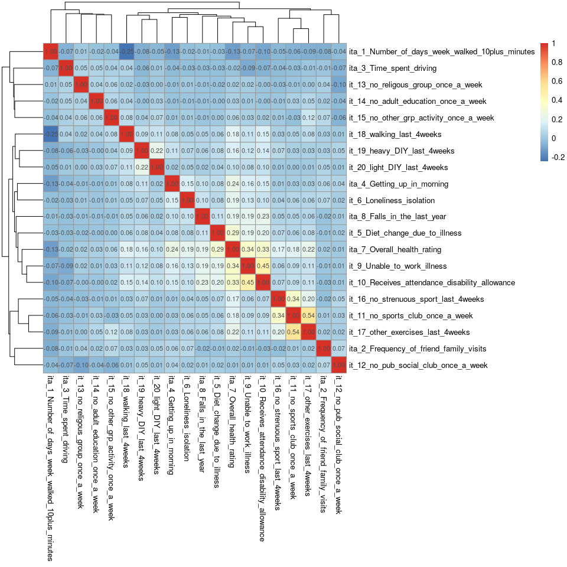

<center>

**Supp Figure 1: Pearson’s correlation matrix of data items chosen to
evaluate the impact of chronic pain (pipeline with 6 retrofitting items
in continuous format)**

</center>

<br>

Out of 190 possible combinations, 188 items had weak correlations, 2
items had moderate correlations and 0 items had strong correlations.

## 9.2 PA of items chosen to evaluate the impact of chronic pain

``` r
fa.parallel(efa_dat %>% select(-eid, -starts_with("itb_")),
            main = "",
            fa ="fa",
            error.bars = T)
```

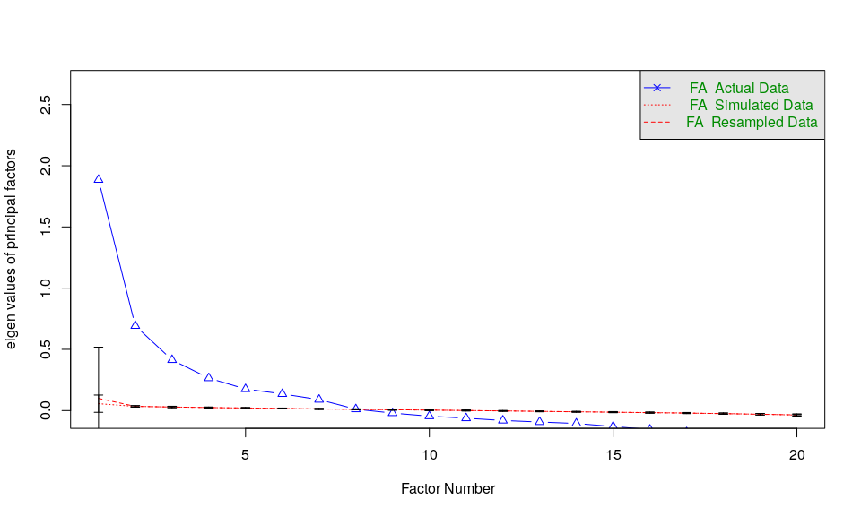

    ## Parallel analysis suggests that the number of factors =  7  and the number of components =  NA

<center>

**Supp Figure 2: Scree plot of data items chosen to evaluate the impact
of chronic pain (pipeline with 6 retrofitting items in continuous
format)**

</center>

<br>

## 9.3 EFA of items chosen to evaluate the impact of chronic pain

``` r
rotater <- c("none", "varimax", "promax")
cnames <- c("num", "no-rotation-F1","no-rotation-F2",
                 "varimax-F1", "varimax-F2",
                 "promax-F1","promax-F2")

res1 <- data.frame(num = 1:20)
rownames(res1) <- colnames(efa_dat %>% select(-eid, -starts_with("itb_")))

for (rmeth in rotater) {
    res1.efa <- psych::fa(efa_dat %>% select(-eid, -starts_with("itb_")), nfactors = 2, rotate = rmeth)
    res1 <- cbind(res1,res1.efa$loadings[,1:2])
}

colnames(res1) <- cnames

res1 <- res1 %>% select(-num)

res1 %>% round(2) %>% pheatmap(display_numbers = T, 
                      cluster_rows = F,
                      cluster_cols = F,
                      angle_col = 45,
                      color = colorRampPalette(rev(brewer.pal(n = 7, name = "RdBu")))(100),
                      breaks = seq(-1, 1, by = 0.02),
                      main = "")
```

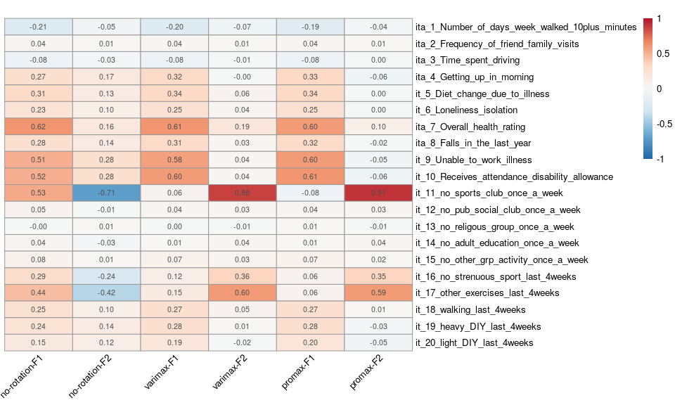

<center>

**Supp Figure 3: Comparison of loadings between rotations for
exploratory factor analysis of data items chosen to evaluate the impact
of chronic pain (pipeline with 6 retrofitting items in continuous
format)**

</center>

<br>

## 9.4 EFA of items chosen to evaluate the impact of chronic pain after removal of the items not loading on a factor

Items were removed if they did not have a value of &lt; -0.3 \| &gt; 0.3
on one factor and &gt; -0.1 & &lt; 0.1 on the other factor.

### 9.4.1 Iteration 1

``` r
res11_REM <- res1 %>%
  mutate(p0 = (`promax-F1` > -0.1 & `promax-F1` < 0.1) & (`promax-F2` < -0.3 | `promax-F2` > 0.3) |
          (`promax-F2` > -0.1 & `promax-F2` < 0.1) & (`promax-F1` < -0.3 | `promax-F1` > 0.3)) %>%
  filter(p0 == TRUE)

res11 <- data.frame(num = 1:length(rownames(res11_REM)))
rownames(res11) <- colnames(efa_dat %>% select(rownames(res11_REM)))
                             
for (rmeth in rotater) {
    res11.efa <- psych::fa(efa_dat %>% select(rownames(res11_REM)), nfactors = 2, rotate = rmeth)
    res11 <- cbind(res11, res11.efa$loadings[,1:2])
}

colnames(res11) <- cnames

res11 <- res11 %>% select(-num)

res11 %>% round(2) %>% pheatmap(display_numbers = T, 
                      cluster_rows = F,
                      cluster_cols = F,
                      angle_col = 45,
                      color = colorRampPalette(rev(brewer.pal(n = 7, name = "RdBu")))(100),
                      breaks = seq(-1, 1, by = 0.02),
                      main = "")
```

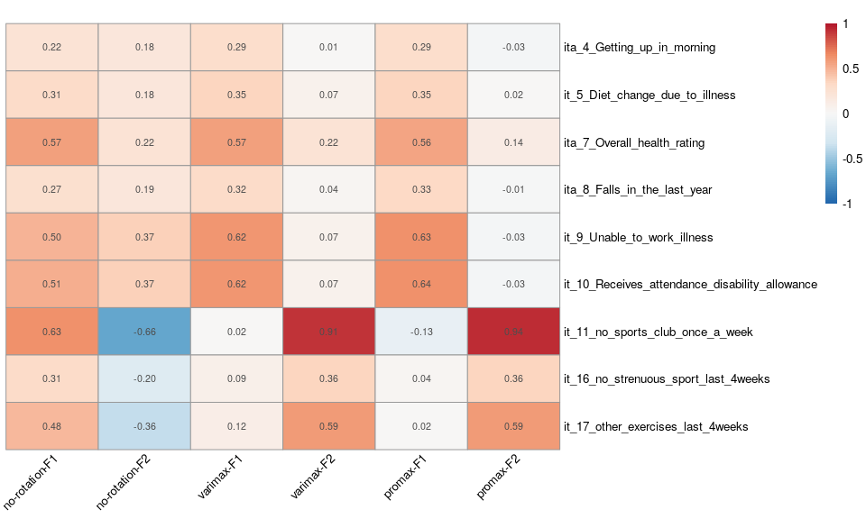

<center>

**Supp Figure 4: Comparison of loadings between rotations for
exploratory factor analysis of data items chosen to evaluate the impact
of chronic pain - Iteration 1 (pipeline with 6 retrofitting items in
continuous format)**

</center>

<br>

### 9.4.2 Iteration 2

``` r
res12_REM <- res11 %>%
  mutate(p0 = (`promax-F1` > -0.1 & `promax-F1` < 0.1) & (`promax-F2` < -0.3 | `promax-F2` > 0.3) |
          (`promax-F2` > -0.1 & `promax-F2` < 0.1) & (`promax-F1` < -0.3 | `promax-F1` > 0.3)) %>%
  filter(p0 == TRUE)

res12 <- data.frame(num = 1:length(rownames(res12_REM)))
rownames(res12) <- colnames(efa_dat %>% select(rownames(res12_REM)))
                             
for (rmeth in rotater) {
    res12.efa <- psych::fa(efa_dat %>% select(rownames(res12_REM)), nfactors = 2, rotate = rmeth)
    res12 <- cbind(res12, res12.efa$loadings[,1:2])
}

colnames(res12) <- cnames

res12 <- res12 %>% select(-num)

res12 %>% round(2) %>% pheatmap(display_numbers = T, 
                      cluster_rows = F,
                      cluster_cols = F,
                      angle_col = 45,
                      color = colorRampPalette(rev(brewer.pal(n = 7, name = "RdBu")))(100),
                      breaks = seq(-1, 1, by = 0.02),
                      main = "")
```

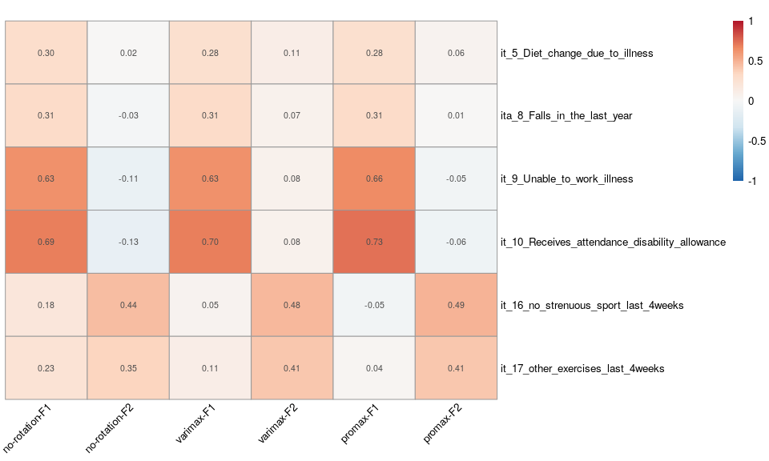

<center>

**Supp Figure 5: Comparison of loadings between rotations for
exploratory factor analysis of data items chosen to evaluate the impact
of chronic pain - Iteration 2 (pipeline with 6 retrofitting items in
continuous format)**

</center>

<br>

### 9.4.3 Iteration 3

``` r
res13_REM <- res12 %>%
  mutate(p0 = (`promax-F1` > -0.1 & `promax-F1` < 0.1) & (`promax-F2` < -0.3 | `promax-F2` > 0.3) |
          (`promax-F2` > -0.1 & `promax-F2` < 0.1) & (`promax-F1` < -0.3 | `promax-F1` > 0.3)) %>%
  filter(p0 == TRUE)

res13 <- data.frame(num = 1:length(rownames(res13_REM)))
rownames(res13) <- colnames(efa_dat %>% select(rownames(res13_REM)))
                             
for (rmeth in rotater) {
    res13.efa <- psych::fa(efa_dat %>% select(rownames(res13_REM)), nfactors = 2, rotate = rmeth)
    res13 <- cbind(res13, res13.efa$loadings[,1:2])
}

colnames(res13) <- cnames

res13 <- res13 %>% select(-num)

res13 %>% round(2) %>% pheatmap(display_numbers = T, 
                      cluster_rows = F,
                      cluster_cols = F,
                      angle_col = 45,
                      color = colorRampPalette(rev(brewer.pal(n = 7, name = "RdBu")))(100),
                      breaks = seq(-1, 1, by = 0.02),
                      main = "")
```

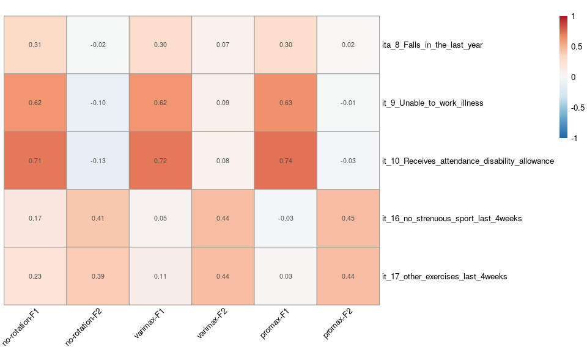

<center>

**Supp Figure 6: Comparison of loadings between rotations for
exploratory factor analysis of data items chosen to evaluate the impact
of chronic pain - Iteration 3 (pipeline with 6 retrofitting items in
continuous format)**

</center>

<br>

There are only 4 items remaining that have a value of &lt; -0.3 \| &gt;
0.3 on one factor and &gt; -0.1 & &lt; 0.1 on the other factor: no
further iterations can be completed. There are two items that are in
each factor and the minimum number of items for factor analysis is
three. No clear data structure is reached.

## 9.5 CFA of items chosen to evaluate the impact of chronic pain

As there is no clear data structure in EFA, all items will be included
in a CFA to check that there is not a structure of the data that is
being missed.

``` r
One.factor.model1<-'
  Lv1   =~ ita_1_Number_of_days_week_walked_10plus_minutes+ita_2_Frequency_of_friend_family_visits+ita_3_Time_spent_driving+ita_4_Getting_up_in_morning+it_5_Diet_change_due_to_illness+it_6_Loneliness_isolation+ita_7_Overall_health_rating+ita_8_Falls_in_the_last_year+it_9_Unable_to_work_illness+it_10_Receives_attendance_disability_allowance+it_11_no_sports_club_once_a_week+it_12_no_pub_social_club_once_a_week+it_13_no_religous_group_once_a_week+it_14_no_adult_education_once_a_week+it_15_no_other_grp_activity_once_a_week+it_16_no_strenuous_sport_last_4weeks+it_17_other_exercises_last_4weeks+it_18_walking_last_4weeks+it_19_heavy_DIY_last_4weeks+it_20_light_DIY_last_4weeks
'
One.factor.Fit1 <- cfa(model = One.factor.model1, 
                     data = cfa_dat)
```

Comparative Fit Index (CFI): 0.5477219 (The cut-off should be above 0.9)
Tucker-Lewis Index (TLI): 0.4945127 (The cut-off should be above 0.9)
Root Mean Square Error of Approximation: 0.0657889(The cut-off should be
below 0.05) Standardized Root Mean Square Residual (SRMR): 0.0538626
(The cut-off should be below 0.05)

There is no underlying data structure of all 20 items, according to CFA.

## 9.6 IRT model of items chosen to evaluate the impact of chronic pain

EFA and CFA suggest that the items chosen are not unidimensional and
that there are no combinations of several items together that create a
unidimensional solution. Therefore, the assumptions of an IRT model or
Rasch analysis are violated and it is not appropriate to run the
analysis.

# 10 Data analysis pipeline with 6 retrofitting items in binary format

6 items (UKB field IDs 864, 1090, 2178, 2296, 1031 and 1170) were
treated as binary data for this analysis, as described in the
reformatting description above.

## 10.1 Correlation between items chosen to evaluate the impact of chronic pain

``` r
cor2 <- polychoric(efa_dat %>% select(-eid, -starts_with("ita_")), smooth = F, correct = F) 

cor2$rho %>% pheatmap(display_numbers = T, 
                      cluster_rows = T,
                      cluster_cols = T)
```

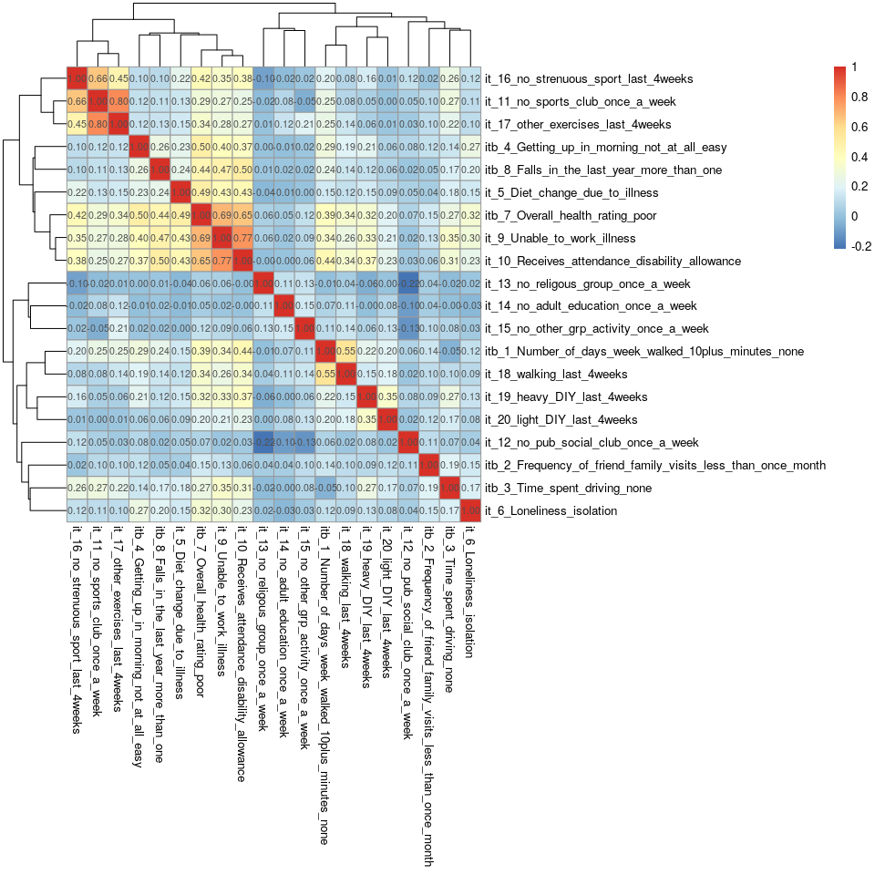

<center>

**Supp Figure 7: Pearson’s correlation matrix of data items chosen to
evaluate the impact of chronic pain (pipeline with 6 retrofitting items
in binary format)**

</center>

<br>

Out of 190 possible combinations, 174 items had weak correlations, 11
items had modetate correlations and 5 items had strong correlations.

## 10.2 PA of items chosen to evaluate the impact of chronic pain

``` r
fa.parallel(efa_dat %>% select(-eid, -starts_with("ita_")),
            main = "",
            fa ="fa",
            cor = "poly",
            correct = T,
            error.bars = T)
```

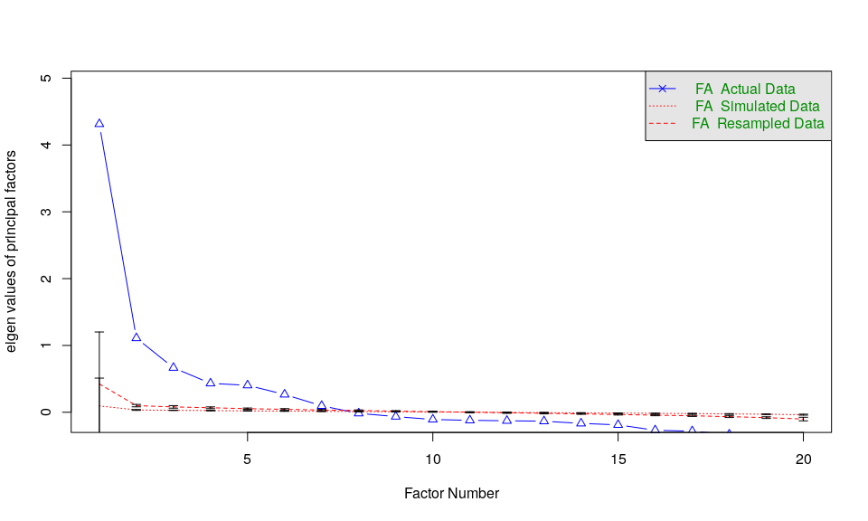

    ## Parallel analysis suggests that the number of factors =  7  and the number of components =  NA

<center>

**Supp Figure 8: Scree plot of data items chosen to evaluate the impact
of chronic pain (pipeline with 6 retrofitting items in binary format)**

</center>

<br>

## 10.3 EFA of items chosen to evaluate the impact of chronic pain

``` r
res2 <- data.frame(num = 1:20)
rownames(res2) <- colnames(efa_dat %>% select(-eid, -starts_with("ita_")))

for (rmeth in rotater) {
    res2.efa <- psych::fa(efa_dat %>% select(-eid, -starts_with("ita_")), nfactors = 2, rotate = rmeth, cor = "poly", fm = "gls", correct = "T")
    res2 <- cbind(res2,res2.efa$loadings[,1:2])
}

colnames(res2) <- cnames

res2 <- res2 %>% select(-num)

res2 %>% round(2) %>% pheatmap(display_numbers = T, 
                      cluster_rows = F,
                      cluster_cols = F,
                      angle_col = 45,
                      color = colorRampPalette(rev(brewer.pal(n = 7, name = "RdBu")))(100),
                      breaks = seq(-1, 1, by = 0.02),
                      main = "")
```

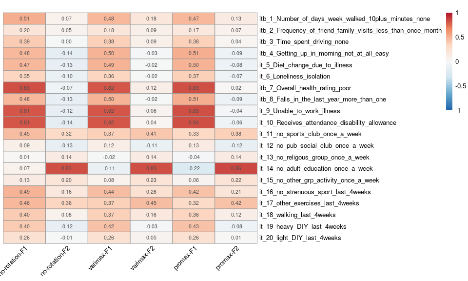

<center>

**Supp Figure 9: Comparison of loadings between rotations for
exploratory factor analysis of data items chosen to evaluate the impact
of chronic pain (pipeline with 6 retrofitting items in binary format)**

</center>

<br>

## 10.4 EFA of items chosen to evaluate the impact of chronic pain after removal of the items not loading on a factor

Items were removed if they did not have a value of &lt; -0.3 \| &gt; 0.3
on one factor and &gt; -0.1 & &lt; 0.1 on the other factor.

### 10.4.1 Iteration 1

``` r
res21_REM <- res2  %>%
  mutate(p0 = ((`promax-F1` > -0.1 & `promax-F1` < 0.1) & (`promax-F2` < -0.3 | `promax-F2` > 0.3) |
          (`promax-F2` > -0.1 & `promax-F2` < 0.1) & (`promax-F1` < -0.3 | `promax-F1` > 0.3))) %>%
  filter(p0 == TRUE)

res21 <- data.frame(num = 1:length(rownames(res21_REM)))
rownames(res21) <- colnames(efa_dat %>% select(rownames(res21_REM)))
                             
for (rmeth in rotater) {
    res21.efa <- psych::fa(efa_dat %>% select(rownames(res21_REM)), nfactors = 2, rotate = rmeth, cor = "poly", fm = "gls", correct = "T")
    res21 <- cbind(res21, res21.efa$loadings[,1:2])
}

colnames(res21) <- cnames

res21 <- res21 %>% select(-num)

res21 %>% round(2) %>% pheatmap(display_numbers = T, 
                      cluster_rows = F,
                      cluster_cols = F,
                      angle_col = 45,
                      color = colorRampPalette(rev(brewer.pal(n = 7, name = "RdBu")))(100),
                      breaks = seq(-1, 1, by = 0.02),
                      main = "")
```

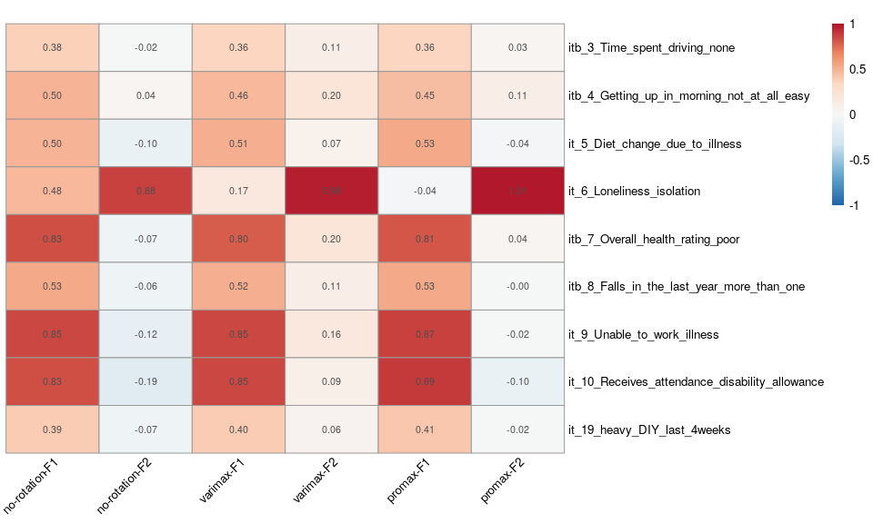

<center>

**Supp Figure 10: Comparison of loadings between rotations for
exploratory factor analysis of data items chosen to evaluate the impact
of chronic pain - Iteration 1 (pipeline with 6 retrofitting items in
binary format)**

</center>

<br>

### 10.4.2 Iteration 2

As above, but remove single item loading completely on factor 2 (this
could not form a factor analysis on its own)

``` r
res22_REM <- res21 %>%
  mutate(p0 = ((`promax-F1` > -0.1 & `promax-F1` < 0.1) & (`promax-F2` < -0.3 | `promax-F2` > 0.3) |
          (`promax-F2` > -0.1 & `promax-F2` < 0.1) & (`promax-F1` < -0.3 | `promax-F1` > 0.3)) &
           `promax-F2` < 0.9) %>%
  filter(p0 == TRUE)

res22 <- data.frame(num = 1:length(rownames(res22_REM)))
rownames(res22) <- colnames(efa_dat %>% select(rownames(res22_REM)))
                             
for (rmeth in rotater) {
    res22.efa <- psych::fa(efa_dat %>% select(rownames(res22_REM)), nfactors = 2, rotate = rmeth, cor = "poly", fm = "gls", correct = "T")
    res22 <- cbind(res22, res22.efa$loadings[,1:2])
}

colnames(res22) <- cnames

res22 <- res22 %>% select(-num)

res22 %>% round(2) %>% pheatmap(display_numbers = T, 
                      cluster_rows = F,
                      cluster_cols = F,
                      angle_col = 45,
                      color = colorRampPalette(rev(brewer.pal(n = 7, name = "RdBu")))(100),
                      breaks = seq(-1, 1, by = 0.02),
                      main = "")
```

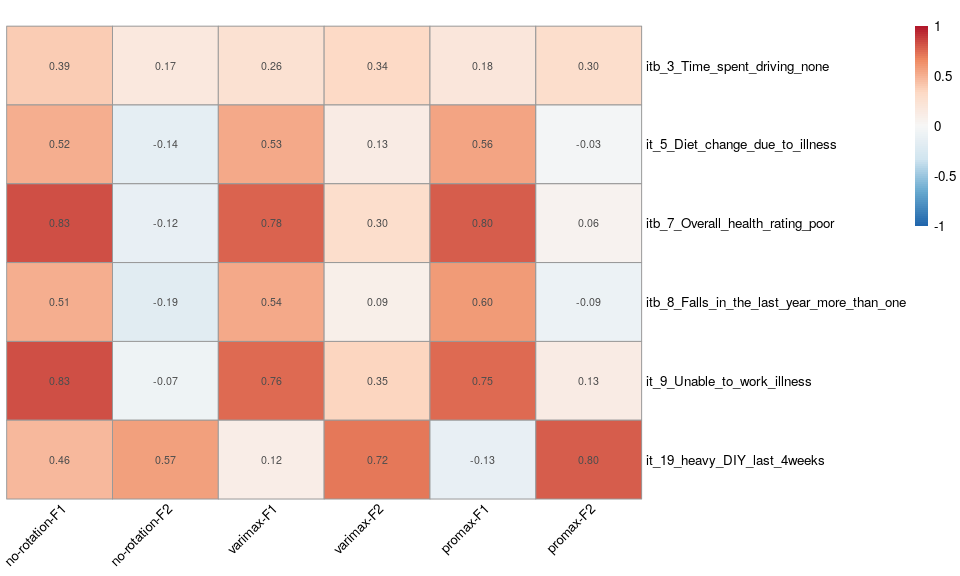

<center>

**Supp Figure 11: Comparison of loadings between rotations for
exploratory factor analysis of data items chosen to evaluate the impact
of chronic pain - Iteration 2 (pipeline with 6 retrofitting items in
binary format)**

</center>

<br>

### 10.4.3 Iteration 3

As above - remove item loading completely on factor 2

``` r
res23_REM <- res22 %>%
  mutate(p0 = ((`promax-F1` > -0.1 & `promax-F1` < 0.1) & (`promax-F2` < -0.3 | `promax-F2` > 0.3) |
          (`promax-F2` > -0.1 & `promax-F2` < 0.1) & (`promax-F1` < -0.3 | `promax-F1` > 0.3)) &
           `promax-F2` < 0.9) %>%
  filter(p0 == TRUE)

res23 <- data.frame(num = 1:length(rownames(res23_REM)))
rownames(res23) <- colnames(efa_dat %>% select(rownames(res23_REM)))
                             
for (rmeth in rotater) {
    res23.efa <- psych::fa(efa_dat %>% select(rownames(res23_REM)), nfactors = 2, rotate = rmeth, cor = "poly", fm = "gls", correct = "T")
    res23 <- cbind(res23, res23.efa$loadings[,1:2])
}

colnames(res23) <- cnames

res23 <- res23 %>% select(-num)

res23 %>% round(2) %>% pheatmap(display_numbers = T, 
                      cluster_rows = F,
                      cluster_cols = F,
                      angle_col = 45,
                      color = colorRampPalette(rev(brewer.pal(n = 7, name = "RdBu")))(100),
                      breaks = seq(-1, 1, by = 0.02),
                      main = "")
```

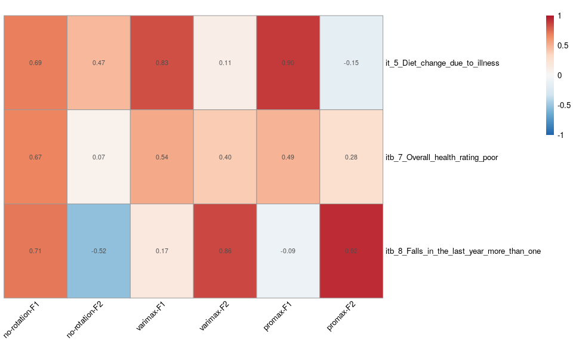

<center>

**Supp Figure 12: Comparison of loadings between rotations for
exploratory factor analysis of data items chosen to evaluate the impact
of chronic pain - Iteration 3 (pipeline with 6 retrofitting items in
binary format)**

</center>

<br>

There are only 3 items remaining, only 1 of which loads on a factor. No
further iterations will be completed. No clear data structure is
reached.

## 10.5 CFA of items chosen to evaluate the impact of chronic pain

As there is no clear data structure in EFA, all items will be included
in a CFA to check that there is not a structure of the data that is
being missed.

``` r
One.factor.model2<-'
  Lv1   =~ itb_1_Number_of_days_week_walked_10plus_minutes_none+itb_2_Frequency_of_friend_family_visits_less_than_once_month+itb_3_Time_spent_driving_none+itb_4_Getting_up_in_morning_not_at_all_easy+it_5_Diet_change_due_to_illness+it_6_Loneliness_isolation+itb_7_Overall_health_rating_poor+itb_8_Falls_in_the_last_year_more_than_one+it_9_Unable_to_work_illness+it_10_Receives_attendance_disability_allowance+it_11_no_sports_club_once_a_week+it_12_no_pub_social_club_once_a_week+it_13_no_religous_group_once_a_week+it_14_no_adult_education_once_a_week+it_15_no_other_grp_activity_once_a_week+it_16_no_strenuous_sport_last_4weeks+it_17_other_exercises_last_4weeks+it_18_walking_last_4weeks+it_19_heavy_DIY_last_4weeks+it_20_light_DIY_last_4weeks
'
One.factor.Fit2 <- cfa(model = One.factor.model2, 
                       estimator = "WLSM",
                       ordered = TRUE, # polychoric correlations for the ordinal variables
                     data = cfa_dat)
```

Comparative Fit Index (CFI): 0.8245608 (The cut-off should be above 0.9)
Tucker-Lewis Index (TLI): 0.8039209 (The cut-off should be above 0.9)
Root Mean Square Error of Approximation: 0.054747(The cut-off should be
below 0.05) Standardized Root Mean Square Residual (SRMR): 0.1053468
(The cut-off should be below 0.05)

There is no underlying data structure of all 20 items, according to CFA.

## 10.6 IRT model of items chosen to evaluate the impact of chronic pain

EFA and CFA suggest that the items chosen are not unidimensional and
that there are no combinations of several items together that create a
unidimensional solution. Therefore, the assumptions of an IRT model or
Rasch analysis are violated and it is not appropriate to run the
analysis.

# 11 Conclusion

We evaluated UKB assessment items collected between 2006 and 2010 for
mapping to the NIH detection criteria and the workflow process described
in our paper. These analyses demonstrated that the variables that were
mapped to the NIH pain impact measure did not form a unidimensional
measure.

# 12 References

1.  UK Biobank. Online showcase. Available from:
    <https://biobank.ndph.ox.ac.uk/showcase/index.cgi>. $$Accessed 9th
    July 24$$.
2.  Interagency Pain Research Coordinating Committee. National Pain
    Strategy. Available from:
    <https://www.iprcc.nih.gov/sites/default/files/documents/NationalPainStrategy_508C.pdf>.
    $$Accessed 9th July 24$$.
3.  UK Biobank. Data-Field 21000. Available from:
    <https://biobank.ndph.ox.ac.uk/showcase/field.cgi?id=21000>.
    $$Accessed 9th July 24$$.
4.  UK Biobank. Data-Field 189. Available from:
    <https://biobank.ctsu.ox.ac.uk/crystal/field.cgi?id=189>. $$Accessed
    9th July 24$$.
